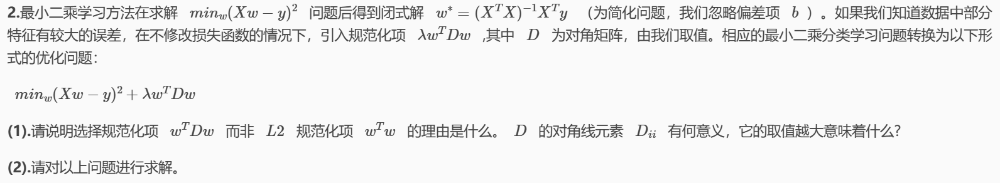
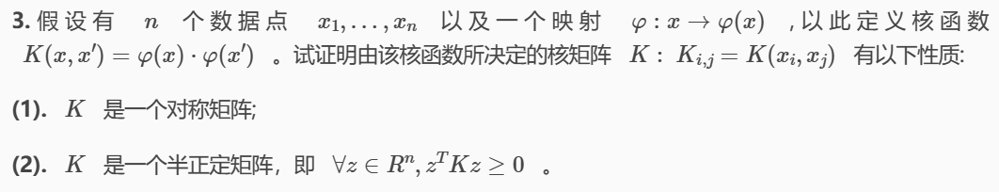
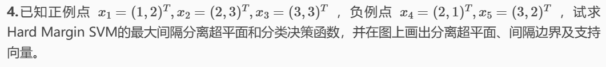
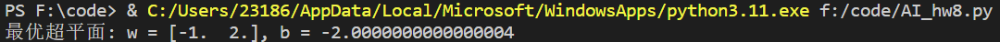
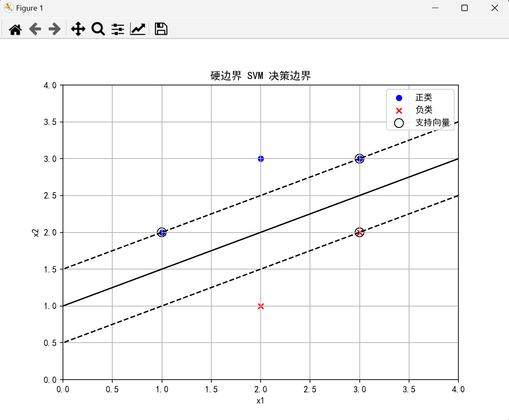
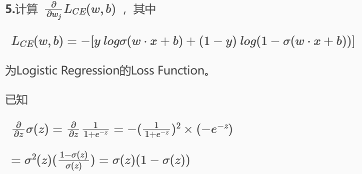

# AI HW8

## PB21111733 牛庆源

### 1. 试证明对于不含冲突数据集（即特征向量完全相同但标记不同）的训练集，必存在与训练集一致（即训练误差为 0）的决策树。

1. 设训练集D包含n个样本，每个样本由特征向量和标记组成。即对于特征向量 $\bold{x}_i = \bold{x}_j$ ，对应的标记 $y_i=y_j$ 。
2. 选择特征 $x_1$ 作为根节点分裂标准，根据特征 $x_1$ 的取值将训练集分为若干子集。对于每一个特征值 $v$ ，得到一个子集 $D_v$ ，其中所有样本在 $x_1$ 上的值都为 $v$ 。
3. 对于每一个子集 $D_v$ ，继续选择下一个特征 $x_2$ 进行下一步划分。不断递归直到所有特征都被用完或者子集中的样本全部具有相同的标记。
4. 当划分到某一层，子集中所有的样本都具有相同的标记时，将该子集对应的节点设置为叶节点，并将叶节点标记为该标记。由于训练集中没有冲突数据，这种情况一定会出现。
5. 递归过程中如果某个子集中的样本都具有相同的特征向量，则它们的标记也必然相同，可以直接将该子集划分为一个叶节点，并标记为该标记。

通过这样的构造，可以保证生成的决策树可以完全匹配训练集中的每一个样本。


### 2.



* 相较于$L_2$规范化项$w^Tw$，$w^TDw$引入了对角矩阵$D$，$L_2$规范化所有特征的权重收到的惩罚程度相同，而加入对角矩阵$D$可以给不同特征以不同权重，调整惩罚力度，降低了这些特征对模型的影响。

  $D$的对角元素$D_{ii}$的值反应了对第$i$个特征权重$w_{ii}$的惩罚强度。取值越大代表施加更大的惩罚。

* $F(w)=(Xw-y)^T(Xw-y)+\lambda w^TDw$

  $F'(w)=2X^TXw-2X^Ty+2\lambda Dw$

  令$F'(w)=0$得

  $w^*=(X^TX+\lambda D)^{-1}X^Ty$


### 3.



* $K_{i,j}=K(x_i,x_j)=\varphi(x_i)\cdot \varphi(x_j)$

  $K_{j,i}=K(x_j,x_i)=\varphi(x_j)\cdot\varphi(x_i)$

  由$\varphi(x_i)\cdot \varphi(x_j)=\varphi(x_j)\cdot\varphi(x_i)$

  则$K_{i,j}=K_{j,i}$，是对称矩阵。

* $$
  z^TKz=\sum^n_{i=1}\sum^n_{j=1}z_iK_{ij}z_j\\=\sum^n_{i=1}\sum^n_{j=1}z_i\varphi(x_i)\cdot\varphi(x_j) z_j\\=\sum^n_{i=1}\sum^n_{j=1}(z_i\varphi(x_i))\cdot(z_j\varphi(x_j))
  $$

  另$\phi =(\varphi(x_1)z1,...,\varphi(x_n)z_n)$

  则$z^TKz=\phi^T\phi=||z'||^2\geqslant 0$

  所以半正定。


### 4.



线性规划求解$min(w_1^2+w_2^2)$

约束条件为：
$$
w_1+2w_2+b\geqslant1\\
2w_1+3w_2+b\geqslant1\\
3w_1+3w_2+b\geqslant1\\
-2w_1-w_2-b\geqslant1\\
-3w_1-2w_2-b\geqslant1
$$
结果为：$w_1=-1,w_2=2,b=-2$。

绘图代码如下：

```python
import numpy as np
import matplotlib.pyplot as plt
from sklearn.svm import SVC

# 定义数据点
positive_points = np.array([[1, 2], [2, 3], [3, 3]])
negative_points = np.array([[2, 1], [3, 2]])

X = np.vstack((positive_points, negative_points))
y = np.array([1, 1, 1, -1, -1])

# 拟合模型
clf = SVC(kernel='linear', C=1e10)  # 大C值表示硬边界
clf.fit(X, y)

# 获取分离超平面
w = clf.coef_[0]
b = clf.intercept_[0]
print(f'最优超平面: w = {w}, b = {b}')

# 创建网格以绘制决策边界
xx = np.linspace(0, 4, 500)
yy = np.linspace(0, 4, 500)
YY, XX = np.meshgrid(yy, xx)
xy = np.vstack([XX.ravel(), YY.ravel()]).T
Z = clf.decision_function(xy).reshape(XX.shape)

# 绘图
plt.figure(figsize=(8, 6))

# 绘制决策边界和间隔边界
plt.contour(XX, YY, Z, levels=[-1, 0, 1], linestyles=['--', '-', '--'], colors='k')

# 绘制数据点
plt.scatter(positive_points[:, 0], positive_points[:, 1], color='b', marker='o', label='正类')
plt.scatter(negative_points[:, 0], negative_points[:, 1], color='r', marker='x', label='负类')

# 绘制支持向量
plt.scatter(clf.support_vectors_[:, 0], clf.support_vectors_[:, 1], s=100, facecolors='none', edgecolors='k', label='支持向量')

# 图形格式设置
plt.legend()
plt.xlabel('x1')
plt.ylabel('x2')
plt.rcParams['font.sans-serif'] = ['SimHei'] # 显示中文
plt.title('硬边界 SVM 决策边界')
plt.grid(True)
plt.show()
```

运行结果如下：






### 5.


$$
\frac{\part{L_{CE}(w,b)}}{\part{w_j}}\\
=-\left[y\cdot\frac{1}{\sigma(w\cdot x+b)}\cdot\frac{\part{\sigma(w\cdot x+b)}}{\part{w_j}}+(1-y)\cdot\frac{1}{1-\sigma(w\cdot x+b)}\cdot\frac{\part{(1-\sigma(w\cdot x+b))}}{\part{w_j}}\right]\\
=-\left[y\cdot\frac{1}{\sigma z}\cdot\sigma z(1-\sigma z)x_j-(1-y)\cdot\frac{1}{1-\sigma z}\cdot(-\sigma z)(1-\sigma z)(-x_j)\right](令z=w\cdot x+b)\\
=-(y-\sigma z)x_j=[\sigma(w\cdot x+b)-y]x_j
$$


### 6. K-means算法是否一定会收敛？如果是，给出证明过程，如果不是，给出说明。

一定收敛，证明：

1. 目标函数定义为：
   $$
   J=\sum^k_{i=1}\sum_{x\in{C_i}}||x-\mu_i||^2
   $$
   其中，$C_i$是第$i$个聚类，$\mu_i$是第$i$个聚类的质心。

2. 将每个点分配到最近的质心的过程中，不会增加目标函数的值；在重新计算每个聚类的质心时，由均值性质可知，也不会增加目标函数的值。因此在$K-means$算法过程中每次迭代，目标函数$J$非增。

3. 由于目标函数$J$非负，且在每次迭代中非增，则必须在某个点收敛。