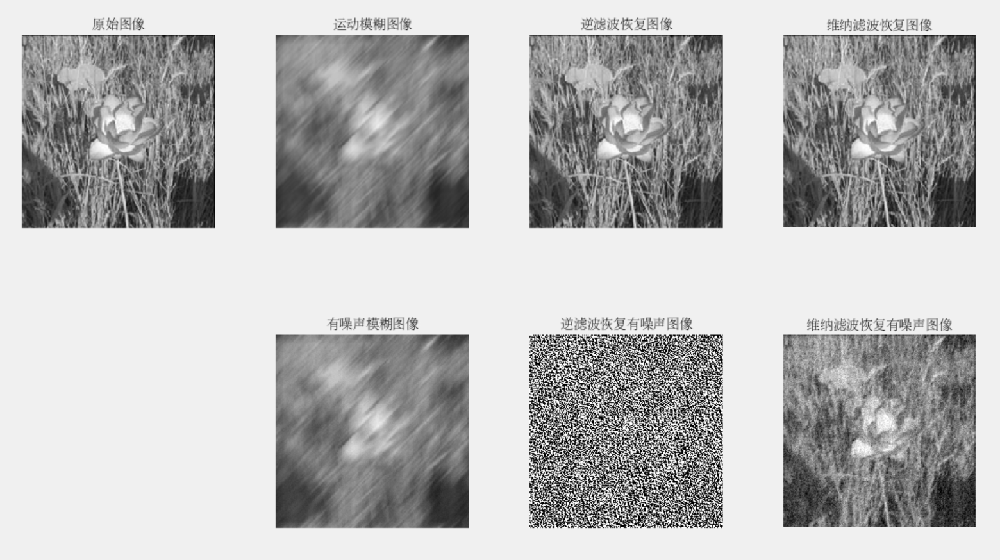
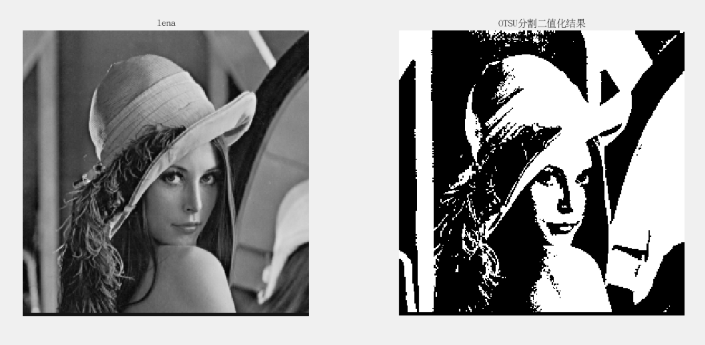
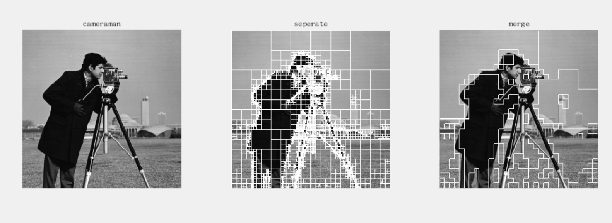

# 数字图像处理实验报告

## 牛庆源 PB21111733

### lab1 图像几何变换

* 图像平移：使用 `input` 获取输入的水平和垂直平移量，使用 `imtranslate` 函数对输入的 lena 图像进行平移处理，使用 `subplot` 函数展示原始图像和平移后的图像。另：用`clc,clear,close all`释放上次使用的资源。以下展示输入水平平移量 60 和垂直平移量 88 时的图像输出结果：

* 图像旋转：使用 `center` 函数获取原图像中心点坐标，使用 `imrotate` 函数，输入旋转角度并分别取 `method` 字段为`nearest` 和 `bilinear` 来分别获得最近邻插值和双线性插值旋转后的图像，另：对 `bbox` 分别采取 `crop` 和 `loose` 来分别使输出图像和输入图像大小相同，和完整展示输出图像。旋转60度结果如下：

  

* 图像缩放：使用 `imresize` 函数，采用 `B = imresize(A, [numrows numcols], method)` 来缩放图像，其中 `numrows` 为 使用 `round` 函数取整 `size(originalImage,1)*verticalScale` ， `numcols` 同理，`method` 分别取 `nearest` 和 `bilinear` 来分别获得最近邻插值和双线性插值缩放后的图像。输入水平缩放量0.5，垂直缩放量5后得到的结果为：

  

* 图像几何失真校正：首先，读取图像后设置控制点，原始图像控制点为图像的四个角点，对应失真图像的位置为：左上角点，右下角点，223,0 ，0,225 这四个点，将其按照实际情况一一对应。设置好控制点后，使用 `cp2tform` 计算变换矩阵，注意根据实际情况（失真图像是倾斜的）设置 `transformationType` 字段为 `projective` ，最后用 `imtransform` 函数来用变换矩阵校正图像，注意使用 `XData` 和 `YData` 字段来处理 X-Y 空间的二维图像变换。最后得到的结果如下：

  


### lab2 图像点处理增强

* 灰度的线性变换：使用 $size$ 读取图像的行数和列数，用于之后遍历该灰度图像的所有像素。对于图像的每一个像素，使用灰度变换方程：$D_B = f(D_A)=f_A*D_A+f_B$ ，注意对于计算出的 $D_B$ ，要确保其在0到255之间，使用 $\min$ 函数实现。对于输入：$f_A=2$ ，$f_B = -20$ ，结果如下：

  

* 灰度拉伸：$input$ 输入两个转折点的横纵坐标，参考实验手册中的三个表达式，使用 $if...elseif...else...end$ 分别处理三段像素。对于输入 $x_1 = 100,y_1 = 150,x_2 = 200,y_2 = 175$ （对第一段拉伸，第二段压缩，第三段拉伸），输出为：

  

* 灰度直方图：使用到了 $imhist$ 函数来输出灰度直方图。$input$ 读入上下限后，使下限以下的灰度等于下限，上限以上的灰度等于上限，最后输出图像和灰度直方图。输入下限100，上限150后的结果如下：

  

* 直方图均衡和直方图规定化：使用 $imhist$ 来输出灰度直方图。对于直方图均衡，使用到了函数 $histeq(I)$ 直接对输入图像进行该函数处理，然后输出即可。对于直方图规定化为高斯分布，首先想到使用 $histeq(I, hgram)$ 来使原始图像 $I$ 匹配到目标直方图 $hgram$ ，这里要求为高斯分布，于是使用高斯分布的概率密度函数，自定义均值和标准差，对于 $0:255$ 的每一个灰度进行高斯分布的处理，最后得出结果。由于这里自己编写了高斯分布的函数，展示于下：

  ```matlab
  % 4. 直方图规定化为高斯分布
  numPixels = numel(input_image);
  % 均值
  meanValue = 100;
  % 标准差
  stdDev = 10;
  targetHist = numPixels * (1 / (stdDev * sqrt(2 * pi))) * exp(-((0:255) - meanValue).^2 / (2 * stdDev^2));
  
  % 使用histeq(I,hgram)匹配目标直方图来进行直方图规定化
  normalized_image = histeq(input_image, targetHist);
  ```

  

  注：检查时的bug为 `exp(-(0:255 - meanValue).^2 / (2 * stdDev^2))` 处没有给 `0:255` 加括号导致灰度区间错误，加上括号变为以上代码块中的样子即可。设置均值为100，标准差为10时，本实验的输出为：

  


### lab3 图像空间滤波增强

* 加噪：使用 $imnoise$ 函数加噪，分别使用字段 `salt & pepper` , `gaussian` , `speckle` 来添加椒盐噪声，高斯噪声和随机噪声，注意最后一个字段为 `0.03` 来保证产生3%的噪声。

  

* 均值滤波器去噪：设置 `filter_size = 3` ，使用 $fspecial$ 来创建滤波器，方式字段使用 `average` ，大小设置为 `[filter_size filter_size]` ，然后使用 $imfilter$ 来分别对三个噪声图像应用创建的滤波器。

  

* 超限邻域平均法：设置超限阈值为20，自定义函数 `ave_nei_Filter` 实现超限邻域平均。

  ```matlab
  % 超限邻域平均法函数
  function denoised_image = ave_nei_Filter(image, threshold)
      [rows, cols] = size(image);
      
      % 与image大小相同的图像用于赋值，输出
      denoised_image = uint8(zeros(rows, cols));
  
      % 处理像素
      for i = 2:rows - 1
          for j = 2:cols - 1
              %计算邻域像素平均值
              neighborhood_mean = mean2(image(i-1:i+1, j-1:j+1));
              % 如果是噪声
              if abs(image(i, j) - neighborhood_mean) > threshold
                  % 用平均值代替
                  denoised_image(i, j) = uint8(neighborhood_mean);
              % 不是噪声
              else
                  % 原像素值
                  denoised_image(i, j) = image(i, j);
              end
          end
      end
  end
  ```

  依据超限邻域平均的定义，对每一个像素分条件进行处理即可，处理方式如上。

  应用该函数，`image` 变量分别为三个加噪图像，`threshold` 为设置的超限阈值20。

  

* 中值滤波：窗口大小设置为3，使用 $medfilt2$ 分别对三个加噪图像以窗口大小进行中值滤波即可。

  

* 超限邻域中值法：设置超限阈值为20，自定义函数 `mid_nei_Filter` 实现超限邻域中值。

  ```matlab
  % 超限邻域中值函数
  function denoised_image = mid_nei_Filter(image, threshold)
      [rows, cols] = size(image);
      denoised_image = uint8(zeros(rows, cols));
  
      for i = 2:rows - 1
          for j = 2:cols - 1
          	% 将八个像素压入1*9数组，然后用median求中值即可
              neighborhood_mid = median([image(i-1,j-1),image(i-1,j),
              image(i-1,j+1),image(i,j-1),image(i,j),image(i,j+1),
              image(i+1,j-1),image(i+1,j),image(i+1,j+1)]);
              if abs(image(i, j) - neighborhood_mid) > threshold
                  denoised_image(i, j) = uint8(neighborhood_mid);
              else
                  denoised_image(i, j) = image(i, j);
              end
          end
      end
  end
  ```

  实现方式类似超限邻域平均，把 `neighborhood_mean` 改为 `neighborhood_mid` 并使用 $median$ 取 $3\times3$ 范围内的中值即可。对每个像素分条件处理即可，处理方式如上。应用该函数即得到结果。

  

* 比较四种方法的处理结果：

  |              |       椒盐噪声       |      高斯噪声      |     随机噪声     |
| :----------: | :------------------: | :----------------: | :--------------: |
  |   均值滤波   |  较差，容易模糊图像  | 较好，但会模糊边缘 | 一般，会模糊图像 |
|   中值滤波   |  最佳，可以保留边缘  |        一般        |      不太好      |
  | 超限邻域均值 | 好，可以保留图像细节 |   较好，需要调参   |  较好，参数敏感  |
| 超限邻域中值 |  中等，需要调整参数  |  好，可以保留细节  | 较好，能保留细节 |

* 对 `blood.bmp` 和 `lena.bmp` 分别使用五种算子实现边缘检测：（以下仅描述 `blood.bmp` ，另一幅图像同理即可）

  对于 `Roberts` , `Sobel` , `Prewitt` , `Canny`，使用 $edge$ 函数分别采用上述字段即可实现各自方法的边缘检测。

  对于两种拉普拉斯算子，首先分别定义两个拉普拉斯矩阵，使用 $imfilter$ 分别对两个矩阵采用 `replicate` 方式进行滤波即可得到结果。

  

  


***以下实验结果为Vlab虚拟机上运行得出***

### lab4 图像变换及频域滤波增强

* 二维傅里叶变换：使用 $fft2$ 处理强制转换为 $double$ 类型的图像得到二维傅里叶变换图像，然后使用 $ffshift$ 将低频移动到中心。幅度谱使用 $abs$ 计算绝对值得出。为了显示，采用对数变换 $log$ 并且为了防止没有定义的情况，对幅度谱加一使用 $log$ 。结果如下：

  

* 分别使用 Fourier 系数的幅度和相位进行 Fourier 反变换：幅度使用上一答中的傅里叶变换结果并取 $abs$ ，相位对结果使用 $angle$ 得出。使用 $ifft2$ 进行傅里叶反变换，只用幅度进行变换则相位设置为0即可：即 `F1_amplitude_only = ifft2(amplitude1);` ，只用相位进行变换则幅度设置为1即可：即 `F1_phase_only = ifft2(exp(1i * phase1));` 。结果如下：

  

  其中，由于幅度反变换后rect1图像十分不清晰，在 $imshow$ 时将输出区间改为0~255可以使图像清晰一些，`imshow(real(F1_amplitude_only), [0 255]);` ，如下：

  

  比较结果发现：幅频特性体现了图像的颜色分布，相频特性主要体现图像边界特点。人眼对相频特性更加敏感，可以从相频特性看出图像的大致内容。

* 将图像傅里叶变换置为共轭后反变换，显示图像：使用 $conj$ 计算傅里叶变换的共轭，使用 $ifft2$ 计算二维傅里叶变换的反变换，差异用两者之差表示，注意共轭反变换后取 $real$ 去掉潜在的虚部。结果如下：

  

  观察得出，对傅里叶变换的共轭进行反变换后，图像相较于原来的图像绕中心旋转了180度。

* 对两幅图像分别采用理想低通滤波器，巴特沃斯低通滤波器和高斯低通滤波器，再做反变换，观察不同截止频率下采用不同低通滤波器得到的图像与原图像的区别，注意振铃效应：首先将读取的图像 $double$ 处理，用 $size$ 读取图像尺寸，对读出来的图像尺寸，使用 $meshgrid$ 计算DFT网络。利用公式计算出 $D$ 和三个滤波器各自的 $H$ **（注意这里巴特沃斯低通滤波器的阶数采用了2）**，使用 $ffshift$ 将低频移至中心。应用滤波器并进行反变换 `pout_ideal = real(ifft2(fft2(pout) .* H_ideal));` 另外两个滤波器同理。对第二张图像同理处理即可。得到的截止频率为30的结果为：

  

  更改截止频率为70，得到的结果为：

  

  总的来说，低截止频率的图像相较于高截止频率的图像，在低通滤波器的处理下更为模糊。且低截止频率的振铃效应跟明显，尤其是对理想低通滤波器和阶数为2的巴特沃斯低通滤波器，对于高斯低通滤波器则不会产生振铃效应，并且阶数为1的巴特沃斯低通滤波器也没有振铃现象。

* 对 Girl.bmp 图像添加椒盐噪声、高斯噪声，分别使用截止频率为30和70的三种低通滤波器去噪，比较去噪结果：首先使用 $imnoise$ 添加噪声，然后对噪声后的图像应用滤波器并进行反变换即可：

  截止频率为30时：

  

  截止频率为70时：

  

  可以看出，低截止频率的低通滤波器去噪效果相对高截止频率的去噪效果好一些；对于高斯噪声的去噪效果要好于对于椒盐噪声的去噪效果；三种低通滤波器对比则去噪效果以及保留图像效果由好到坏依次为高斯低通滤波器，二阶巴特沃斯低通滤波器，理想低通滤波器。

* 高通滤波：与低通滤波同理，将 $H$ 计算中的判断条件分别改为：

  `H_ideal = double(D > D0_ideal);`

  `H_butterworth = 1 ./ (1 + (D0_butterworth ./ D).^(2 * n));`

  `H_gaussian = 1 - exp(-(D.^2) / (2 * D0_gaussian^2));`

  即可（阻止低频通过），然后应用滤波器并进行反变换得到结果。

  截止频率为20：

  截止频率为80：

  

  低截止频率下，经过高通滤波器处理得到的结果显示出图像的一些轮廓信息，但是高截止频率下图像的轮廓信息也不明显了。振铃效应的发生同低通滤波器，但是细节方面有所不同。对于低通滤波器,控制振铃效应的是通带内最高频率（即截止频率）；对于高通滤波器,控制振铃效应的是通带外最低频率（也即截止频率）。

* 将图像 pout.bmp 先进行高频增强滤波再直方图均衡化，与先直方图均衡化再高频滤波增强得到的结果对比：将原图加上滤波后的结果得到增强图，再将增强图使用 $histeq$ 处理，注意类型转换为 $uint8$ ，得到结果；将原图先试用 $histeq$ 进行直方图均衡化处理，注意类型转换为 $uint8$ ，然后对直方图均衡化后的结果应用高通滤波器并反变换得到滤波结果，最后再加上直方图均衡化的图，得到结果。

  对比为：

  

  通过查看相同位置的灰度，发现先进行直方图均衡再高频增强滤波增强得到的图像更白，推测是因为先均衡增强了图像整体的对比度，但是细节模糊了，再高频增强后虽然可以恢复一定细节，但是无法完全补偿。


### lab5 图像恢复与图像分割

* 对图像 flower1.jpg 设置运动模糊，然后使用逆滤波和维纳滤波恢复。对模糊后的图像添加高斯噪声，然后使用逆滤波和维纳滤波恢复：首先使用 $im2double$ 将读取的图像转换格式，然后使用 $fspecial$ 生成运动模糊核 $PSF$ ，这里的参数选择为 $'motion'$ ，位移30个像素，角度为45度。使用 $imfilter$ 采用循环 ( $'circular'$ ) 卷积 ( $'conv'$ ) 的方式应用该模糊核得到模糊图像。对该模糊图像使用 $deconvwnr$ 进行逆滤波恢复（使用模糊核 $PSF$ ） ；设置 $NSR1$ 为 0 ，使用 $deconvwnr$ 进行维纳滤波恢复。

  在模糊的图像上使用 $imnoise$ 加入均值为 0 ，方差为 0.0001 的高斯噪声。对有噪声的图像使用 $deconvwnr$ 进行逆滤波恢复；设置 $NSR$ 为 $\frac{0.0001}{var(flower1(:))}$ ，使用 $deconvwnr$ 进行维纳滤波恢复。显示结果如下：（这里使用方差为 0.0001 的高斯噪声是为了更好的显示维纳滤波恢复出的图像）

  

  可以看出，只有运动模糊时，逆滤波和维纳滤波恢复图像相同，效果都好。当运动模糊加上高斯噪声后，逆滤波恢复图像受到高斯噪声的强烈影响，图像恢复效果极差；但是维纳滤波由于有 $NSR$ 的存在，恢复效果比较好，但是如果高斯噪声方差再大一些，恢复效果也会较差，但是仍然比逆滤波恢复结果好得多。

* 对图像 lena.bmp 采用大律法 (OTSU) 自动选取阈值进行分割，显示分割二值化结果图像：使用 $graythresh$ 读取图像的灰度 $level$ ，然后使用 $imbinarize$ 自动对 lena 采用大律法自动阈值分割，结果如下：

  

* 对图像 cameraman.bmp 采用四叉树表达的迭代区域分裂合并算法进行分割：选取阈值为0.35。使用 $qtdecomp$ 进行四叉树分割。将 $blocks$ 初始化为 $size$ 为原图的全0。

  * 使用 $for$ 循环对大小从128到1的块进行处理，得到分块的边界：先使用 $length$ 获得分块数，再初始化获得的分块值为全1，然后将块值填充为全0，使得边缘变为全1。将设置好的边界赋值到 $blocks$ 中。此时的 $blocks$ 分块边界为 1 ，其余都为0。将 $seperate$ 图赋值为原图后， $blocks$ 为1的位置设置为白色，表示边界。得到分裂图。

  * 使用 $for$ 循环遍历每一个分块大小，使用 $qtgetblk$ 读取当前循环中的分块 ( $blocks$ ) 信息，如果值为1（边界）则遍历该分块并标记每一个位置为计数器的值。循环结束得到标记后的分块。

    遍历所有标记后的分块，使用 $boundarymask$ 获取边界（注意边界不能在分块内），并使用 $find$ 得到边界点。遍历边界点，使用 $|$ 获得合并的块，利用阈值 $thresh$ 判断并合并。最后利用合并后的分块对原图进行分割。

  得到结果为：

  
