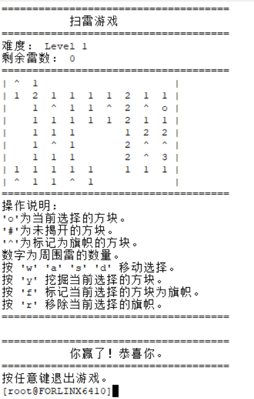
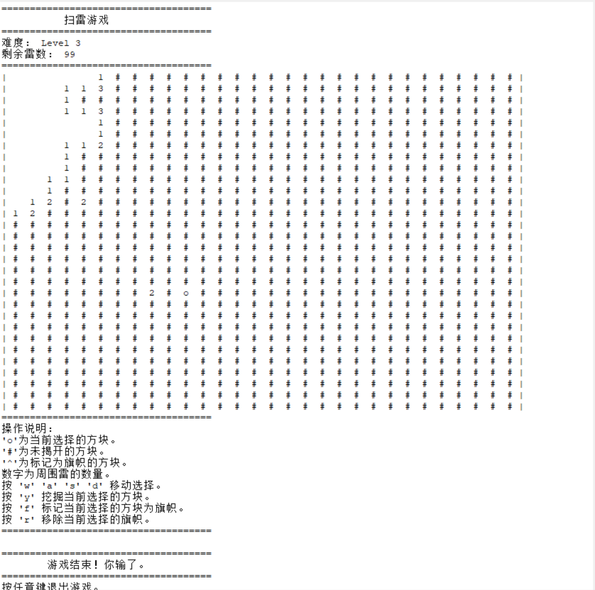

# 嵌入式系统 实验六

*PB21111733 牛庆源*

## 实验目的

* 编写扫雷程序，在开发板上运行（通过串口）

## 实验步骤

* 编写程序：

  1. 基础的扫雷程序：

     * `draw`：当前选择以 `o` 显示，未揭开的方块显示为 `#`，已标记的雷以 `^` 显示。

       ```c
       // 核心内容
           // 绘制地图
           int i, j;
           for (i = 0; i < n; ++i) {
               printf("|");  // 添加边框
               for (j = 0; j < m; ++j) {
                   if (i == x && j == y) {
                       printf(" o ");  // 当前选中的块
                   } else if (display[i][j] == 0) {
                       printf(" # ");  // 未揭开的块
                   } else if (display[i][j] == -1) {
                       printf(" ^ ");  // 标记为旗帜的块
                   } else if (chess[i][j] > 0) {
                       printf(" %c ", (char)(chess[i][j] + '0'));  // 显示数字
                   } else {
                       printf("   ");  // 空白块
                   }
               }
               printf("|\n");  // 每行结束后打印边框
           }
       ```

     * `input`：获取输入

       `'w'`, `'a'`, `'s'`, `'d'`：用于在地图上移动当前选中的方块。

       `'y'`：挖掘当前选中的方块。

       `'f'`：标记当前选中的方块为旗帜（表示猜测是雷）。

       `'r'`：移除当前选中的方块的旗帜。

       ```c
       // 核心内容
           char c;
           while (c = getchar()) {
               switch (c) {
                   case 'w':
                       *x = (*x - 1 + n) % n;
                       return 0;
                   case 'a':
                       *y = (*y - 1 + m) % m;
                       return 0;
                   case 's':
                       *x = (*x + 1) % n;
                       return 0;
                   case 'd':
                       *y = (*y + 1) % m;
                       return 0;
                   case 'y':
                       display[*x][*y] = 1;
                       return 1;
                   case 'f':
                       if (display[*x][*y] == 0) {
                           display[*x][*y] = -1;
                       }
                       return 0;
                   case 'r':
                       if (display[*x][*y] == -1) {
                           display[*x][*y] = 0;
                       }
                       return 0;
                   default:
                       break;
               }
           }
       ```
       
     * `init`：初始化地图。（注意保证第一个选中的位置不会是雷）

     * `fail`，`win`：判断游戏胜负。

     * `spread`：展开空白区域。

       ```c
       // 核心内容
       if (chess[x][y] != 0) return;
           memset(visited, 0, sizeof(visited));
           int head = 0, tail = 0;
           queue[tail][0] = x;
           queue[tail++][1] = y;
           visited[x][y] = 1;
           int i, j, dx, dy;
           while (head < tail) {
               i = queue[head][0];
               j = queue[head++][1];
               for (dx = -1; dx <= 1; ++dx) {
                   for (dy = -1; dy <= 1; ++dy) {
                       if (dx == 0 && dy == 0) continue;
                       int nx = i + dx, ny = j + dy;
                       if (nx < 0 || nx >= n || ny < 0 || ny >= m || display[nx][ny] < 0) continue;
                       display[nx][ny] = 1;
                       if (chess[nx][ny] == 0 && !visited[nx][ny]) {
                           visited[nx][ny] = 1;
                           queue[tail][0] = nx;
                           queue[tail++][1] = ny;
                       }
                   }
               }
           }
       ```

       

  2. 对Linux平台的适配：

     * 用`system("clear");`来取代`system("clr");`清除每一步的冗余屏显。

     * 实现即时响应：

       ```c
       #include <termios.h>
       #include <unistd.h>
       
       // 初始化非阻塞输入模式
       void init_terminal_mode() {
           struct termios newt;
           tcgetattr(STDIN_FILENO, &newt); // 获取当前终端设置
           newt.c_lflag &= ~(ICANON | ECHO); // 关闭缓冲和回显
           tcsetattr(STDIN_FILENO, TCSANOW, &newt); // 设置新模式
       }
       
       // 恢复默认终端模式
       void reset_terminal_mode() {
           struct termios newt;
           tcgetattr(STDIN_FILENO, &newt);
           newt.c_lflag |= ICANON | ECHO; // 恢复缓冲和回显
           tcsetattr(STDIN_FILENO, TCSANOW, &newt);
       }
       ```

       然后在`main`函数调用：

       ```c
       int main() {
           init_terminal_mode(); // 启用非阻塞模式
           // 游戏代码
           reset_terminal_mode(); // 恢复终端模式
           return 0;
       }
       ```

* 在Linux虚拟机上使用之前的`arm-linux-gcc-4.3.2`交叉编译程序。

  ```bash
  arm-linux-gcc -o final minesweeper.c
  ```

* 通过串口传输到开发板上运行（lab3内容），结果如下：

  * 难度一：

    

  * 难度三：

    


## 总结：

编写程序并为Linux平台做了适配，实现程序在开发板上的运行。