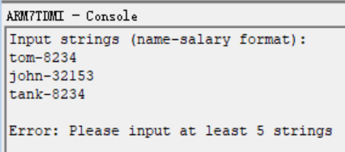
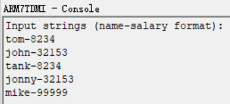
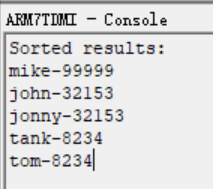

# 实验一

## PB21111733 牛庆源

---

* 字符串排序：使用字母组合表示姓名，使用数字组合表示薪水，可以定义一个字符串为“姓名-薪水”，比如“tom-8234"和”john-32153“。从键盘输入至少5个具有”姓名-薪水“格式的字符串。按照薪水的高低（从高到低）对字符串进行排序；如果薪水相同，则按照姓名的字母顺序（从小到大）进行排序。
  * 示例：对三个字符串“tom-8234”，“john-32153“和”tank-8234“进行排序，输出为：“john-32153“，”tank-8234“，“tom-8234”。
  * 实现要求：
    * 使用ADS编程模式，在ADS的console中显示输出结果
    * 使用C语言完成字符串的输入以及输出
    * 使用ARM汇编语言完成排序操作
  * 检查要求
    * 需要检查源代码和编译运行结果
    * 独立完成
    * 检查和提交实验报告

---

### 目录结构：

	└─EX1
		├─EX1_Data
	
		├─EX1.mcp
	
		├─main.c
	
		└─sort.s

### 实验思路：

#### main.c负责：

* 用户输入输出交互
* 数据存储结构定义
* 调用汇编程序进行排序

##### 具体实现：

* 按行读取输入，空行时输入结束

* 判断输入数量

* 调用汇编排序函数

##### 注意事项：

* ADS要求变量的声明必须放在所有逻辑命令之前

#### sort.s负责：

* 分割字符串
* 按照规则实现排序

##### 主体代码逻辑：

1. **保存与初始化**：
   - `STMFD sp!, {r4-r11, lr}`：将 `r4` 到 `r11` 寄存器及返回地址 `lr` 保存到栈中，以便后续恢复。
   - `MOV r4, r0` 和 `MOV r5, r1`：将数组首地址存入 `r4`，数组长度存入 `r5`。

2. **外层循环** (`outer_loop` 标签)：
   - `MOV r6, #0`：初始化索引 `i = 0`。
   - `SUB r7, r5, #1`：设定循环上限 `limit = length - 1`。
   - `MOV r8, #0`：初始化标志 `swapped = false` 表示是否发生交换。

3. **内层循环** (`inner_loop` 标签)：
   - `CMP r6, r7` 和 `BGE inner_loop_end`：如果 `i >= limit`，则跳出内层循环。
   - `LDR r9, [r4, r6, LSL #2]` 和 `LDR r10, [r4, r6+1, LSL #2]`：加载相邻两个字符串的指针，分别存入 `r9` 和 `r10`，即 `str1` 和 `str2`。

4. **薪水比较**：
   - `MOV r0, r9` 和 `BL find_salary_asm`：调用 `find_salary_asm` 函数，提取 `str1` 的薪水整数值，结果存入 `r11`。
   - `MOV r0, r10` 和 `BL find_salary_asm`：调用 `find_salary_asm` 提取 `str2` 的薪水整数值，结果存入 `r0`。
   - `CMP r11, r0` 和 `BLT swap`：比较 `str1` 和 `str2` 的薪水值。如果 `salary1 < salary2`，则跳转到 `swap` 标签交换两者（即薪水高的在前）。
   - `BNE no_swap`：如果薪水不相等，则无需比较姓名，跳过交换逻辑。

5. **姓名比较**（当薪水相等时）：
   - `MOV r0, r9` 和 `MOV r1, r10` 后 `BL compare_name_asm`：调用 `compare_name_asm` 比较 `str1` 和 `str2` 的姓名。
   - `CMP r0, #0` 和 `BLE no_swap`：如果 `str1` 小于或等于 `str2`，则不交换，跳过交换逻辑。

6. **交换操作** (`swap` 标签)：
   - `STR r10, [r4, r6, LSL #2]` 和 `STR r9, [r4, r6+1, LSL #2]`：交换 `str1` 和 `str2` 的指针位置。
   - `MOV r8, #1`：设置 `swapped = true`，标记发生了交换。

7. **外层循环检查**：
   - `CMP r8, #0` 和 `BNE outer_loop`：如果发生了交换，重新执行外层循环；否则排序结束。   
   - `LDMFD sp!, {r4-r11, pc}`：恢复寄存器并返回。

8. **自定义函数**：

   1. `find_salary_asm`：查找并转换薪水部分为整数

      该函数查找字符串中的 `'-'` 符号，然后将后面的字符逐个转换为整数形式的薪水值。

      * **流程**：
        * `LDRB r1, [r4], #1`：逐字节读取字符，直到找到 `'-'`。
        * `BNE salary_loop`：继续查找直到遇到 `'-'`，进入 `convert_loop`。
        * **转换薪水值**（循环 `convert_loop`）：
          * 检查字符是否为数字，如果是数字：
            * `SUB r1, r1, #'0'`：将字符从 ASCII 转换为数值。
            * `MUL r5, r5, #10` 和 `ADD r5, r5, r1`：将当前薪水值乘以 10，再加上新数字，累积成最终的整数值。（有误，具体看**实验过程中遇到的bug**一栏）
          * 退出循环后，将`r5` 中的薪水值返回。

   2. `compare_name_asm`：逐字符比较两个姓名的大小

      该函数逐字符比较两个姓名的字母顺序，并返回比较结果。

      * **流程**：
        * `LDRB r1, [r4], #1` 和 `LDRB r2, [r5], #1`：逐字节读取 `str1` 和 `str2` 的字符。
        * 比较字符：
          * `CMP r1, r2` 和 `BNE name_compare_end`：如果当前字符不相等，跳转到 `name_compare_end` 输出差值。
          * 检查字符串结束：
            * `CMP r1, #0` 和 `BEQ name_compare_equal`：如果字符相等且到达字符串末尾，返回 0 表示相等。
        * `SUB r0, r1, r2`：若字符不等，返回字符差值；若相等返回 0。

##### 实验过程中遇到的bug（或者注意事项）

1. 查过资料后发现可以直接在汇编代码中使用import来导入strcmp直接比较姓名，以及atoi直接比较薪水，但是感觉不太像汇编编程了。

2. 在`find_salary_asm`函数中，本来使用`MUL r5, r5, #10 `来实现乘10，但是不能有立即数，于是用寄存器保存这个立即数来实现，但是运行很长时间出现`dest == op1`的bug，又实用新的寄存器来存放运算结果但是仍然未消除，于是最后采用了移位指令来等效实现乘10的效果。

   ```assembly
   MOV     r2, r5, LSL #3      ; r2 = r5 * 8（左移 3 位相当于乘以 8）
   ADD     r5, r2, r5, LSL #1  ; r5 = r2 + (r5 * 2) = r5 * 10
   ADD     r5, r5, r1          ; r5 = r5 + 当前数字
   ```

### 运行与结果：

1. 输入少于五个字符串时：

   

2. 输入正确时：

   

   排序结果为：

   

### 具体代码

```c
// main.c
#include <stdio.h>
#include <string.h>

#define MAX_STR_LEN 50
#define MAX_ENTRIES 10

// 声明外部汇编函数
extern void sort_strings(char** strings, int count);

// 定义结构体存储字符串和指针
typedef struct {
    char data[MAX_ENTRIES][MAX_STR_LEN];
    char* ptrs[MAX_ENTRIES];
} StringArray;

int main(void) {
    // 所有变量声明放在函数开始处
    StringArray arr;
    int count = 0;
    int i;
    char temp;
    
    printf("Input strings (name-salary format):\n");
    
    // 读取输入
    while (count < MAX_ENTRIES) {
        // 读取一行输入
        i = 0;
        while (i < MAX_STR_LEN - 1) {
            temp = getchar();
            if (temp == '\n' || temp == EOF) {
                break;
            }
            arr.data[count][i++] = temp;
        }
        arr.data[count][i] = '\0';
        
        // 如果是空行，结束输入
        if (i == 0) {
            break;
        }
        
        arr.ptrs[count] = arr.data[count];
        count++;
        
        // 清除可能的多余输入
        while (temp != '\n' && temp != EOF) {
            temp = getchar();
        }
    }
    
    if (count < 5) {
        printf("Error: Please input at least 5 strings\n");
        return 1;
    }
    
    // 调用汇编排序函数
    sort_strings(arr.ptrs, count);
    
    printf("\nSorted results:\n");
    for (i = 0; i < count; i++) {
        printf("%s\n", arr.ptrs[i]);
    }
    
    return 0;
}
```


```assembly
    AREA    |.text|, CODE, READONLY

    EXPORT sort_strings

sort_strings
    STMFD   sp!, {r4-r11, lr}   ; 保存寄存器
    
    MOV     r4, r0              ; 保存数组指针
    MOV     r5, r1              ; 保存数组长度

outer_loop
    MOV     r6, #0              ; i = 0
    SUB     r7, r5, #1          ; limit = length - 1
    MOV     r8, #0              ; swapped = false

inner_loop
    CMP     r6, r7
    BGE     inner_loop_end

    ; 加载相邻字符串指针
    LDR     r9, [r4, r6, LSL #2]    ; str1
    ADD     r10, r6, #1
    LDR     r10, [r4, r10, LSL #2]  ; str2

    ; 找到薪水部分并转换为整数
    MOV     r0, r9
    BL      find_salary_asm
    MOV     r11, r0             ; salary1

    MOV     r0, r10
    BL      find_salary_asm     ; salary2 在 r0 中

    ; 比较薪水
    CMP     r11, r0
    BLT     swap                ; 如果 salary1 < salary2, 交换 (高薪在前)
    BNE     no_swap             ; 如果不相等, 无需比较姓名

    ; 薪水相等，逐字符比较姓名
    MOV     r0, r9
    MOV     r1, r10
    BL      compare_name_asm
    CMP     r0, #0
    BLE     no_swap             ; 如果 str1 <= str2, 不交换

swap
    ; 交换字符串指针
    STR     r10, [r4, r6, LSL #2]
    ADD     r10, r6, #1
    STR     r9, [r4, r10, LSL #2]
    MOV     r8, #1              ; swapped = true

no_swap
    ADD     r6, r6, #1          ; i++
    B       inner_loop

inner_loop_end
    CMP     r8, #0              ; 检查是否发生了交换
    BNE     outer_loop          ; 如果发生了交换，继续外层循环

    LDMFD   sp!, {r4-r11, pc}   ; 恢复寄存器并返回

; 查找并转换薪水部分为整数的函数
find_salary_asm
    STMFD   sp!, {r4, r5, lr}   ; 保存寄存器
    MOV     r4, r0              ; 保存字符串指针
    MOV     r5, #0              ; 初始化薪水值为0

salary_loop
    LDRB    r1, [r4], #1
    CMP     r1, #'-'            ; 查找 '-' 符号
    BNE     salary_loop

    ; 读取并转换薪水部分
convert_loop
    LDRB    r1, [r4], #1
    CMP     r1, #'0'            ; 检查是否为数字字符
    BLT     convert_end
    CMP     r1, #'9'
    BGT     convert_end

    ; 计算薪水的整数值: salary = salary * 10 + (r1 - '0')
    SUB     r1, r1, #'0'        ; 将 ASCII 字符转换为整数
    MOV     r2, r5, LSL #3      ; r2 = r5 * 8（左移 3 位相当于乘以 8）
    ADD     r5, r2, r5, LSL #1  ; r5 = r2 + (r5 * 2) = r5 * 10
    ADD     r5, r5, r1          ; r5 = r5 + 当前数字
    B       convert_loop

convert_end
    MOV     r0, r5              ; 返回薪水整数值
    LDMFD   sp!, {r4, r5, pc}   ; 恢复寄存器并返回

; 比较姓名的函数
compare_name_asm
    STMFD   sp!, {r4, r5, r6, lr} ; 保存寄存器
    MOV     r4, r0              ; 保存 str1 指针
    MOV     r5, r1              ; 保存 str2 指针

name_compare_loop
    LDRB    r1, [r4], #1
    LDRB    r2, [r5], #1
    CMP     r1, r2              ; 比较字符
    BNE     name_compare_end

    ; 检查是否到达字符串末尾
    CMP     r1, #0
    BEQ     name_compare_equal   ; 如果两者相等且结束，返回相等

    B       name_compare_loop

name_compare_end
    ; r1 - r2 的结果用于比较
    SUB     r0, r1, r2
    B       compare_exit

name_compare_equal
    MOV     r0, #0              ; 字符串相等

compare_exit
    LDMFD   sp!, {r4, r5, r6, pc} ; 恢复寄存器并返回

    END
```

