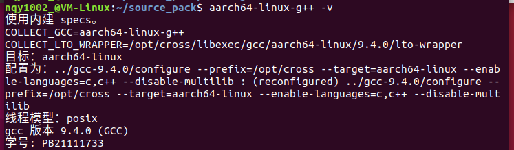
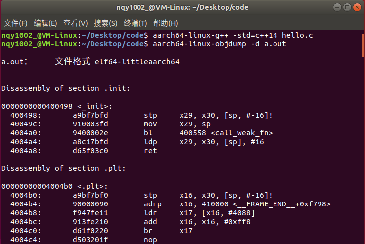
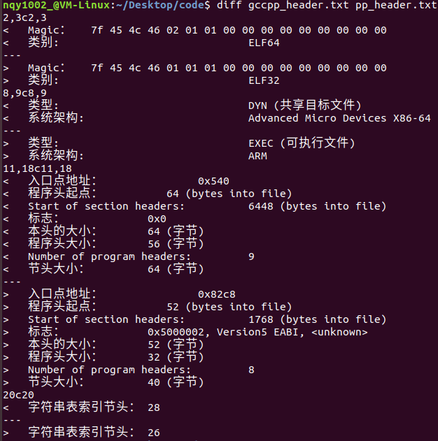
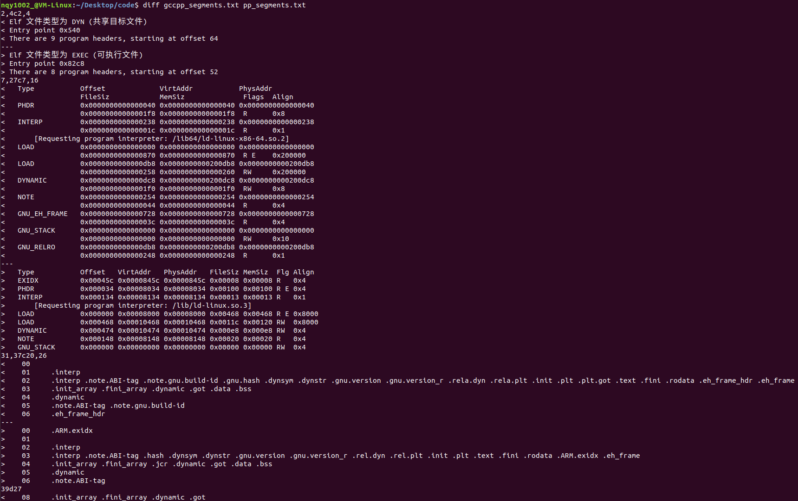
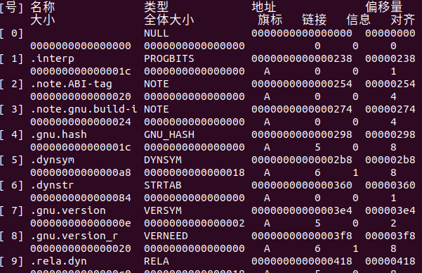
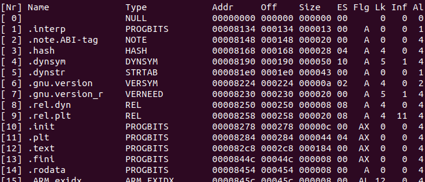
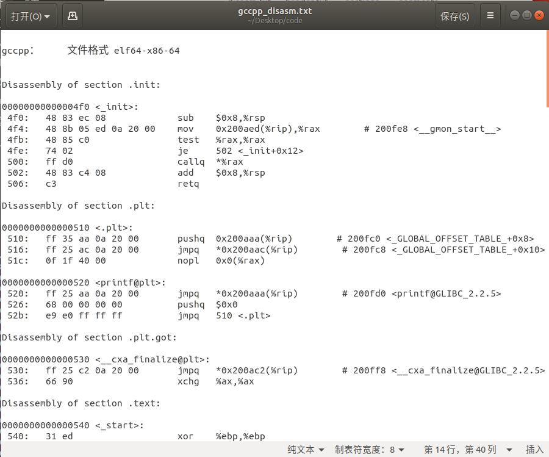
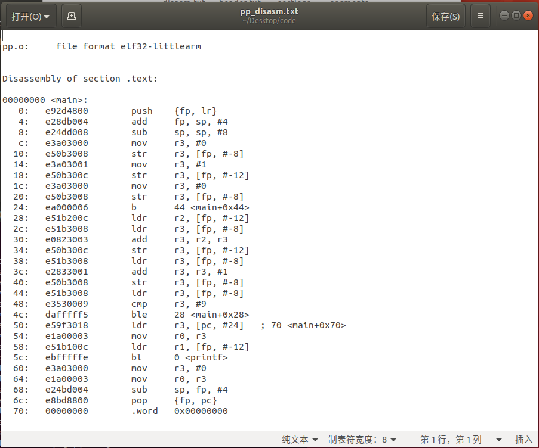
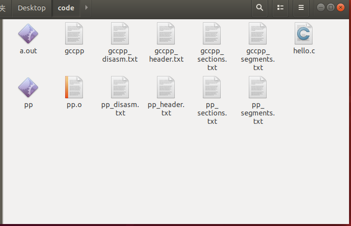

# 嵌入式系统 实验二

*PB21111733 牛庆源*

---

## 实验要求

* 生成交叉编译器：
  * 使用step-by-step的模式，编译一个你自己的arm-linux-gcc编译器。
  * 修改gcc的代码，使得gcc –v 的输出中包含个人的信息。
  * 使用C代码测试编译器。
* 在linux平台上面安装arm-linux- 工具链：
  * 写一个C语言程序。
  * 使用gcc和arm-gcc编译，比较生成的目标代码的区别。需要使用readelf和objdump等工具。
    * 重点分析ELF文件头部，分段等信息。

---

## 实验步骤：

### 生成交叉编译器：

#### 1. 按照教程（[如何构建 GCC 交叉编译器](https://preshing.com/20141119/how-to-build-a-gcc-cross-compiler/)）步骤，在我的Ubuntu18.04上构建GCC交叉编译器。

1. **准备工作：**

   软件包下载（下载较新的包，教程中的版本尝试之后发现运行失败）：

   ```sh
   sudo apt-get install g++ make gawk
   wget http://ftpmirror.gnu.org/binutils/binutils-2.28.1.tar.gz
   wget http://ftpmirror.gnu.org/gcc/gcc-9.4.0/gcc-9.4.0.tar.gz
   wget https://www.kernel.org/pub/linux/kernel/v4.x/linux-4.15.1.tar.xz
   wget http://ftpmirror.gnu.org/glibc/glibc-2.24.tar.xz
   wget http://ftpmirror.gnu.org/mpfr/mpfr-4.1.1.tar.xz
   wget http://ftpmirror.gnu.org/gmp/gmp-6.2.0.tar.xz
   wget http://ftpmirror.gnu.org/mpc/mpc-1.2.1.tar.gz
   ```

   *注：由于`isl`和`cloog`可选，而之前的各种包依赖关系比较复杂，固本实验中没有安装。*

   提取源包：

   ```sh
   for f in *.tar*; do tar xf $f; done
   ```

   创建GCC目录到其他一些目录的符号链接（依赖项）：

   ```sh
   cd gcc-9.4.0
   ln -s ../mpfr-4.1.1 mpfr
   ln -s ../gmp-6.2.0 gmp
   ln -s ../mpc-1.2.1 mpc
   cd ..
   ```

   选择安装目录并确定权限以及环境变量：

   ```sh
   sudo mkdir -p /opt/cross
   sudo chown nqy1002_ /opt/cross
   export PATH=/opt/cross/bin:$PATH
   ```

2. **binutils配置：**

   ```sh
   mkdir build-binutils
   cd build-binutils
   ../binutils-2.28.1/configure --prefix=/opt/cross --target=aarch64-linux --disable-multilib
   make -j4
   make install
   cd ..
   ```

3. **Linux内核头文件：**

   ```sh
   cd linux-4.15.1
   make ARCH=arm64 INSTALL_HDR_PATH=/opt/cross/aarch64-linux headers_install
   cd ..
   ```

4. **C/C++编译器：**

   ```sh
   mkdir -p build-gcc
   cd build-gcc
   ../gcc-9.4.0/configure --prefix=/opt/cross --target=aarch64-linux --enable-languages=c,c++ --disable-multilib
   make -j4 all-gcc
   make install-gcc
   cd ..
   ```

5. **标准C库头文件和启动文件：**

   ```sh
   mkdir -p build-glibc
   cd build-glibc
   CFLAGS="-O2 -Wno-error" ../glibc-2.24/configure --prefix=/opt/cross/aarch64-linux --build=$MACHTYPE --host=aarch64-linux --target=aarch64-linux --with-headers=/opt/cross/aarch64-linux/include --disable-multilib libc_cv_forced_unwind=yes
   make install-bootstrap-headers=yes install-headers
   make -j4 csu/subdir_lib
   install csu/crt1.o csu/crti.o csu/crtn.o /opt/cross/aarch64-linux/lib
   aarch64-linux-gcc -nostdlib -nostartfiles -shared -x c /dev/null -o /opt/cross/aarch64-linux/lib/libc.so
   touch /opt/cross/aarch64-linux/include/gnu/stubs.h
   cd ..
   ```

   *注：为确保交叉编译正确进行（保证兼容性），在configure时，由于系统将所有的warning都作error处理，不希望被警告中断编译，加入CFLAGS标识，`-O2`为二级优化，`-Wno-error`将所有警告转化为普通提示。*

6. **编译器支持库：**

   ```sh
   cd build-gcc
   make -j4 all-target-libgcc
   make install-target-libgcc
   cd ..
   ```

   *注：报错`PATH_MAX`未定义，找到发生error的位置*`gcc-9.4.0/libsanitizer/asan/asan_linux.cc`*并为`PATH_MAX`赋值`2048`*

7. **标注C库：**

   ```sh
   cd build-glibc
   make -j4
   make install
   cd ..
   ```

8. **标准C++库：**

   ```sh
   cd build-gcc
   make -j4
   make install
   cd ..
   ```


#### 2. 修改gcc代码，使得gcc –v 的输出中包含个人的信息。

1. 路径为：`gcc-9.4.0/gcc/gcc.c`。

2. 其中函数`print_configuration`用于输出gcc的配置信息，在最后一行加入：

   ```c
   fnotice(file, "学号：PB21111733\n");
   ```

   并保存文件。

3. `cd`到`build-gcc`目录，重新执行一遍 *1.4* 中的内容。

4. 输出结果如图：

   


#### 3. 使用C代码测试编译器。

编写C代码如下：

```c
//hello.c
#include <stdio.h>
int main()
{
   int i = 0, j = 1;
   for(i = 0; i < 10; i++)
   {
      j += i;
   }
   printf("%d", j);
   return 0;
}
```

测试汇编器：



可以看到顺利反汇编。


#### 其他事项：

在终端进行测试时，会出现`aarch64-linux-g++：未找到命令`的问题，是环境变量没有持久化导致的。

解决方法为：

* 编辑 `~/.bashrc` 文件：

  ```sh
  nano ~/.bashrc
  ```

* 添加`PATH`到文件末尾：

  ```sh
  export PATH=/opt/cross/bin:$PATH
  ```

* 保存，退出：

  ```sh
  source ~/.bashrc
  ```

* 重启虚拟机后问题解决。


### 在linux平台上面安装arm-linux- 工具链：

*注：安装了arm-linux-gcc-4.6.4*

#### 编写C语言程序如下（同上）：

```c
//hello.c
#include <stdio.h>
int main()
{
   int i = 0, j = 1;
   for(i = 0; i < 10; i++)
   {
      j += i;
   }
   printf("%d", j);
   return 0;
}
```


#### 使用gcc和arm-gcc编译，比较生成的目标代码的区别。需要使用readelf和objdump等工具。

编译：

```bash
arm-linux-gcc hello.c -o pp
arm-linux-gcc -c hello.c -o pp.o
gcc hello.c -o gccpp
```

1. **查看ELF文件头信息：**

   ```bash
   readelf -h gccpp > gccpp_header.txt
   readelf -h pp > pp_header.txt
   diff gccpp_header.txt pp_header.txt
   ```

   结果如下：

   

   发现两者的ELF文件头信息表明在**类别**，**类型**，**系统架构**，**入口点地址**等方面都有很大差异。

   |         | 类别  | 类型 | 系统架构 | 入口点地址 |
   | ------- | ----- | ---- | -------- | ---------- |
   | gcc     | ELF64 | DYN  | X86-64   | 0x540      |
   | arm-gcc | ELF32 | EXEC | ARM      | 0x82c8     |

   

2. **查看程序段信息：**

   ```bash
   readelf -l gccpp > gccpp_segments.txt
   readelf -l pp > pp_segments.txt
   diff gccpp_segments.txt pp_segments.txt
   ```

   结果如下：

   

   通过对比也能发现两者在**Type**，**Offset和Vaddr**，**Size和Align**等方面的不同（详见上图）。

3. **查看段表信息：**

   ```bash
   readelf -S gccpp > gccpp_sections.txt
   readelf -S pp > pp_sections.txt
   diff gccpp_sections.txt pp_sections.txt
   ```

   结果如下：

   gcc：

   

   arm-gcc：

   

   可以发现他们在段的**名称**、**大小**、**对齐方式**等方面有所不同。

4. **反汇编二进制代码：**

   ```bash
   objdump -d gccpp > gccpp_disasm.txt
   arm-linux-objdump -d pp.o > pp_disasm.txt
   diff gccpp_disasm.txt pp_disasm.txt
   ```

   对比得出两者**指令集**、**指令顺序**以及**处理方式**等方面的区别（比较显然的是，gcc汇编了例如`<_init>`在内的很多内容，而arm-gcc只有`<main>`），如图：

   gcc：

   

   arm-gcc：

   

#### 其他事项：

实验后的文件目录：

