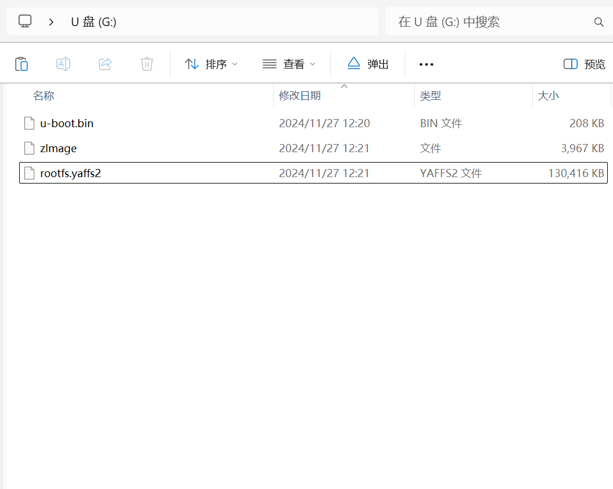
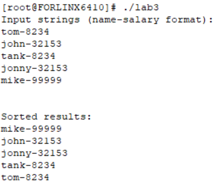

# 嵌入式系统 实验三

*PB21111733 牛庆源*

---

## 实验要求

* 将实验一中设计的字符串排序的代码，修改成gnu格式的代码，使用交叉编译器进行编译。
  * 生成的代码，利用网口，加载到开发板上运行。
* 实验要求：
  * 代码部分独立完成。
  * 开发板配置，代码上传等可以互相探讨。
  * 检查代码，操作，运行结果等。
  * 提交实验报告。

---

## 实验步骤：

### 1. 修改ARM汇编代码：

1. 段声明修改：

   * ARM 汇编使用 `AREA` 来定义代码段，并用 `EXPORT` 声明全局函数。
   * GNU 汇编使用 `.section` 指令声明段，`.text` 是代码段的标准名称。同时，`.global` 用于声明全局符号以供外部链接。

   ```assembly
   .section .text
   .global sort_strings
   ```

2. 寄存器保护与恢复：

   * 在 GNU 汇编中，使用`push` 和 `pop` ，等价于 `STMFD sp!, {...}` 和 `LDMFD sp!, {...}`。

3. 注释格式：

   * ARM 汇编使用分号 `;` 作为注释符号。
   * GNU 汇编则使用 `@` 作为注释符号。

4. 指令格式：

   * GNU 汇编指令是大小写不敏感的，但通常使用小写表示操作指令。
   * GNU 格式中无需对指令和操作数进行额外对齐。

5. 结束指令移除：

   * ARM 汇编使用 `END` 表示文件结束。
   * GNU 汇编不需要此指令，文件内容到结尾即完成。

6. 全局标签声明：

   * 在 GNU 汇编中，`.global`（或 `.globl`）用来声明符号为全局变量，供链接器识别。

7. 函数标签格式：

   * 在 GNU 汇编中，函数名后必须加 `:`，明确标识为标签。

### 2. 使用交叉编译器编译

1. 安装 `gcc-arm-linux-gnueabi` ：

   ```bash
   sudo apt install gcc-arm-linux-gnueabi
   ```

2. 交叉编译lab1的c文件和刚刚修改过后的s文件：

   ```bash
   arm-linux-gnueabi-gcc -c main.c -o main.o
   arm-linux-gnueabi-as -o sort.o sort.s
   arm-linux-gnueabi-gcc -o lab3 main.o sort.o
   ```

   得到的 `lab3` 作为可执行文件。

### 3. 开发板操作

1. 参照**手册操作**（从 2-4 开始）将Linux系统加载到开发板上。

   SD卡内容如下：

   

   烧写过程见手册，略。

   *一些兼容性问题：将 SD-Writer.exe 以 win7 兼容，管理员模式运行。*

2. 使用串口线将开发板连接电脑，下载相应驱动并调整设置。

   兼容性问题：[windows10更新windows11后，发现不支持PL2303TA（PL2303TA不支援WINDOWS 11及后续版本，请洽询购买厂商）_pl2303win11-CSDN博客](https://blog.csdn.net/qq_43322436/article/details/121122232)

   该文末附了驱动下载链接。

3. 在 HyperTerminal 上新建一个对应串口的连接。

   HyperTerminal 下载：[HyperTerminal超级终端汉化版下载(附使用教程) v2.7.6 - 软件学堂](https://www.xue51.com/soft/50593.html)

4. 参照**手册**将虚拟机上的 `lab3` 通过 HyperTerminal 传到开发板上。

   我先把它传到自己的机器上，然后使用 ZModeM 传输方式传输到开发板上。

   ```bash
   cd mnt
   rz
   # 在HyperTerminal上使用ZModeM从机器传到开发板上
   ls # 确认文件是否传输成功
   ls -l lab3 # 查看文件权限
   chmod +x lab3 # 为lab3添加可执行权限
   ```

5. 在 HyperTerminal 上运行可执行文件。

   ```bash
   ./lab3
   ```

### 4. 运行过程与结果：

* 输入：

  ```bash
  tom-8234
  john-32153
  tank-8234
  jonny-32153
  mike-99999
  ```

* 运行结果：

  

## 总结：

1. 学到了gnu格式的汇编代码，以及gnu交叉编译。
2. 学会使用开发板运行程序。

## 附修改后的汇编代码：

```assembly
    .section .text
    .global sort_strings

sort_strings:
    push {r4-r11, lr}           @ 保存寄存器

    mov r4, r0                  @ 保存数组指针
    mov r5, r1                  @ 保存数组长度

outer_loop:
    mov r6, #0                  @ i = 0
    sub r7, r5, #1              @ limit = length - 1
    mov r8, #0                  @ swapped = false

inner_loop:
    cmp r6, r7
    bge inner_loop_end

    @ 加载相邻字符串指针
    ldr r9, [r4, r6, lsl #2]    @ str1
    add r10, r6, #1
    ldr r10, [r4, r10, lsl #2]  @ str2

    @ 找到薪水部分并转换为整数
    mov r0, r9
    bl find_salary_asm
    mov r11, r0                 @ salary1

    mov r0, r10
    bl find_salary_asm          @ salary2 在 r0 中

    @ 比较薪水
    cmp r11, r0
    blt swap                    @ 如果 salary1 < salary2, 交换 (高薪在前)
    bne no_swap                 @ 如果不相等, 无需比较姓名

    @ 薪水相等，逐字符比较姓名
    mov r0, r9
    mov r1, r10
    bl compare_name_asm
    cmp r0, #0
    ble no_swap                 @ 如果 str1 <= str2, 不交换

swap:
    @ 交换字符串指针
    str r10, [r4, r6, lsl #2]
    add r10, r6, #1
    str r9, [r4, r10, lsl #2]
    mov r8, #1                  @ swapped = true

no_swap:
    add r6, r6, #1              @ i++
    b inner_loop

inner_loop_end:
    cmp r8, #0                  @ 检查是否发生了交换
    bne outer_loop              @ 如果发生了交换，继续外层循环

    pop {r4-r11, pc}            @ 恢复寄存器并返回

@ 查找并转换薪水部分为整数的函数
find_salary_asm:
    push {r4, r5, lr}           @ 保存寄存器
    mov r4, r0                  @ 保存字符串指针
    mov r5, #0                  @ 初始化薪水值为0

salary_loop:
    ldrb r1, [r4], #1
    cmp r1, #'-'                @ 查找 '-' 符号
    bne salary_loop

    @ 读取并转换薪水部分
convert_loop:
    ldrb r1, [r4], #1
    cmp r1, #'0'                @ 检查是否为数字字符
    blt convert_end
    cmp r1, #'9'
    bgt convert_end

    @ 计算薪水的整数值: salary = salary * 10 + (r1 - '0')
    sub r1, r1, #'0'            @ 将 ASCII 字符转换为整数
    mov r2, r5, lsl #3          @ r2 = r5 * 8（左移 3 位相当于乘以 8）
    add r5, r2, r5, lsl #1      @ r5 = r2 + (r5 * 2) = r5 * 10
    add r5, r5, r1              @ r5 = r5 + 当前数字
    b convert_loop

convert_end:
    mov r0, r5                  @ 返回薪水整数值
    pop {r4, r5, pc}            @ 恢复寄存器并返回

@ 比较姓名的函数
compare_name_asm:
    push {r4, r5, r6, lr}       @ 保存寄存器
    mov r4, r0                  @ 保存 str1 指针
    mov r5, r1                  @ 保存 str2 指针

name_compare_loop:
    ldrb r1, [r4], #1
    ldrb r2, [r5], #1
    cmp r1, r2                  @ 比较字符
    bne name_compare_end

    @ 检查是否到达字符串末尾
    cmp r1, #0
    beq name_compare_equal      @ 如果两者相等且结束，返回相等

    b name_compare_loop

name_compare_end:
    @ r1 - r2 的结果用于比较
    sub r0, r1, r2
    b compare_exit

name_compare_equal:
    mov r0, #0                  @ 字符串相等

compare_exit:
    pop {r4, r5, r6, pc}        @ 恢复寄存器并返回

```

