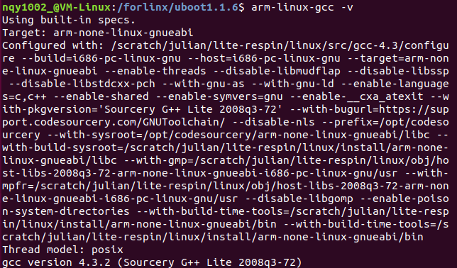
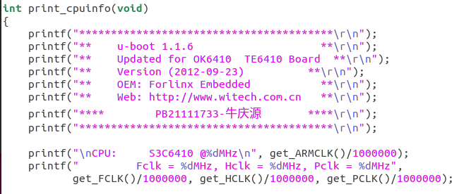
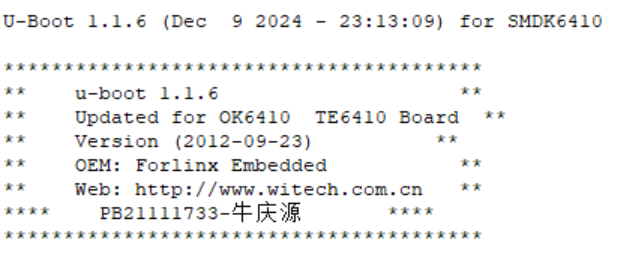

# 嵌入式系统 实验四

*PB21111733 牛庆源*

---

## 实验要求

* 编译uboot，在开发板上面启动操作系统
  * 要求：Uboot运行时，通过串口在主机显示器上面显示个人信息（学号，姓名的拼音）。
* 简要分析uboot的第二阶段文件，说明做了哪些工作。
* 提交实验结果和实验报告。

---

## 实验步骤

*注：参照用户手册*

### 1. 下载必要文件并解压

下载：

`uboot1.1.6-V5.50-2014-09-19.tar.gz`

`arm-linux-gcc-4.3.2.tgz`

```bash
sudo mkdir -p /forlinx
sudo cp uboot1.1.6-V5.50-2014-09-19.tar.gz /forlinx
sudo cp arm-linux-gcc-4.3.2.tgz /forlinx
```


### 2. 安装交叉编译器

*注：参照手册7-5*

```bash
cd /forlinx
sudo mkdir /usr/local/arm #若目录已存在会提示错误无所谓
tar zxvf arm-linux-gcc-4.3.2.tgz -C /
sudo vi /etc/profile #添加环境变量
```

添加：

```bash
export PATH=/usr/local/arm/4.3.2/bin:$PATH
export TOOLCHAIN=/usr/local/arm/4.3.2
export TB_CC_PREFIX=arm-linux-
export PKG_CONFIG_PREFIX=$TOOLCHAIN/arm-none-linux-gnueabi
```

保存退出后**重启虚拟机**以应用环境变量更改。

执行

```bash
arm-linux-gcc -v
```

结果如下：




### 3. 编译uboot1.1.6

*注：参照手册8-1*

解压并修改启动时的显示内容：

```bash
cd /forlinx
sudo tar zxf uboot1.1.6-V5.50-2014-09-19.tar.gz
```

修改`/forlinx/uboot1.1.6/cpu/s3c64xx/s3c6410/speed.c`文件的`print_cpuinfo`如下：



配置config：

```bash
cd uboot1.1.6
make forlinx_nand_ram256_config #上一次实验用的256M内存沿用
make clean
make
```

成功后下载`uboot.bin`。

**一些报错：**
有关`drivers/video`的`Makefile`报错，方法为：

1. 检查目录权限：

   ```bash
   ls -ld /forlinx/uboot1.1.6/drivers/video
   ```

2. 权限不足则用`chmod`为目录添加写权限：

   ```bash
   sudo chmod -R u+w /forlinx/uboot1.1.6/drivers/video
   ```

3. 若是文件夹权限问题，则可以直接修改目录所有者为当前用户：

   ```bash
   sudo chown -R nqy1002_ /forlinx/uboot1.1.6/drivers/video
   ```

4. 然后重新

   ```bash
   make clean
   make
   ```

有关`System.map`的报错，同理：

```bash
ls -ld /forlinx/uboot1.1.6
sudo chmod -R u+w /forlinx/uboot1.1.6
sudo chown -R nqy1002_ /forlinx/uboot1.1.6
```

**找到修改位置的方法：**

1. 不修改，直接按照顺序做下去（第4步结束），然后观察开机信息。
2. 按照开机信息文本搜索uboot1.1.6中的文件，找到对应位置。
3. 然后修改后重新操作。


### 4. 下载，烧写并连接串口启动开发板

将`uboot.bin`下载到SD卡中（可以选择删除之前的`uboot.bin`）

将开发板重新按SD卡启动然后烧写（上一次实验的步骤）

拨动八位开关至开机样，连接串口，并开机。

显示如下：




### 5. Uboot第二阶段文件分析

#### Uboot第二阶段在`uboot1.1.6/lib_arm/board.c`的`start_armboot`函数

1. 初始化堆空间

   ```c
   	gd = (gd_t*)(_armboot_start - CFG_MALLOC_LEN - sizeof(gd_t));
   	/* compiler optimization barrier needed for GCC >= 3.4 */
   	__asm__ __volatile__("": : :"memory");
   	memset ((void*)gd, 0, sizeof (gd_t));
   	gd->bd = (bd_t*)((char*)gd - sizeof(bd_t));
   	memset (gd->bd, 0, sizeof (bd_t));
   	monitor_flash_len = _bss_start - _armboot_start;
   ```

2. 执行初始化序列

   ```c
   	for (init_fnc_ptr = init_sequence; *init_fnc_ptr; ++init_fnc_ptr) {
   		if ((*init_fnc_ptr)() != 0) {
   			hang ();
   		}
   	}
   ```

   ```c
   init_fnc_t *init_sequence[] = {
   	cpu_init,		/* basic cpu dependent setup */
   	board_init,		/* basic board dependent setup */
   	interrupt_init,		/* set up exceptions */
   	env_init,		/* initialize environment */
   
   	init_baudrate,		/* initialze baudrate settings */
   	serial_init,		/* serial communications setup */
   	console_init_f,		/* stage 1 init of console */
   	display_banner,		/* say that we are here */
   #if defined(CONFIG_DISPLAY_CPUINFO)
   	print_cpuinfo,		/* display cpu info (and speed) */
   #endif
   #if defined(CONFIG_DISPLAY_BOARDINFO)
   	checkboard,		/* display board info */
   #endif
   	dram_init,		/* configure available RAM banks */
   	display_dram_config,
   
   	NULL,
   };
   ```

3. nand初始化

   ```c
   	nand_init();		/* go init the NAND */
   ```

4. 初始化环境变量

   ```c
   	/* initialize environment */
   	env_relocate ();
   ```

5. 进入主循环

   ```c
   	/* main_loop() can return to retry autoboot, if so just run it again. */
   	for (;;) {
   		main_loop ();
   	}
   ```


#### 主循环（在`uboot1.1.6/common/main.c`中）

1. 获得倒计时

   ```c
   #if defined(CONFIG_BOOTDELAY) && (CONFIG_BOOTDELAY >= 0)
   	s = getenv ("bootdelay");
   	bootdelay = s ? (int)simple_strtol(s, NULL, 10) : CONFIG_BOOTDELAY;
   
   	debug ("### main_loop entered: bootdelay=%d\n\n", bootdelay);
   ```

2. 启动命令

   ```c
   s = getenv ("bootcmd");
   ```

3. 启动内核

   ```c
   	if (bootdelay >= 0 && s && !abortboot (bootdelay)) {
   # ifdef CONFIG_AUTOBOOT_KEYED
   		int prev = disable_ctrlc(1);	/* disable Control C checking */
   # endif
   
   # ifndef CFG_HUSH_PARSER
   		run_command (s, 0);
   # else
   		parse_string_outer(s, FLAG_PARSE_SEMICOLON |
   				    FLAG_EXIT_FROM_LOOP);
   # endif
   
   # ifdef CONFIG_AUTOBOOT_KEYED
   		disable_ctrlc(prev);	/* restore Control C checking */
   # endif
   	}
   ```

   

## 总结：

1. 学会了编译uboot。
1. 了解了uboot启动的两个阶段，并查看了第二阶段对应文件的代码。
