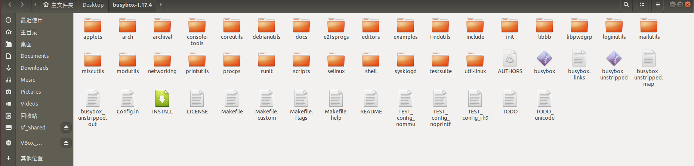
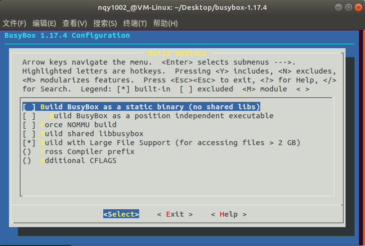
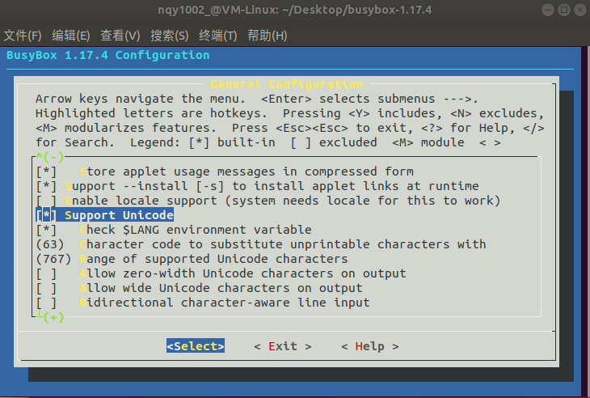
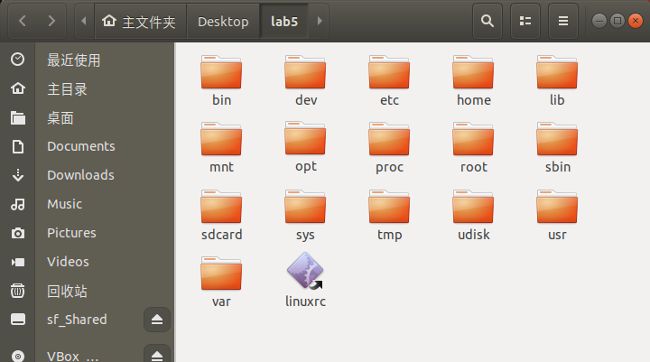
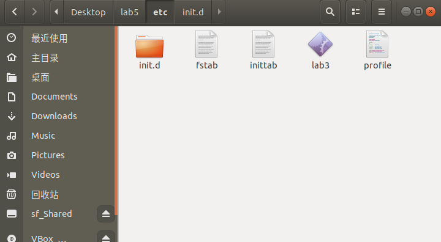
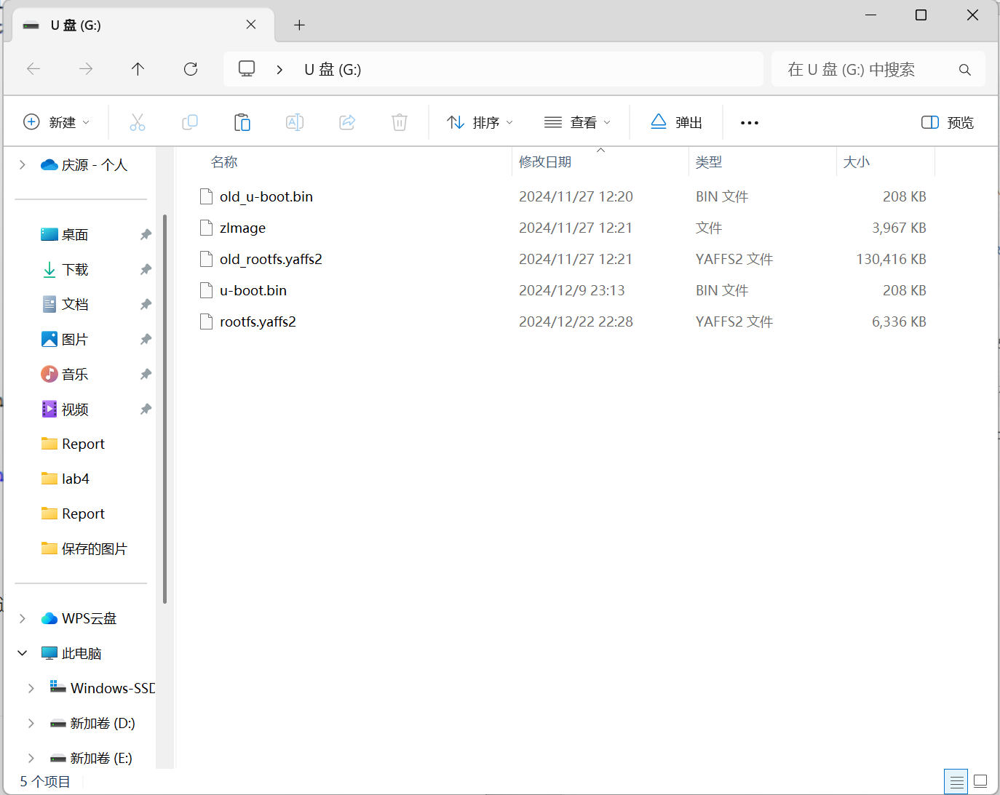
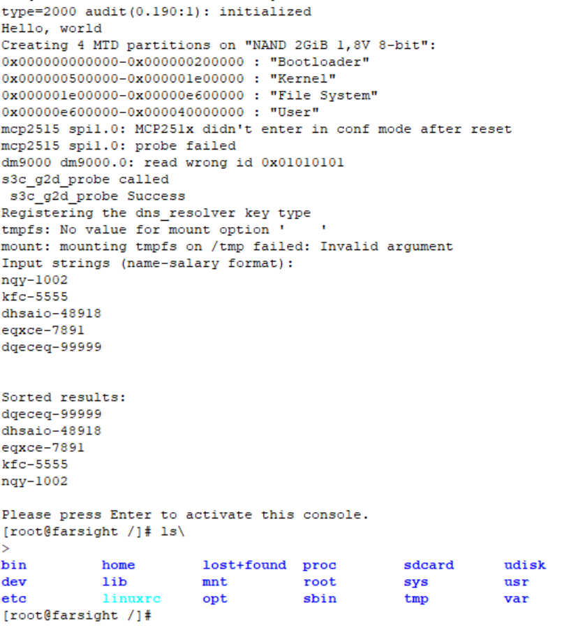

# 嵌入式系统 实验五

*PB21111733 牛庆源*

---

## 实验要求

* 基于busybox制作根文件系统

  * 参考：

    https://embedded.feishu.cn/mindnotes/bmncnTpw7WHoKqzmoeZQEOdxfgc

    《OK6410-A开发板LINUX3.0.1-2014-09用户手册》第9章，第2章

* 要求：

  * 基于busybox创建根文件系统
    * 在开发板上使用自己生成的文件系统
    * 开机启动自己lab3中的字符串排序程序
  * 提交实验报告
    * 需要包含详细的文件系统创建流程，包含如何实现开机启动自己的程序等

---

## 实验步骤

*参照：[通过busybox制作根文件系统 - 管理员D - 博客园](https://www.cnblogs.com/electronic/p/11146614.html)*

### 1. 下载必要文件并解压

**由于上一个实验中使用的交叉编译链版本为4.3.2版本的arm-linux-gcc，使用比较新的busybox版本会导致变量未定义等错误，这里使用了1.17.4的BusyBox版本**

官网下载：[Index of /downloads](https://busybox.net/downloads/)，然后解压。




### 2. 使用BusyBox构建根文件系统

*这一部分参照了[Linux学习笔记---使用BusyBox创建根文件系统(一)_busybox编译成功以后文件在哪儿-CSDN博客](https://blog.csdn.net/qq_20222919/article/details/116270102)*

1. 修改`Makefile`

   1. 指定交叉编译器路径：在164行修改为（上个实验中安装的编译器的路径）：

      `CROSS_COMPILE ?= /usr/local/arm/4.3.2/bin/arm-linux-`

   2. 指定架构：在190行修改为：

      `ARCH ?= arm`

2. 配置 BusyBox

   ```bash
   make menuconfig
   ```

   如若报错，应该是缺少依赖库，安装：

   ```bash
   sudo apt-get install libncurses5-dev
   ```

   然后重新运行`make menuconfig`。

   修改配置（优化和可选）：

   * `Busybox Settings ---> Build Options ---> Build BusyBos as a static binary`

     取消勾选，因为静态编译太费空间。

     

   * `Busybox Settings ---> Busybox Library Tuning ---> vi-style line editing commands`

     勾选，如果后续需要配置其`config`则方便使用`vi`配置。

   * `Linux Module Utilities ---> Simplified modutils`

     取消勾选。

   * `Linux System Utilities ---> mdev`

     勾选其以及其子项。

   * `Busybox Settings ---> General Configuration ---> Support Unicode`

     勾选其以及其子项，支持中文显示（？）

     

3. 编译BusyBox

   ```bash
   make install CONFIG_PREFIX=~/Desktop/lab5/  # 指定一个自己想要的路径
   ```

   **如果直接成功，在指定文件夹下生成了`linuxrc`文件和`bin`，`sbin`等文件夹，则直接跳过接下来的BUG环节**

   ***BUG 环节：***（注：是在使用 $\underline {BusyBox1.30.0}$ 版本时遇到的诸多BUG，修了一会之后发现很多，直接回退BusyBox版本到现在的1.17.4后没有后续报错，但不保证没有之前已经修好的报错，所以罗列在这里）

   1. 报错如下：

      ```bash
      /usr/local/arm/4.3.2/bin/../arm-none-linux-gnueabi/libc/usr/include/sys/types.h:248: error: conflicting types for 'blkcnt_t'
      ```

      *（注：此处路径为相对于`/usr/local/arm/4.3.2/arm-none-linux-gnueabi/libc/usr/include/`的路径）*

      **原因**：`blkcnt_t`在`sys/types.h`和`linux/types.h`中被定义为两种不同类型导致冲突。

      **解决方法**：将`linux/types.h`中的

      ```c
      #ifdef CONFIG_LSF
      typedef u64 blkcnt_t;
      #else
      typedef unsigned long blkcnt_t;
      #endif
      ```

      修改为：

      ```c
      #ifndef blkcnt_t
      #ifdef CONFIG_LSF
      typedef u64 blkcnt_t;
      #else
      typedef unsigned long blkcnt_t;
      #endif
      #endif
      ```

   2. 报错如下：

      ```bash
      /usr/local/arm/4.3.2/bin/../arm-none-linux-gnueabi/libc/usr/include/sys/select.h:78: error: conflicting types for 'fd_set'
      /usr/local/arm/4.3.2/bin/../arm-none-linux-gnueabi/libc/usr/include/linux/types.h:12: error: previous declaration of 'fd_set' was here
      scripts/Makefile.build:197: recipe for target 'libbb/capability.o' failed
      make[1]: *** [libbb/capability.o] Error 1
      Makefile:743: recipe for target 'libbb' failed
      make: *** [libbb] Error 2
      ```

      *（注：此处路径为相对于`/usr/local/arm/4.3.2/arm-none-linux-gnueabi/libc/usr/include/`的路径）*

      **原因**：冲突发生在 `sys/select.h` 和 `linux/types.h` 中的 `fd_set` 定义。编译器可能在编译某些模块时同时引用了两个头文件。

      **解决方法**：修改`linux/capability.h`中的

      ```c
      #include <linux/types.h>
      ```

      修改为

      ```c
      #include <sys/types.h>
      #undef fd_set
      #include <linux/types.h>
      ```

      保证在引用fd_set时没有类型上的冲突。

   3. 报错如下：

      ```bash
      util-linux/lib.a(nsenter.o): In function nsenter_main':
      nsenter.c:(.text.nsenter_main+0x17c): undefined reference to setns'
      coreutils/lib.a(sync.o): In function sync_main':
      sync.c:(.text.sync_main+0x68): undefined reference to syncfs'
      collect2: ld returned 1 exit status
      Note: if build needs additional libraries, put them in CONFIG_EXTRA_LDLIBS.
      Example: CONFIG_EXTRA_LDLIBS="pthread dl tirpc audit pam"
      Makefile:718: recipe for target 'busybox_unstripped' failed
      make: *** [busybox_unstripped] Error 1
      ```

      **原因**：`glibc`版本较低导致没有定义`setns`和`syncfs`，所以无法引用。

      **解决方法**：回退BusyBox版本到1.17.4就没有这俩的引用啦！！！！！！

4. 补全文件系统：

   工作目录切换到`~/Desktop/lab5/`（之前指定的目录）

   1. 创建Linux根目录项：

      ```bash
      mkdir dev etc home lib mnt proc root sys tmp var -p # 创建目录，下图比较完整
      ```

      

   2. 创建一些文件和修改文件内容：

      1. ```bash
         touch etc/inittab
         ```

         添加内容如下：

         ```
         #this is run first except when booting in single-user mode.
         ::sysinit:/etc/init.d/rcS
         # /bin/sh invocations on selected ttys
         ::respawn:-/bin/sh
         # Start an "askfirst" shell on the console (whatever that may be)
         ::askfirst:-/bin/sh
         # Stuff to do when restarting the init process
         ::restart:/sbin/init
         # Stuff to do before rebooting
         ::ctrlaltdel:/sbin/reboot
         ::shutdown:/sbin/swapoff -a
         ```

      2. ```bash
         mkdir etc/init.d/ -p
         ```

      3. ```bash
         touch etc/init.d/rcS
         ```

      4. ```bash
         gedit etc/init.d/rcS
         ```

         编辑如下：

         ```bash
         #!/bin/sh
         #This is the first script called by init process
         /bin/mount -a
         echo /sbin/mdev>/proc/sys/kernel/hotplug
         mdev -s
         
         # 运行自己在lab3中实现的程序
         /etc/lab3
         ```

         修改权限：

         ```bash
         chmod -R 777 rcS
         ```

      5. ```bash
         touch etc/fstab
         ```

         ```bash
         gedit etc/fstab
         ```

         编辑如下：

         ```
         #device     mount-point     type         options       dump     fsck order
         proc        /proc           proc         defaults        0        0
         tmpfs       /tmp            tmpfs    　　 defaults        0        0
         sysfs       /sys            sysfs        defaults        0        0
         tmpfs       /dev            tmpfs        defaults        0        0
         ```

      6. ```bash
         touch etc/profile
         ```

         ```bash
         gedit etc/profile
         ```

         编辑如下：

         ```bash
         #!/bin/sh
         export HOSTNAME=farsight
         export USER=root
         export HOME=root
         export PS1="[$USER@$HOSTNAME \W]\# "
         #export PS1="[\[\033[01;32m\]$USER@\[\033[00m\]\[\033[01;34m\]$HOSTNAME\[\033[00m\ \W]\$ "
         PATH=/bin:/sbin:/usr/bin:/usr/sbin
         LD_LIBRARY_PATH=/lib:/usr/lib:$LD_LIBRARY_PATH
         export PATH LD_LIBRARY_PATH
         ```

      7. **（重要）**将自己lab3中的文件放到`etc`目录下。

      最后的`etc`目录如下：

      

   3. 移植动态库文件

      将`/usr/local/arm/4.3.2/arm-none-linux-gnueabi/libc/lib`中的库文件复制到自己创建的文件系统的`lib`下：（在上述目录中操作）

      ```bash
      nqy1002_@VM-Linux:/usr/local/arm/4.3.2/arm-none-linux-gnueabi/libc/lib$ cp -a *so* *.a ~/Desktop/lab5/lib #自己创建的文件系统的lib位置
      ```

      再偷懒将用户光盘中`Linux-3.0.1/filesystem/FileSystem-Yaffs2-V5.40-2014-7-29.tar.gz`解压后 `usr/lib` 中的内容复制到自己的`usr/lib`中。

5. 创建文件系统映像

   *注：参考用户手册第9章*

   下载用户光盘的`Linux-3.0.1/filesystem/Yaffs2文件系统制作工具/mkyaffs2image-nand2g`并上传到虚拟机。（256m的版本后续开机会报错...）

   运行：

   ```bash
   ./mkyaffs2image-nand2g lab5 rootfs.yaffs2 #注意路径
   ```

   得到`rootfs.yaffs2`。

6. 存到SD卡后上板验证即可。

   实验后SD卡内容如下：

   


### 3. 实验结果：

上板验证结果如下：



可以看到运行了排序程序后进入系统，`ls`指令也正常运行。


## 总结：

1. 了解了Linux文件系统的基本组成部分以及作用。
1. 使用BusyBox制作文件系统，并使开机时运行自己的排序程序。
1. 踩了很多有关版本问题的坑。