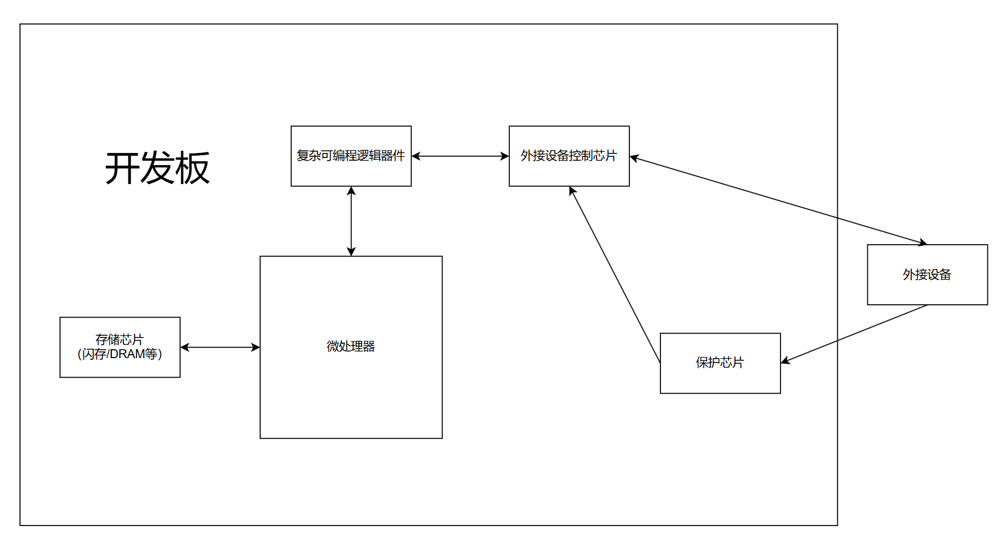

# 嵌入式系统 HW1

## PB21111733 牛庆源

* 拆解开发板，并回答以下问题

  * 开发板上最大的几块芯片的型号，功能分别是什么？

    1. SAMSUNG 822 K9F2G08U0M，为闪存芯片，用于存储数据，即使在电源关闭时也能保留数据。
    2. Hynix H5MS5162DFR-J3M，为DRAM芯片，动态存储器，断电数据消失。
    3. MCIMX233DJM4C，微处理器，用于控制整个微型计算机工作。
    4. Xilinx XC2C64A，CPLD，复杂可编程逻辑器件，是用户可以根据各自需要自行构造逻辑功能的数字集成电路。
    5. ASIX AX88772B，低功耗USB2.0转百兆以太网控制器芯片，可为各类应用增加低成本、小封装、即插即用的百兆以太网连网特性。
    6. MAXIM MAX3232E，为+3.0V供电的EIA/TIA-232和V.28/V.24通信接口芯片，为所有发送器输出和接收器输入提供保护。
    7. GL850G，USB2.0HUB控制器，响应来自USB主机的请求。
    8. ...

  * 这些模块是怎么互联的？

    用开发板上的引脚以及铜线互联。

  * 开发板通过哪些模块与外界交互？

    1. 输入：一些按钮和开关，USB2.0以及一些其他接口。
    2. 输出：通过输出接口连接屏幕，音频设备输出。

* 简述开发板的组成，需要画图说明

  

