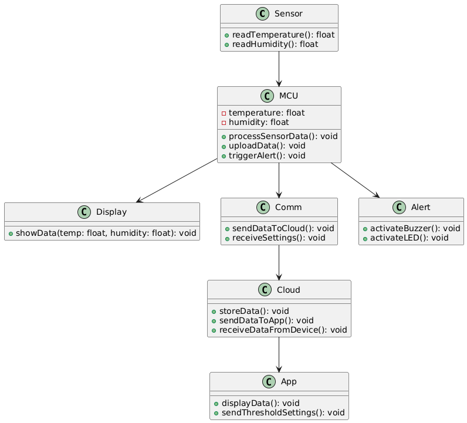
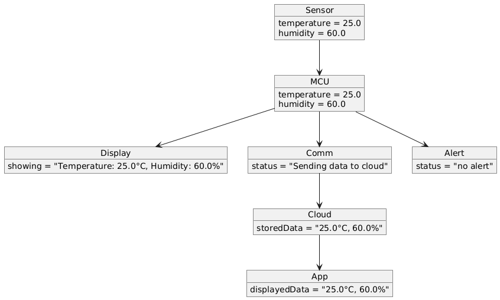
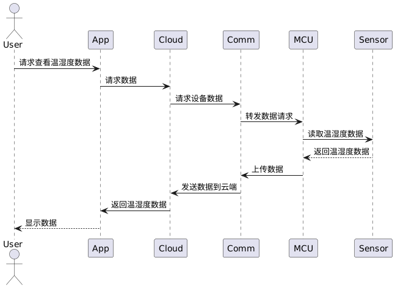
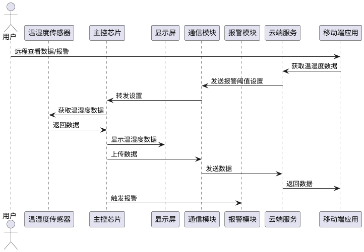

# 嵌入式系统 作业1

## PB21111733 牛庆源

* 对于某个你感兴趣的嵌入式相关的设备
  * 为设备制定需求描述
  * 用UML编写概要设计
    * 尝试使用各种UML图，包括类图、对象图、序列图等。

**设备名称**：智能温湿度监控器

**需求描述**：该嵌入式设备是用于监控环境温度和湿度的智能设备，适用于家庭、办公室或温室等场景。设备能够实时采集温湿度数据并通过显示屏直观显示。同时，设备支持将数据上传至云端进行存储和分析，通过移动引用远程查看历史数据和当前环境状况。设备还有异常报警功能，当温湿度超出阈值时，设备可以发出警报并推送通知到用户的手机。

**关键需求**：

1. **实时温湿度监测**：具备高精度的温湿度传感器，实时监控环境温湿度。
2. **数据展示**：集成LCD显示屏，实时显示当前温湿度数据。
3. **数据存储和上传**：通过Wi-Fi将数据上传至云端，支持历史数据查看和分析。
4. **报警功能**：当温湿度超出预设阈值时，设备能够发出声光报警，并推送通知至用户手机。
5. **远程控制**：通过手机App或网页端查看数据、设置阈值以及接收报警信息。

**概要设计**：

* **硬件设计**
  * **主控芯片**：选择低功耗的微控制器，如ESP32（集成Wi-Fi模块），或STM32系列。
  * **传感器**：
    * 温度传感器：如DHT22或SHT30。
    * 湿度传感器：集成在DHT22或SHT30内。
  * **显示模块**：使用小尺寸的LCD或OLED屏幕（如128x64分辨率）。
  * **通信模块**：集成Wi-Fi模块（如ESP32自带），支持将数据通过HTTP/HTTPS或MQTT协议上传至服务器。
  * **报警模块**：蜂鸣器用于声音报警，LED灯用于视觉报警。

* **UML设计**

  该设备的UML**类图**如下：
  
  *（温湿度传感器：Sensor；主控芯片：MCU；显示模块：Display；通信模块：Comm；报警模块：Alert；云端：Cloud；移动程序：App)*
  
  
  
  当系统运行时，某一时刻，**对象图**如下：
  
  
  当用户发出查看温湿度请求时，**序列图**：
  
  
  设备整体的**时序图**：
  