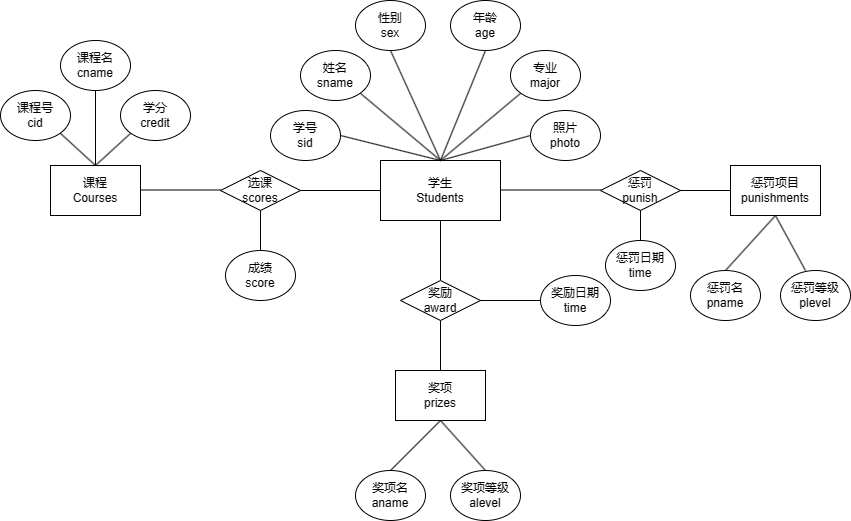

<div style="text-align:center;font-size:2em;font-weight:bold">中国科学技术大学计算机学院</div>

<div style="text-align:center;font-size:2em;font-weight:bold">《数据库系统实验报告》</div>


<div style="display: flex;flex-direction: column;align-items: center;font-size:2em">
<div>
<p>实验题目：xxxxx</p>
<p>学生姓名：xxx</p>
<p>学生学号：PBxxxxxxxx</p>
<p>完成时间：2024年x月x日</p>
</div>
</div>


<div style="page-break-after:always"></div>

## 需求分析


## 总体设计

#### 系统模块结构

>  如前端和后端两大模块

#### 系统工作流程

>  可配图

#### 数据库设计

> ER图
>
> 模式分解
>
> 存储过程、触发器、函数等设计思路

* ER 图如下：

  

* 模式分解为：

  ```sql
  Students(sid, sname, sex, age, major, photo) -- sid为主码
  Courses(cid, cname, credit) -- cid为主码
  Prizes(aname, alevel) -- aname为主码
  Punishments(pname, plevel) -- pname为主码
  Scores(sid, cid, scores) -- sid,cid为主码，分别外键约束于Students和Courses的对应属性
  award(sid, aname, time) -- sid,aname为主码，分别外键约束于Students和Prizes的对应属性
  punish(sid, pname, time) -- sid,pname为主码，分别外键约束于Students和Punishments的对应属性
  ```

  注意`time`格式为`Date`，`photo`格式为`blob`，`age`，`credit`和`scores`格式为`int`，其余都为`varchar`。

* 主要设计了

## 核心代码解析（可改名为对应模块，如后端实现）

#### 仓库地址

> 建议使用github、gitlab、gitee等代码托管网站进行开发，并在**实验验收结束前**设置为**private**，结束后改为**public**

#### 目录

> 使用tree命令获取文件结构，并在文件名后用 "-------注释" 解释文件功能

#### 标题1

> 分为若干个标题，以一定逻辑顺序讲解代码，如按ER图实体、关系讲解数据库建模代码，按存储过程、触发器分类讲解代码、按前端实现、接口等讲解前端代码
>
> 注意不要无脑粘贴代码，选取具有代表性的代码讲解，并注明文件来源，如首行注释: // backend\models.py

## 实验与测试

#### 依赖

> 所需的库、运行环境

#### 部署

> 代码运行步骤，建议使用命令行运行代码

#### 实验结果

> 如增删改查、验证存储过程、函数、触发器、文件管理

## 参考

> 如前端使用的模板、引用的图片来源、第三方库的官网等等