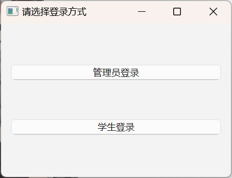
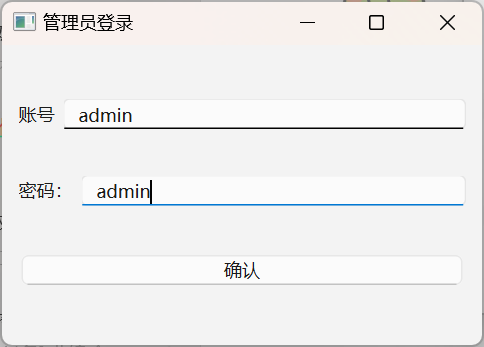
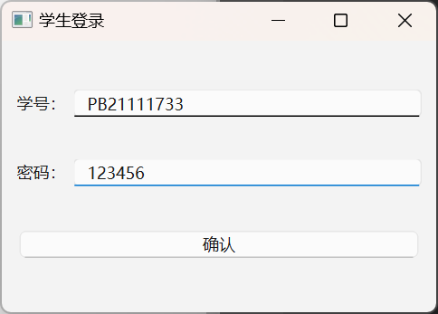
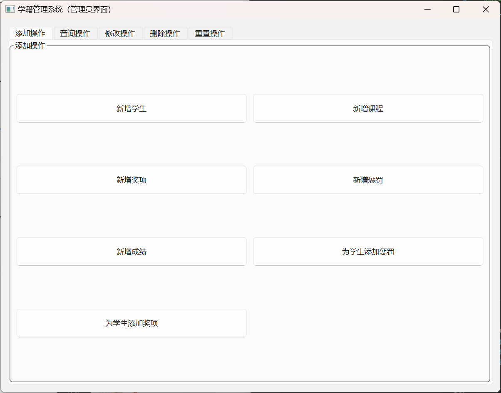
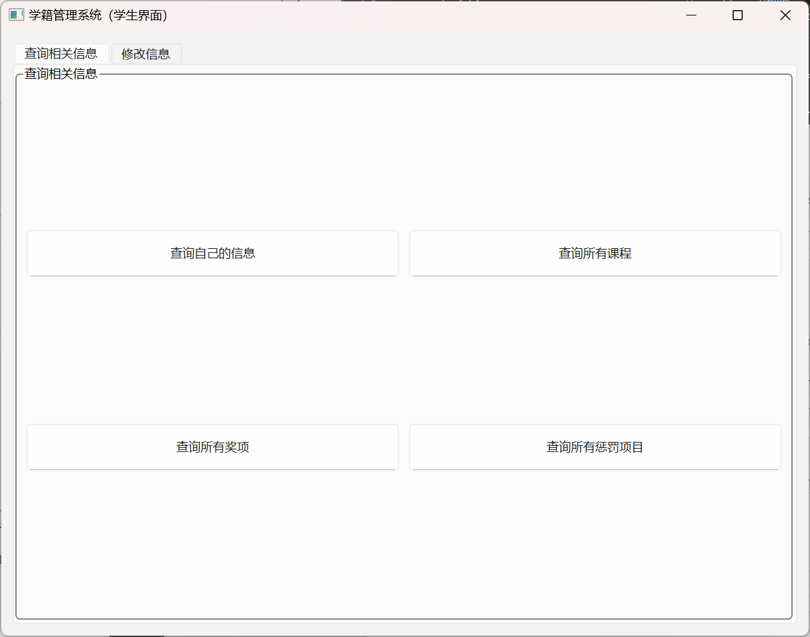

<div style="text-align:center;font-size:2em;font-weight:bold">中国科学技术大学计算机学院</div>

<div style="text-align:center;font-size:2em;font-weight:bold">《数据库系统实验报告》</div>


<div style="display: flex;flex-direction: column;align-items: center;font-size:2em">
<div>
<p>实验题目：xxxxx</p>
<p>学生姓名：xxx</p>
<p>学生学号：PBxxxxxxxx</p>
<p>完成时间：2024年x月x日</p>
</div>
</div>


<div style="page-break-after:always"></div>

## 需求分析

设计一个学籍管理系统，以及登录界面，实现管理员进行所有操作，学生进行部分操作。

其中管理员可以新增学生，课程等，也可以删除，更改，以及查询所有的内容，同时可以重置数据库。

学生可以查询学校开的课程，奖励和惩罚，自己的包括成绩，奖惩以及个人信息，总学分，平均成绩的信息。

## 总体设计

#### 系统模块结构

前端使用Python的PyQt6，后端是基于Python的数据库调用和用户操作逻辑，数据库是Mysq。

整体使用C/S架构。

#### 系统工作流程

用户通过登录界面登录为学生/管理员，使用按钮进行查询等操作。操作逻辑通过Python调用，注入sql代码实现数据库内容的增删查改，可以调用存储过程和函数。

#### 数据库设计

* ER 图如下：

  

* 模式分解为：

  ```sql
  Students(sid, sname, sex, age, major, photo) -- sid为主码
  Courses(cid, cname, credit) -- cid为主码
  Prizes(aname, alevel) -- aname为主码
  Punishments(pname, plevel) -- pname为主码
  Scores(sid, cid, scores) -- sid,cid为主码，分别外键约束于Students和Courses的对应属性
  award(sid, aname, time) -- sid,aname分别外键约束于Students和Prizes的对应属性
  punish(sid, pname, time) -- sid,pname分别外键约束于Students和Punishments的对应属性
  StuLogin(sid, password) -- sid为主码，外键约束于Students的对应属性
  ```

  注意`time`格式为`Date`，`photo`格式为`blob`，`age`，`credit`和`scores`格式为`int`，其余都为`varchar`。

* 主要设计的`procedure`为修改学生ID和修改课程ID，实现修改ID时，外键约束对应的属性为修改后的内容。

  `function`为计算学生的总学分和加权平均成绩。

  `trigger`为在删除学生时删除学生有关的成绩，奖励情况和惩罚情况；在新增学号时，设置学生的默认登录密码；修改学生学号时，自动更新学生登录信息。

## 核心代码解析（可改名为对应模块，如后端实现）

#### 仓库地址

Github地址：[USTC-CS-COURSES/数据库/lab/lab2/src at master · n1uf/USTC-CS-COURSES (github.com)](https://github.com/n1uf/USTC-CS-COURSES/tree/master/数据库/lab/lab2/src)

#### 目录

```sh
|  db_functions.py		----- sql函数
│  db_procedures.py		----- sql存储过程
│  db_triggers.py		----- sql触发器
│  display.py			----- 用户界面定义
│  functions.py			----- 用户功能函数
│  inittable.py			----- 注入sql实现数据库初始化
│  main.py				----- 主函数（运行该函数）
```


#### 标题1

> 分为若干个标题，以一定逻辑顺序讲解代码，如按ER图实体、关系讲解数据库建模代码，按存储过程、触发器分类讲解代码、按前端实现、接口等讲解前端代码
>
> 注意不要无脑粘贴代码，选取具有代表性的代码讲解，并注明文件来源，如首行注释: // backend\models.py

#### 数据库的建模

参照ER图以及分解出的模式，通过使用Python的`pymysql`库实现从Python注入sql代码，实现数据库的建模


#### 功能实现

首先确定自己需要的基本功能，包括增删查改等，然后根据需求设计函数（如新增学生等），再根据进一步的需求设计sql函数（如查询总学分、平均成绩），sql存储过程（如修改学生ID、课程ID），以及功能实现时考虑触发器（删除时同步删、新增时新增默认密码）

这里给出一些存储过程、函数和触发器的定义以及解释：

* 存储过程（修改学生ID）：

  用以下代码去掉外键约束

  ```sql
  // db_procedures.py
  DROP FOREIGN KEY Scores_sforeign;
  ```

  同步修改ID

  ```sql
  UPDATE Scores
  SET sid = new_id
  WHERE sid = old_id;
  ```

  之后后加上外键约束

  ```sql
  ADD CONSTRAINT Scores_sforeign FOREIGN KEY (sid) REFERENCES Students (sid);
  ```

  其余同步修改同理实现即可。

* 函数（查询某个学生的平均成绩）

  主要实现方式：

  计算每一个成绩与学分的乘积的和

  ```sql
  // db_functions.py
  SELECT SUM(Scores.score * Courses.credit) INTO total_Score
  FROM Scores, Courses
  WHERE Scores.cid = Courses.cid AND Scores.sid = stuid;
  ```

  计算学分和

  ```sql
  SELECT SUM(Courses.credit) INTO total_Credits
  FROM Courses
  WHERE cid IN (SELECT cid FROM Scores WHERE Scores.sid = stuid);
  ```

  返回加权平均成绩

  ```sql
  RETURN total_Score / total_Credits;
  ```

* 触发器（新增学生时自动赋默认登录密码）

  ```sql
  // db_triggers.py
  AFTER INSERT ON Students
  FOR EACH ROW
  BEGIN
      INSERT INTO StuLogin (sid, password) VALUES (NEW.sid, '123456');
  END
  ```

`functions.py`内设计了很多函数用来被`display.py`调用，这些函数通过注入sql代码的方式实现对数据库内容的增删查改等操作。

例如：

* 查询某个学生的所有成绩：

  ```python
  // db functions.py
  cursor.execute("""SELECT scores.cid, cname, score, credit 
                 FROM Scores, Courses, Students 
                 WHERE scores.cid = courses.cid
                 AND scores.sid = students.sid
                 AND scores.sid = %s""", (sid,))
  ```

  通过连接表实现各项数据的查询和显示。

* 查询某个学生的平均成绩：

  ```python
  // db functions.py
  cursor.execute("SELECT GetAverageScore(%s) as AverageScore", (sid,))
  ```

  通过编写的sql函数实现。

* 修改学号：

  ```python
  // db functions.py
  cursor.execute("CALL updateStudentID(%s, %s)", (old_id, new_id))
  ```

  通过调用sql存储过程实现。

**这里需要注意，对于各种查询的返回，`fetchall`和`fetchone`完全不同，需要根据后面的`display.py`修改，如果需要全部返回就`fetchall`，如果需要返回一个头指针用于遍历，就`fetchone`**


#### 前端实现

使用`PyQt6`实现。

主要逻辑在`display.py`中，每一个类都创建一个用户界面。

每一个类中都包含有以下大体内容：初始化（用于传参），布局设置，内部函数设置。

##### 先说明类与类之间的调用以及类调用`functions.py`中的函数（例为登录操作）

`Main_Window`是初始界面，设置布局来为用户提供登录方式，不同登录方式连接不同的内部函数，内部函数实现逻辑并按照需求调用另一个类。

如学生登录，则调用内部函数`open_student_window`，这个函数内调用了`StudentLogin`类来唤起新窗口。

类`StudentLogin`内同样设置布局来引导用户输入信息，按确认按钮。确认按钮连接了内部函数`get_text`，其中包含了登录的逻辑以及唤起类`Student_Window`界面（学生操作界面）。

这里登录的逻辑使用了`functions.py`中的相关函数来判断信息是否输入合法，通过`flag`来标记合法的数量，达到一定数量则通过登录，唤起`Student_Window`，然后关闭自身。

##### 这里给出管理员界面(Admin_Window)的一些布局，函数

使用`QTabWidget`创建一些选项卡，归类放置功能

```python
// display.py
tab_widget = QTabWidget()
tab_widget.addTab(self.create_add_box(), '添加操作')
tab_widget.addTab(self.create_query_box(), '查询操作')
# ...
```

在每一个选项卡内使用网格布局`QGridLayout`来布置按钮。

```python
// display.py
buttons = [
('新增学生', self.add_student),
('新增课程', self.add_class),
# ...
]
for i, (text, slot) in enumerate(buttons):
	btn = QPushButton(text)
	btn.setMinimumSize(100, 50)  # 设置按钮最小尺寸
	btn.clicked.connect(slot)
	layout.addWidget(btn, i // 2, i % 2)  # 2列布局
```

按钮功能为`self.add_student`等，调用内部函数。

其余的选项卡同理。

内部函数：可以唤起新的类（界面），将界面输入的内容作为参数传回该内部函数，然后根据需求调用`functions.py`的函数修改或者查询数据库，或者使用传回的参数实现逻辑的判断与处理。如果需要，可以调用其他函数（重置数据库时需要确认界面以防止误触）。

以下是一个内部函数，实现学生奖励的删除。（对应现实中奖励的撤销）

```python
def delete_prize_for_student(self):
    self.deleteWindow = DeletePAWindow(self.db, self.cursor, 0)
    if self.deleteWindow.exec():
        newID = self.deleteWindow.get_entered_ID()
        newName = self.deleteWindow.get_entered_Name()
        functions.del_award(self.db, self.cursor, newID, newName)
        widget = QWidget()
        QMessageBox.information(widget, '信息', '删除成功')
```

首先唤起`DeletePAWindow`并传入相关参数，`kind`设置为`0`来在类内使用相关的功能。

唤起成功后读取类传回该内部函数的参数，然后通过调用`functions.py`内的`del_award`函数对数据库进行操作，从而实现删除学生奖励的功能，最后返回一条删除成功的信息。（这里删除失败的信息会在`DeletePAWindow`中实现，如果参数读入（输入）正确则不会出现删除失败的信息）


#### 主函数

使用`pymysql`输入对应参数打开数据库连接。

调用`display.py`中的`Main_Window`打开主界面即可。


#### 其他

图片的输入和读取：使用`QtWidgets`中的`QFileDialog`来读取图片，然后使用`PIL`库的`Image`来规定（调整）图片大小尺寸（防止查看时图片尺寸过大破坏布局），注意转换图片格式。然后转为字节数据，二进制读取并存入图片即可。

## 实验与测试

#### 依赖

需要安装`pymysql`，`PyQt6`和`PIL`库

#### 部署

> 代码运行步骤，建议使用命令行运行代码

#### 实验结果

运行程序，出现登录界面，可以选择管理员登录和学生登录，分别可以使用不同的功能。



管理员登录账号为admin，密码也为admin。



学生登录账号为学号，密码默认为'123456'，可以在登录后修改。



管理员界面如下：设计多个选项卡以使得界面美观，并且功能直观



用户界面如下：比管理员少很多功能，提供了基本的信息查询以及信息修改包括修改密码。



具体的界面功能以及界面布局将在下面描述。

## 参考

> 如前端使用的模板、引用的图片来源、第三方库的官网等等