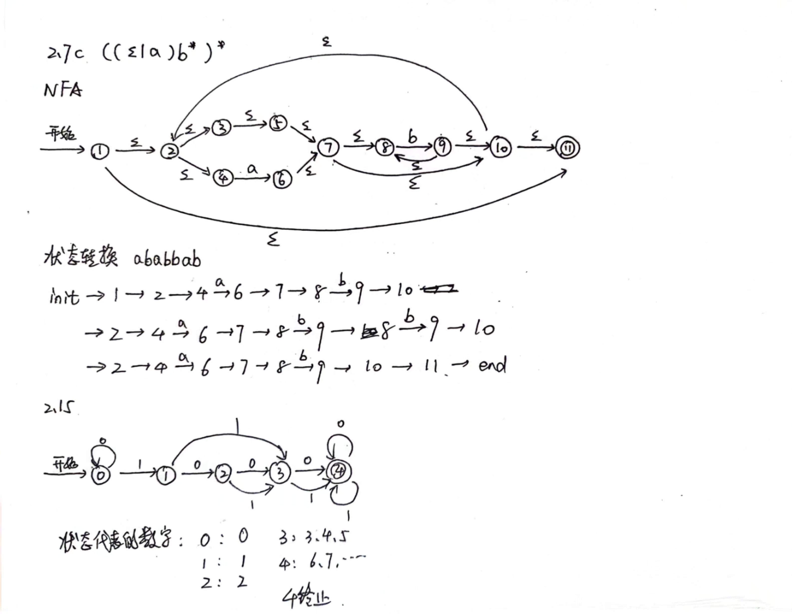

# 编译原理 HW1
## 牛庆源 PB21111733

* 2.1a
  a ~ z, A ~ Z
  0 ~ 9
  空格、水平制表符、垂直制表符、换行、换页
  !   "   #  %  &  `  ()  *  +  ,  -  .   /  :  ;  <  =  >  ? [  \  ]  ^  _  {  |  }  ~


* 2.2
````
type id sep type id sep id sep sep
    key sep id op id op num sep
        key id sep
    key
        key id sep id sep id op id sep sep
sep
````

* 2.3a
  首尾是0的长度大于等于2的01串

* 2.4h
  1*(0|01)*

