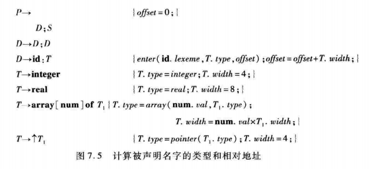

# 编译原理 HW6
## 牛庆源 PB21111733

### Question 7.2 c、7.5、7.12、8.1e、8.2（e）、8.6

* 7.2 c
```c
main() {
    int i;
    int a[10];
    while(i <= 10)
        a[i] = 0;
}
```
三地址代码
```
L:  if(i > 10) goto END
    t1 = i * 4
    a[t1] = 0
    goto L
END:
```


* 7.5


**新增了P.offset1和D.offset1**

```
P->            {D.offset = 0} 
    D;S        {P.offset1 = D.offset1}
D->            {D1.offset = D.offset} D1; {D2.offset = D.offset1} D2 {D.offset1 = D2.offset}
D->id:T        {enter(id.lexeme, T.type, D.offset);D.offset1=D.offset+T.width;}
T->integer          {T.type = integer; T.width = 4;}
T->real             {T.type = real; T.width = 8;}
T->array[num] of T1 {T.type = array(num.val, T1.type); T.width = num.val * T1.width;}
T->↑T1              {T.type = pointer(T1.type); T.width = 4;}
```

* 7.12
```
A[x,y]:=z
```
三地址代码：
```
t1 = x * 5
t1 = t1 + y
t2 = c
t3 = t1 * 4
t2[t3] = z
```
其中c为常量base_A - (1*5+1)*4 = base_A - 24

* 8.1e
`x=a/(b+c)-d*(e+f)`
目标机器代码：
```
LD R1 b
LD R2 c
ADD R1 R1 R2
LD R2 a
DIV R1 R2 R1
LD R2 e
LD R3 f
ADD R2 R2 R3
LD R3 d
MUL R2 R3 R2
SUB R2 R1 R2
ST x R1
```

* 8.2e
假定所有变量均为自动变量（分配在栈上）

```
LD R1 b(STACK)
LD R2 c(STACK)
ADD R1 R1 R2
LD R2 a(STACK)
DIV R1 R2 R1
LD R2 e(STACK)
LD R3 f(STACK)
ADD R2 R2 R3
LD R3 d(STACK)
MUL R2 R3 R2
SUB R2 R1 R2
ST x(STACK) R1
```

* 8.6
```c
main() {
    long i;
    i = 0;
    printf("%ld\n", (++i)+(++i)+(++i));
}
```
1. 结果为7：先两次`++i`(先++再取i)，前两个(`++i`)都为2，最后一个(`++i`)为3，`2+2+3=7`。
2. 结果为6: 分别`++i`，即`1+2+3=6`。