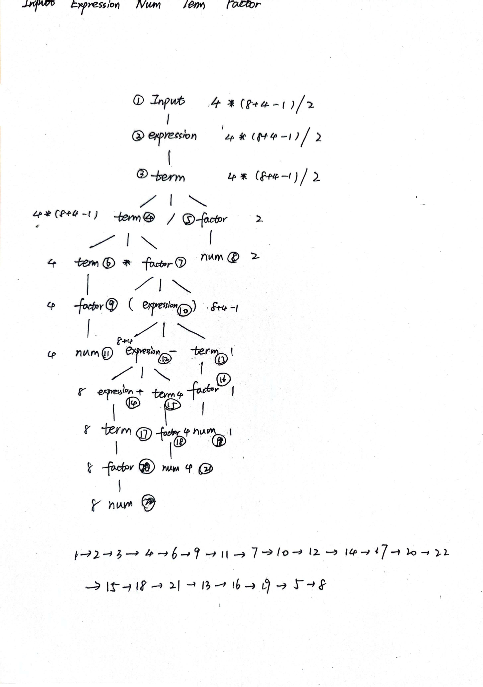

# 编译原理Lab2-1
## 牛庆源 PB21111733

* **1.**

编写代码如下
``````
#include <stdio.h>
int a = 1;
int main(){
    int b = 2;
    int c;
    c = a + b;
    return c;
}
``````
生成.ll文件如下
``````
; ModuleID = 'lab2-1test.c'
source_filename = "lab2-1test.c"
target datalayout = "e-m:e-p270:32:32-p271:32:32-p272:64:64-i64:64-f80:128-n8:16:32:64-S128"
target triple = "x86_64-pc-linux-gnu"

@a = dso_local global i32 1, align 4

; Function Attrs: noinline nounwind optnone uwtable
define dso_local i32 @main() #0 {
  %1 = alloca i32, align 4
  %2 = alloca i32, align 4
  %3 = alloca i32, align 4
  store i32 0, i32* %1, align 4
  store i32 2, i32* %2, align 4
  %4 = load i32, i32* @a, align 4
  %5 = load i32, i32* %2, align 4
  %6 = add nsw i32 %4, %5
  store i32 %6, i32* %3, align 4
  %7 = load i32, i32* %3, align 4
  ret i32 %7
}

attributes #0 = { noinline nounwind optnone uwtable "frame-pointer"="all" "min-legal-vector-width"="0" "no-trapping-math"="true" "stack-protector-buffer-size"="8" "target-cpu"="x86-64" "target-features"="+cx8,+fxsr,+mmx,+sse,+sse2,+x87" "tune-cpu"="generic" }

!llvm.module.flags = !{!0, !1, !2, !3, !4}
!llvm.ident = !{!5}

!0 = !{i32 1, !"wchar_size", i32 4}
!1 = !{i32 7, !"PIC Level", i32 2}
!2 = !{i32 7, !"PIE Level", i32 2}
!3 = !{i32 7, !"uwtable", i32 1}
!4 = !{i32 7, !"frame-pointer", i32 2}
!5 = !{!"Ubuntu clang version 14.0.0-1ubuntu1.1"}
``````
全局变量为`@a = dso_local global i32 1, align 4`


* **2.**

用basicblock表示lable

* **3.**

Module类中`IntegerType`和`FloatTyp`为基本类型

`ArrayType`、`PointerType`和`FunctionType`为组合类型

存储方式不一样，组合类型有更复杂的结构，可以存放更复杂的数据和类型信息，所以需要用与基本类型不同的存储方式

* **4./5.**

