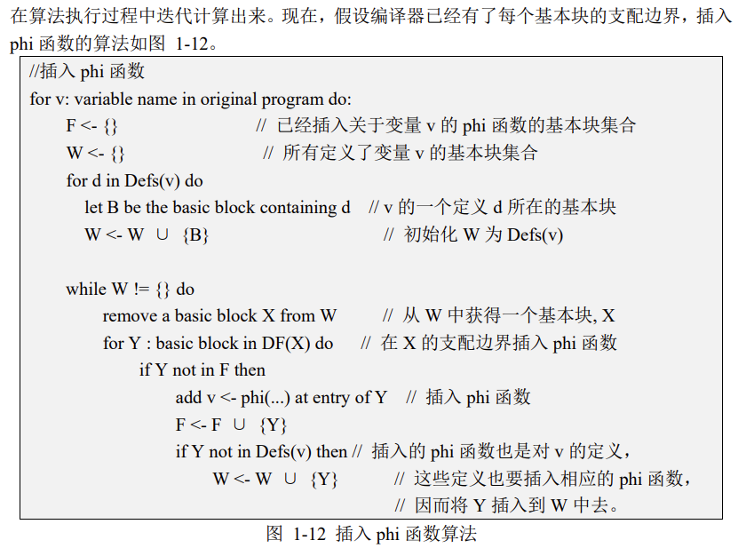

# LAB4
## 牛庆源 PB21111733

* **代码撰写**
    补全 src/passes/Dominators.cpp 文件，使编译器能够进行正确的支配树分析
    补全 src/passes/Meglobal_nameeg.cpp 文件，使编译器能够正确执行 Meglobal_nameeg
    将 phi 指令转化为 copy statement，令后端可以正确处理 phi 指令

#### 补全 src/passes/Dominators.cpp 文件，使编译器能够进行正确的支配树分析

* 由Dom.pdf中给出的算法，需要得到逆后序，这里先用dfs后序遍历，栈存储，结束后出栈建立逆后序(get_reverse_postorder)，然后按照算法中如下的伪代码：
  
  实现create_idom和intersect函数，对于intersect函数注意后序和逆后序大小比较要变化


```cpp
void Dominators::dfs(BasicBlock *bb, std::set<BasicBlock *> &visited) 
{
    visited.insert(bb);
    for(auto &succ : bb->get_succ_basic_blocks()) 
    {
        if(visited.find(succ) == visited.end()) 
        {
            dfs(succ, visited);
        }
    }
    dfs_stack_.push(bb);
}

void Dominators::get_reverse_postorder(Function *f)
{
    int i = 0;
    while (dfs_stack_.empty() == false)
    {
        auto bb = dfs_stack.top();
        dfs_stack_.pop();
        rpo_.push_back(bb);
        rpo_pos_.insert({bb, i++});
    }
}

BasicBlock* Dominators::intersect(BasicBlock *bb1, BasicBlock *bb2) 
{
    while(bb1 != bb2) 
    {
        while(rpo_pos_[bb1] > rpo_pos_[bb2]) 
        {
            bb1 = idom_[bb1];
        }
        while(rpo_pos_[bb2] > rpo_pos_[bb1]) 
        {
            bb2 = idom_[bb2];
        }
    }
    return bb1;
}


void Dominators::create_idom(Function *f) {
    // TODO 分析得到 f 中各个基本块的 idom
    for(auto &bb1 : f->get_basic_blocks())
    {
        idom_.insert({&bb1, nullptr});
    }
    int changed = 1;

    idom_.at(f->get_entry_block()) = f->get_entry_block();

    while(changed)
    {
        changed = 0;
        for(auto &bb1 : rpo_)
        {
            auto bb = bb1;
            if(bb == f->get_entry_block())
                continue;
            auto pre_list = bb->get_pre_basic_blocks();
            BasicBlock *new_idom = nullptr;
            for(auto &pre : pre_list)
            {
                if(new_idom == nullptr)
                {
                    new_idom = pre;
                    continue;
                }
                if(idom_.at(pre) != nullptr)
                {
                    new_idom = intersect(pre, new_idom);
                }
            }
            if(idom_.at(bb) != new_idom)
            {
                idom_.at(bb) = new_idom;
                changed = 1;
            }
        }
    }
}
```

* 对于create_dominance_frontier，直接用文中的算法:

```cpp
void Dominators::create_dominance_frontier(Function *f) {
    // TODO 分析得到 f 中各个基本块的支配边界集合
    for(auto &bb1 : f->get_basic_blocks())
    {
        auto bb = &bb1;
        if(bb->get_pre_basic_blocks().size() >= 2)
        {
            for(auto &pred : bb->get_pre_basic_blocks())
            {
                BasicBlock *use_ing = pred;
                while(use_ing != idom_[bb])
                {
                    dom_frontier_[use_ing].insert(bb);
                    use_ing = idom_[use_ing];
                }
            }
        }
    }
}
```

* 由Dom(b) = {b} ∪ IDom(b) ∪ IDom(IDom(b)) · · · {n0}，易得：

```cpp
void Dominators::create_dom_tree_succ(Function *f) {
    // TODO 分析得到 f 中各个基本块的支配树后继
    for (auto &bb1 : f->get_basic_blocks()) {
        auto bb = &bb1;
        if (bb == f->get_entry_block()) 
        {
            continue;
        }
        dom_tree_succ_blocks_.at(idom_.at(bb)).insert(bb);
    }
}
```

* 补全hpp

```cpp
    // TODO 补充需要的函数

    BasicBlock *intersect(BasicBlock *bb1, BasicBlock *bb2); // intersect函数
    
    void build_pre_blocks(Function *f); // build基本块的前驱集合

    void dfs(BasicBlock *bb, std::set<BasicBlock *> &visited); // DFS遍历

    void get_reverse_postorder(Function *f); // 逆后序


    std::map<BasicBlock *, BasicBlock *> idom_{};  // 直接支配(dom)

    std::map<BasicBlock *, BBSet> dom_frontier_{}; // 支配边界集合

    std::map<BasicBlock *, BBSet> dom_tree_succ_blocks_{}; // 支配树中的后继节点

    std::vector<BasicBlock *> rpo_{}; // 逆后序
    
    std::map<BasicBlock *, int> rpo_pos_{}; // 基本快在逆后序的位置 map

    std::stack<BasicBlock *> dfs_stack_{}; // dfs的栈空间
```

#### 补全 src/passes/Meglobal_nameeg.cpp 文件，使编译器能够正确执行 Meglobal_nameeg

* 依据Meglobal_nameeg中给出的插入phi函数：
  
  
```cpp
// 步骤一：找到活跃在多个 block 的全局名字集合，以及它们所属的 bb 块
    
    for(auto &bb : func_->get_basic_blocks())
    {
        for(auto &inst : bb.get_instructions())
        {
            if(inst.is_store())
            {
                auto store_inst1 = static_cast<StoreInst *>(&inst);
                auto l_val = store_inst1->get_lval();
                if(is_valid_ptr(l_val))
                {
                    mem_vars_.insert(l_val);
                    redefs_[l_val].insert(&bb);
                }
            }
            if(inst.is_load())
            {
                auto load_inst1 = static_cast<LoadInst *>(&inst);
                auto l_val = load_inst1->get_lval();
                if(is_valid_ptr(l_val))
                {
                    mem_vars_.insert(l_val);
                    reuses_[l_val].insert(&bb);
                }
            }
        }
    }
    for(auto &mem_var : mem_vars_)
    {
        if((redefs_[mem_var].size() > 1) || (reuses_[mem_var].size() > 1) ||
        (redefs_[mem_var].size() == 1 && reuses_[mem_var].size() == 1 && redefs_[mem_var] != reuses_[mem_var]))
        {
            global_names_set_.insert(mem_var);
        }
    }
```

```cpp
// 步骤二：从支配树获取支配边界信息，并在对应位置插入 phi 指令

    for(auto &global_name : global_names_set_)
    {
        if(global_name.second.changed)
        {
            for(auto &changed : global_name.second.changed_list)
            {   
                for(auto &dom_fron : dominators_->get_dominance_frontier(changed))
                {
                    if(phi_list.find({dom_fron, global_name.first}) == phi_list.end())
                    {   // 没有phi指令
                        auto phi = PhiInst::create_phi(global_name.second.type, dom_fron, {}, {});
                        dom_fron->add_instr_begin(static_cast<Instruction *>(phi));
                        phi_list.insert({ {dom_fron, global_name.first}, phi});
                        phi2alloc.insert({phi, global_name.first});
                        global_name.second.changed_list.insert(dom_fron);
                    }
                }
            }
        }
    }
```

* rename也如文中给出的变量重命名算法写：
  

```cpp
void Mem2Reg::rename(BasicBlock *bb) {
    // TODO
    std::vector<Instruction *> temp;
    for (auto &inst : bb->get_instructions())
    {
        // 步骤三：将 phi 指令作为 lval 的最新定值，lval 即是为局部变量 alloca 出的地址空间
        if(inst.is_phi())
        {
            auto lval = phi_mem_map_[dynamic_cast<PhiInst *>(&inst)];
            mem_vars_stack_[lval].push(&inst);
            temp.push_back(&inst);
        }
        // 步骤四：将 store 指令的 rval，也即被存入内存的值，作为 lval 的最新定值
        if(inst.is_store())
        {
            auto store_inst1 = static_cast<StoreInst *>(&inst);
            auto lval = store_inst1->get_lval();
            auto rval = store_inst1->get_rval();

            if(is_valid_ptr(lval))
            {
                mem_vars_stack_[lval].push(rval);
                temp.push_back(&inst);
            }
        }
        // 步骤五：用 lval 最新的定值替代对应的load指令
        if(inst.is_load())
        {
            auto load_inst1 = static_cast<LoadInst *>(&inst);
            auto lval = load_inst1->get_lval();
            if(is_valid_ptr(lval))
            {
                load_inst1->replace_all_use_with(mem_vars_stack_[lval].top());
                temp.push_back(&inst);
            }
        }
    }

    // 步骤六：为 lval 对应的 phi 指令参数补充完整
    for(auto &succ : bb->get_succ_basic_blocks())
    {
        for(auto &inst : succ->get_instructions())
        {
            if(inst.is_phi())
            {
                auto phi = dynamic_cast<PhiInst *>(&inst);
                auto mem_var = phi_mem_map_[phi];

                if(mem_vars_stack_[mem_var].size() > 0)
                {
                    phi->add_phi_pair_operand(mem_vars_stack_[mem_var].top(), bb);
                }
            }
        }
    }
    // 步骤七：对 bb 在支配树上的所有后继节点，递归执行 re_name 操作
    for(auto &succ : dominators_->get_dom_tree_succ_blocks(bb))
    {
        rename(succ);
    }
    // 步骤八：pop出 lval 的最新定值
    for(auto &inst : temp)
    {
        if(inst->is_phi())
        {
            auto phi = dynamic_cast<PhiInst *>(inst);
            auto mem_var = phi_mem_map_[phi];
            mem_vars_stack_[mem_var].pop();
        }
        else if(inst->is_store())
        {
            auto store_inst1 = static_cast<StoreInst *>(inst);
            auto lval = store_inst1->get_lval();
            if(is_valid_ptr(lval))
            {
                mem_vars_stack_[lval].pop();
            }
            // 步骤九：清除冗余的指令
            bb->erase_instr(inst);
        }
        // 步骤九：清除冗余的指令
        else if(inst->is_load())
        {
            bb->erase_instr(inst);
        }
    }
}
```

#### 将 phi 指令转化为 copy statement，令后端可以正确处理 phi 指令

* 参照

```cpp
    for(unsigned int i = 0; i < phiInst->get_num_operand(); i += 2)
    {   // 根据需要生成phi
        auto *val = phiInst->get_operand(i);
        auto *bb = static_cast<BasicBlock *>(phiInst->get_operand(i + 1));

        append_inst("addi.d $t0, $zero, -" + std::to_string(context.bb_label_map.at(bb)));
        append_inst("add.d $t0, $a1, $t0");
        append_inst("bnez $t0, lable" + std::to_string(context.label_num));

        if(type->is_integer_type())
        {
            load_to_greg(val, Reg::t(0));
            append_inst("st.w $t0, $fp, " + std::to_string(context.offset_map.at(context.inst)));
        }
        else if(type->is_float_type())
        {
            load_to_freg(val, FReg::ft(0));
            append_inst("fst.d $ft0, $fp, " + std::to_string(context.offset_map.at(context.inst)));
        }
        else
        {
            assert(false);
        }

        append_inst("lable" + std::to_string(context.label_num), ASMInstruction::Label);
        context.label_num ++;
    }
```

#### 结果

由于没有完全正确，验证无法进行，只能先行提交：


