# COD lab2 report
## 牛庆源 PB21111733


### 1. 实验目的与内容
1. 完成寄存器堆的设计和仿真
2. 完成存储器ip核的例化和仿真
3. fifo队列的实现


### 2. 实验平台
* vscode
* vivado
* fpgaol


### 3. 实验过程与结果


#### 3.1 寄存器堆实现
* 要求更改寄存器堆代码使得寄存器堆0号地址恒为0
> 在地址wa为0时写入恒为0，否则写入为实际写入wd
```verilog
always @ (posedge clk) begin
    if (we) 
        if (wa == 0) 
            regfile[wa] <= 0;
        else 
            regfile[wa] <= wd;
    else
        regfile[0] <= 0;
```
**仿真结果：**

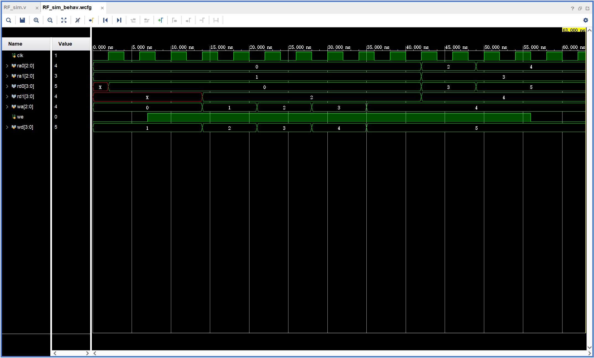


#### 3.2 存储器ip核例化和仿真
* 分布式和块式的16*8位单端口RAM完成功能仿真比较时序差异
* 块式的单端口RAM三种操作模式仿真比较时序差异


通过coe文件为四种不同的RAM赋初值，用仿真文件再为RAM在不同时间赋值，得到以下的结果。

**仿真结果：**

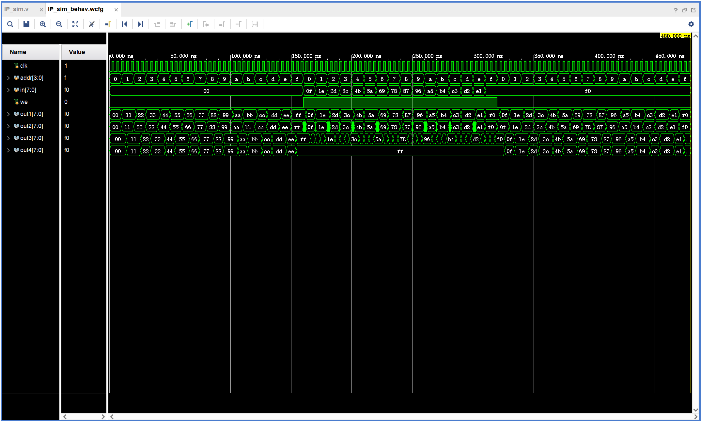

#### 3.3 寄存器堆应用：FIFO队列
* 数据通路为实验手册给出如下：

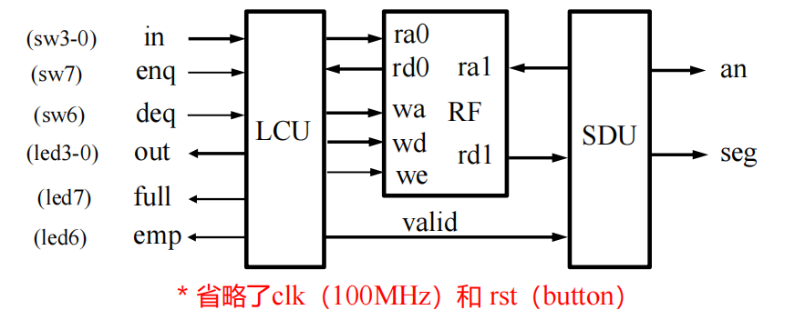

* 队列控制单元LCU设计

端口采用实验手册给出的端口。

> 引入了wpp,rpp,rpm分别为写指针读指针的下一位，读指针的上一位来辅助编写代码。
> 状态转换图如下：
> （补全了手册图中的空缺，只要到ENQU均为enq&!full，到DEQU均为deq&!empty）
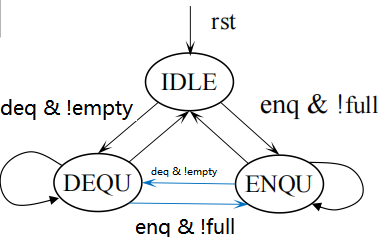

* 数码管显示单元SDU设计

端口采用实验手册给出的端口

> **组合逻辑**
> 对rst后第一个输入的数据特殊处理
> 之后的数据均对数码管地址，地址内容以及读端口地址进行next = cur的操作
> **时序逻辑**
> rst为复位，其他均cur = next来对当前态赋值

* FIFO队列的实现

实例化三个模块即可。（三个模块中的有关时序的使能信号输入部分均用sedg取边沿）
**仿真结果如下：**

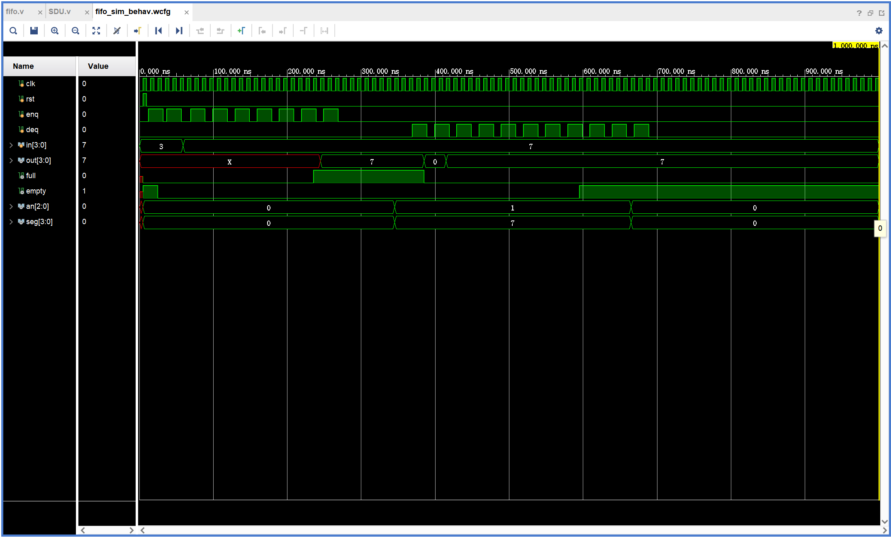

**fpga烧写结果如下：**
1. 初态


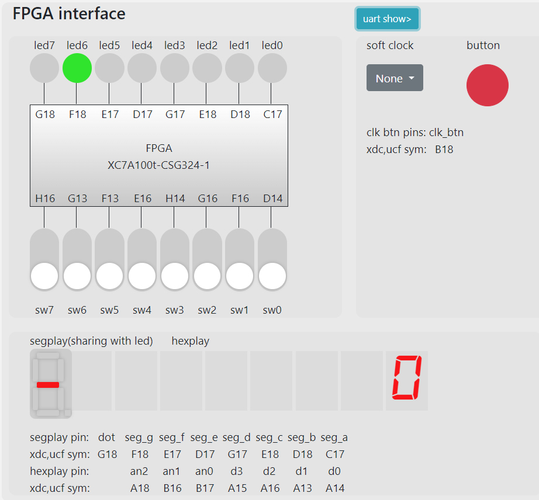

2. 写入第一个元素1（不显示）


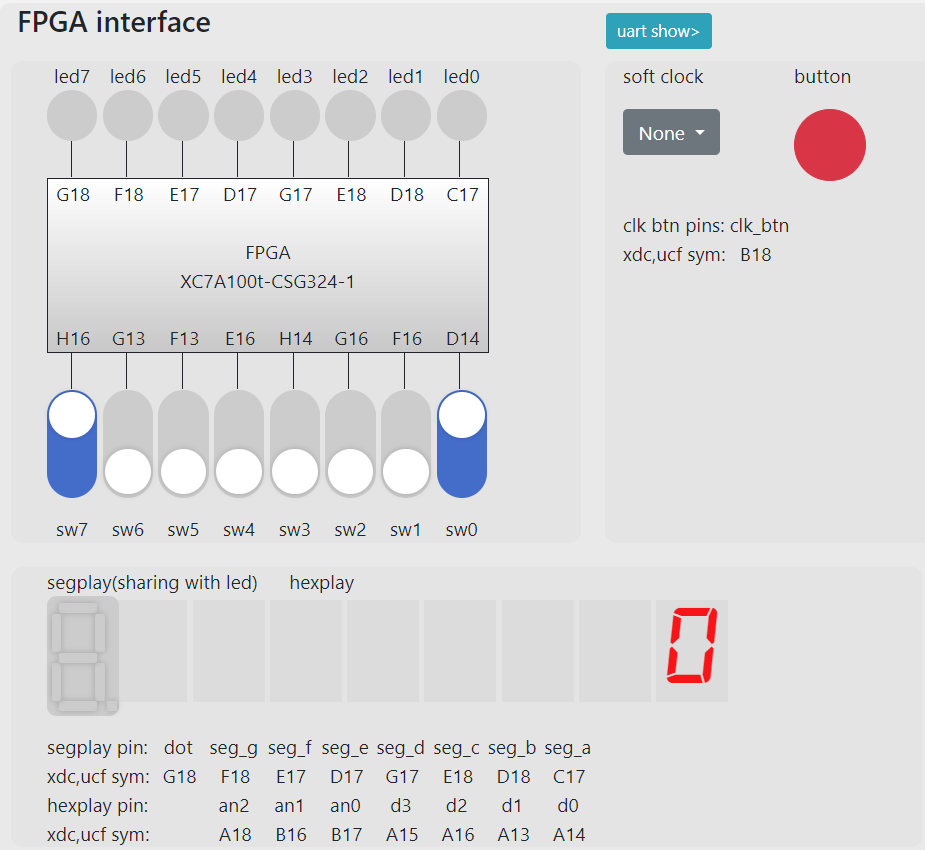

3. 写入第二个元素2


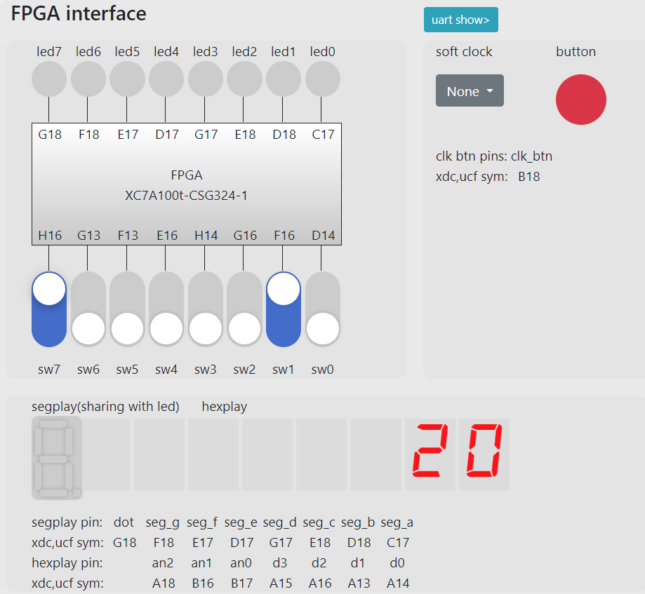

4. 写入第三个元素3


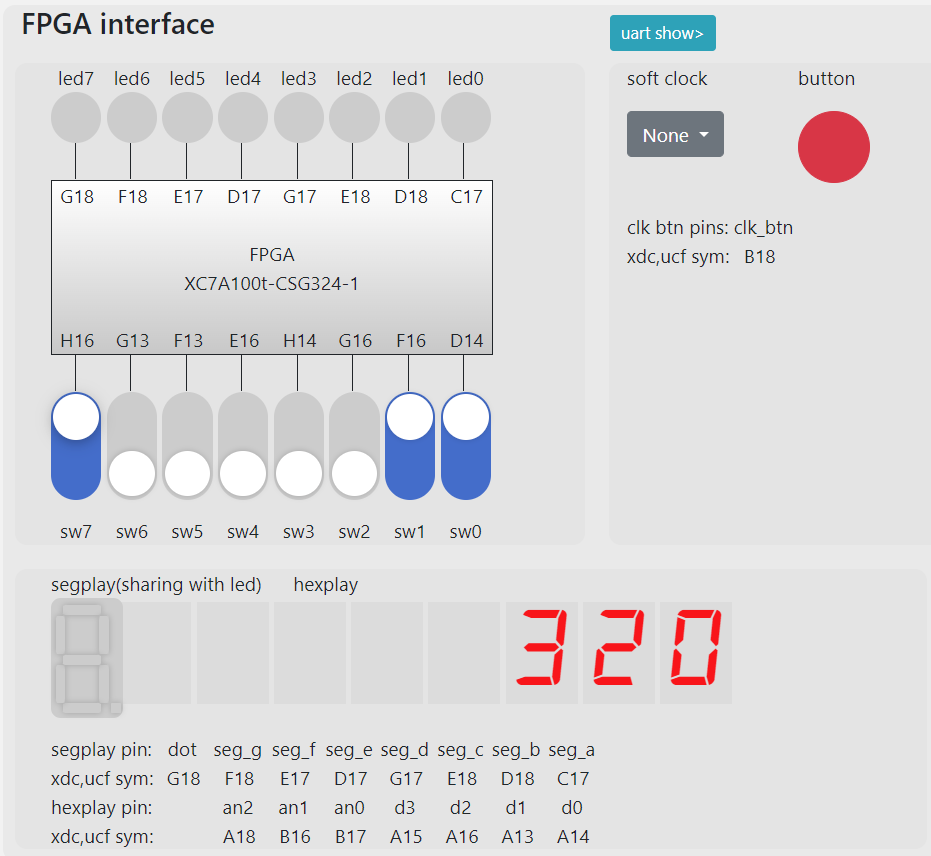

5. 出队列操作


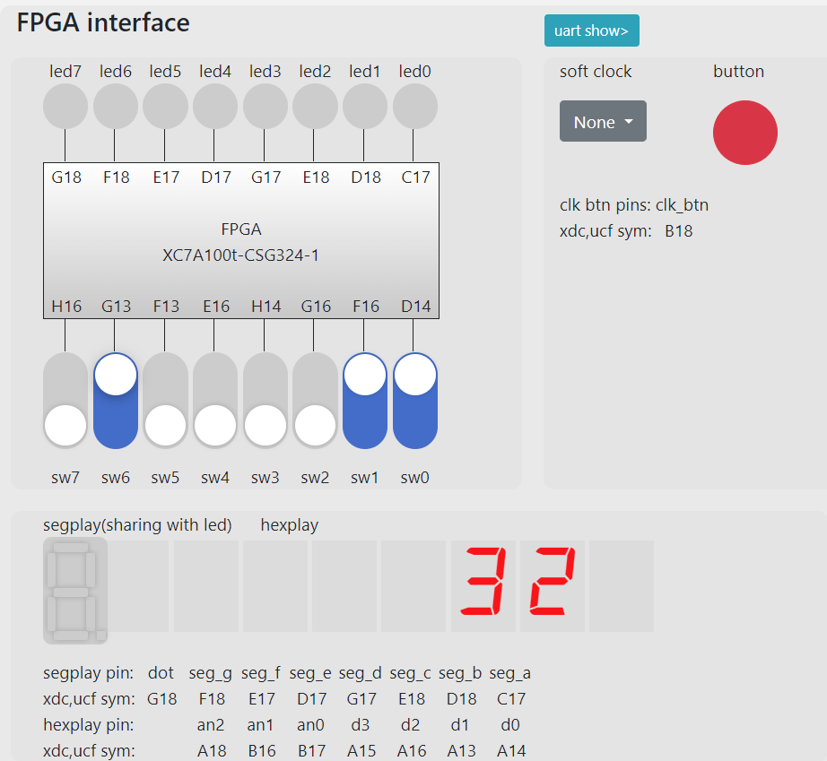

6. 出队列操作


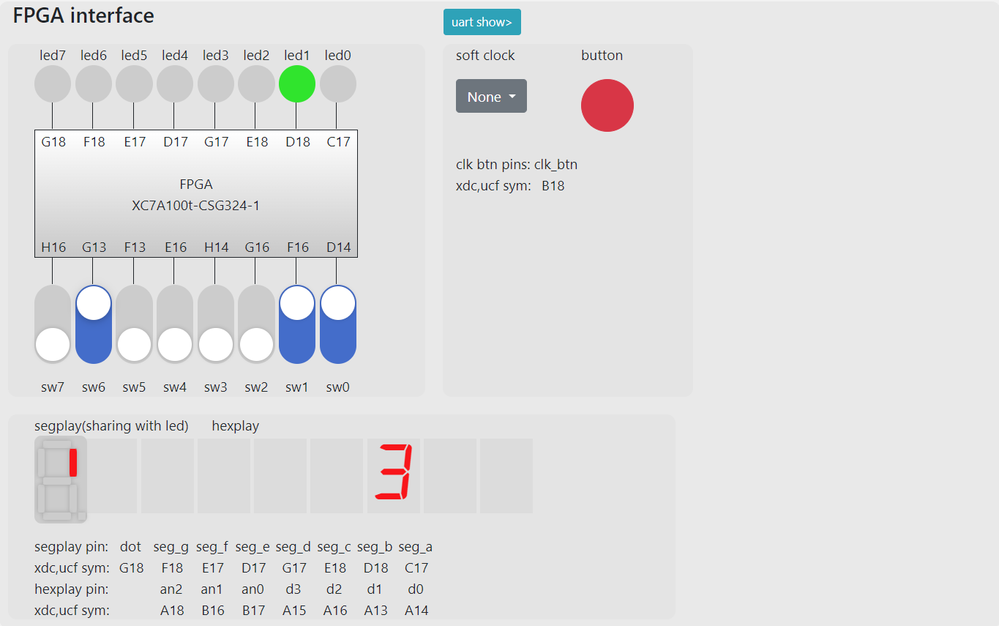

7. 出队列操作


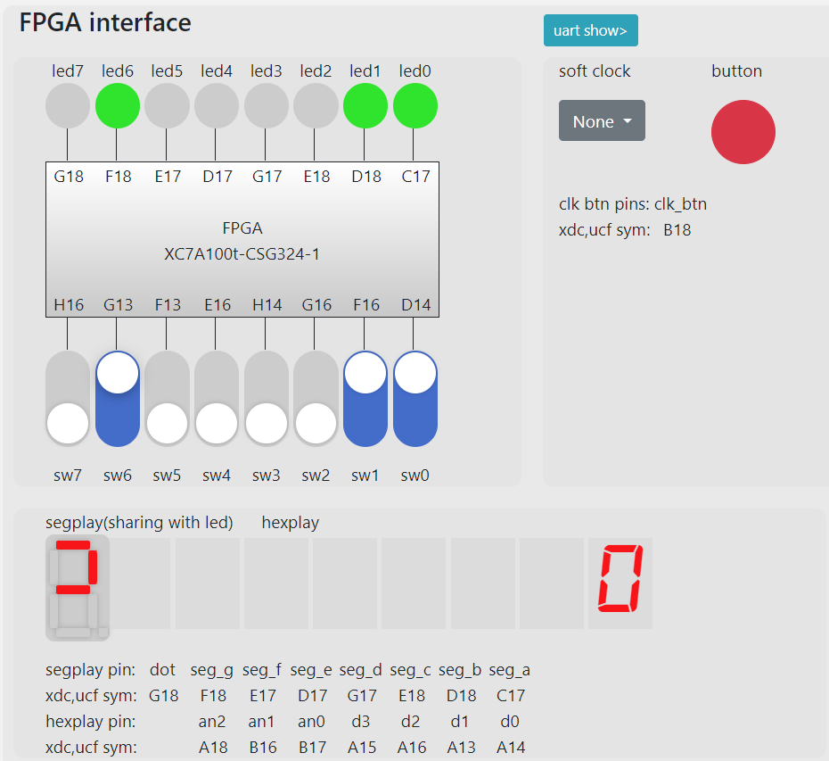

### 4. 实验总结

* 掌握了寄存器堆的功能、时序以及应用
* 例化ip核了解了不同类型存储器的时序和功能
* 实现了fifo队列，编写了fifo的各个模块
* 实验难度中等。