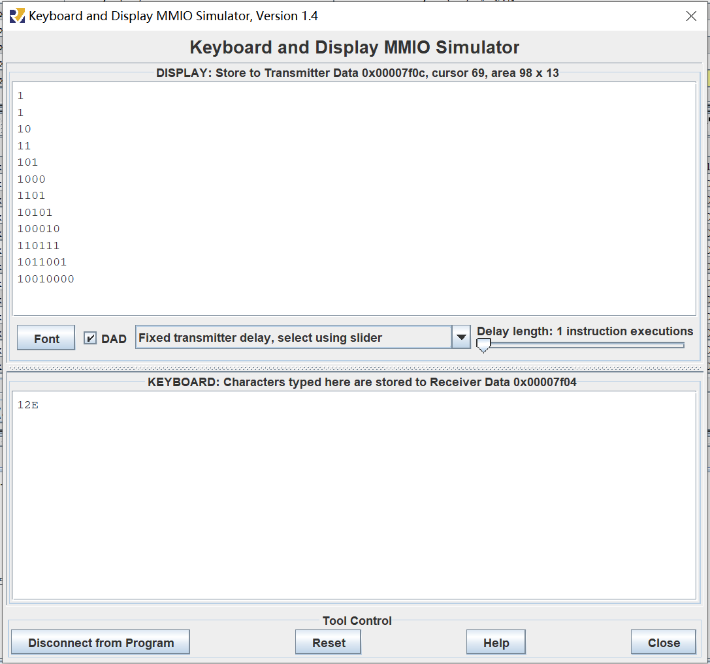
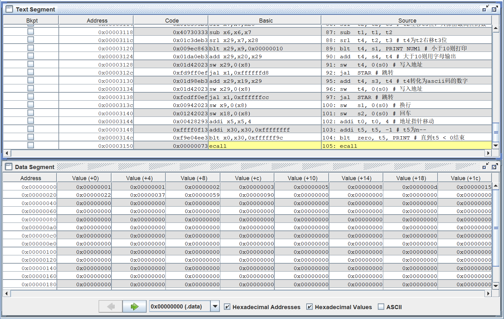
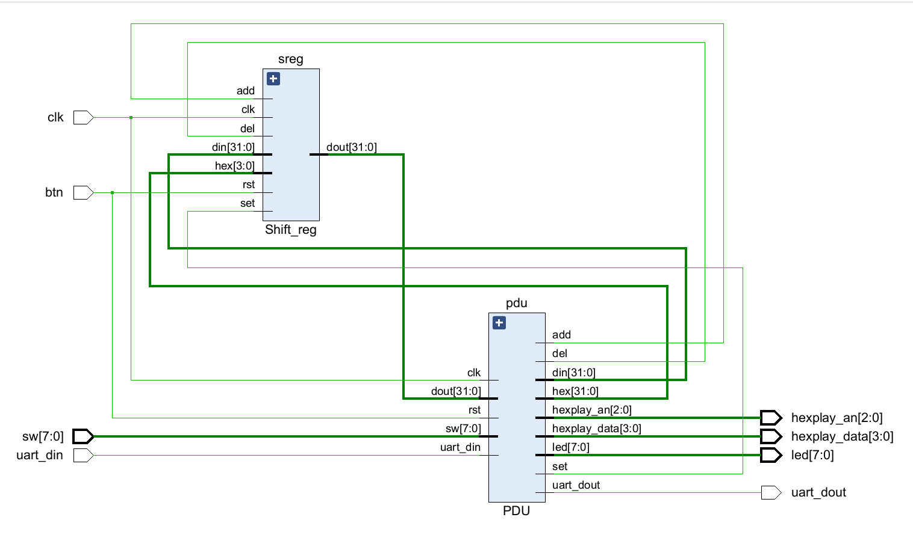
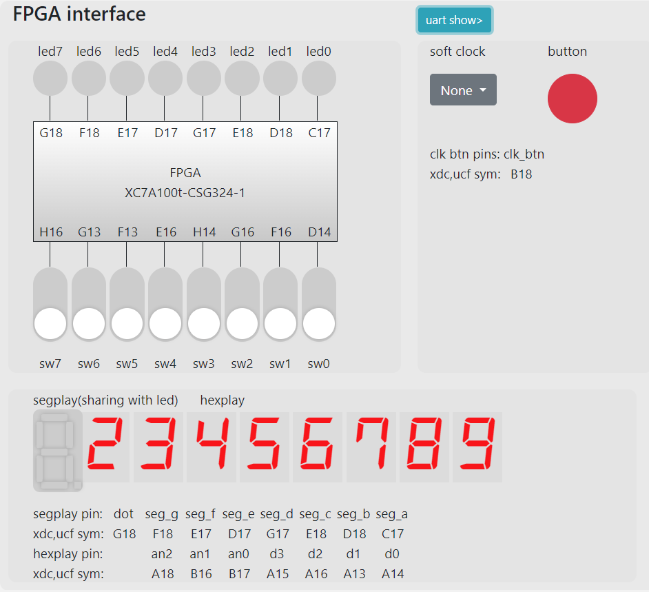
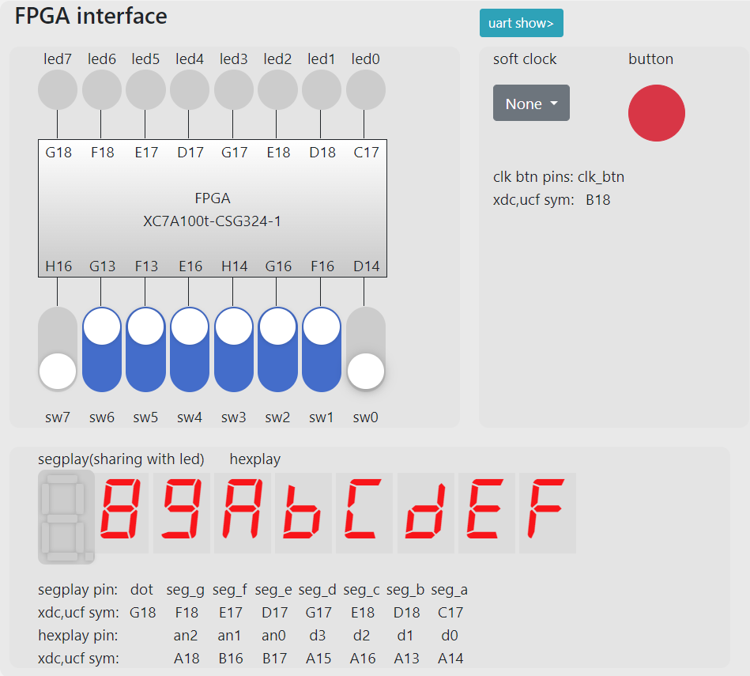
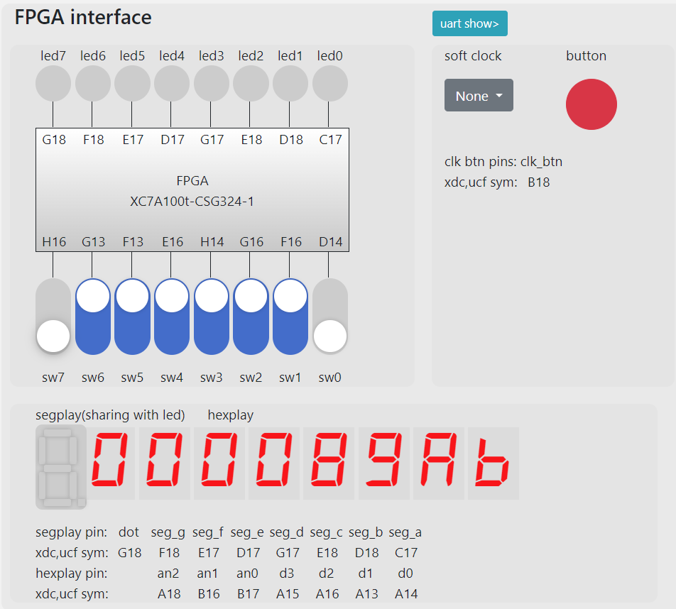
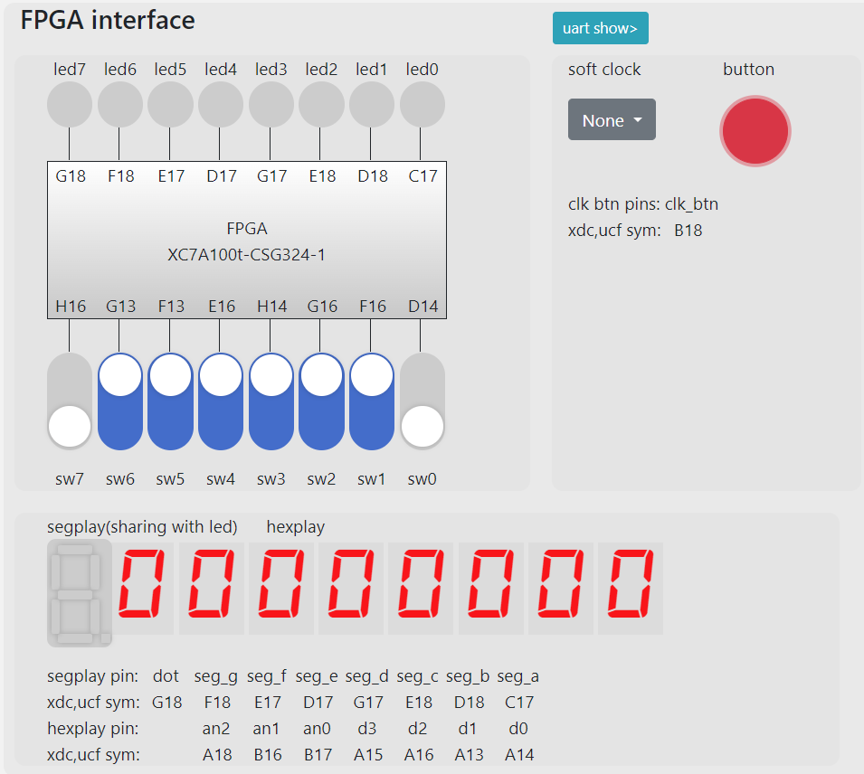

# COD lab3 report
## 牛庆源 PB21111733

### 1. 实验目的与内容
* 理解RISC-V常用的32位整数指令功能
* 熟悉RISC-V汇编仿真软件RARS，掌握程序调试的基本方法
* 掌握RISC-V简单汇编程序设计，以及存储器初始化文件(coe)的生成方法
* 理解CPU调试模块PDU的使用方法

### 2. 实验平台
* vscode
* vivado
* fpgaol

### 3. 实验过程

#### 3.1 设计汇编程序：计算斐波那契数列，生成coe文件

* 要求项数为n（3~40），存在t0（x5）
* 前两项为1，1，将n项数列存储在地址为0x0000开始的数据段
* 汇编程序指令只能使用给出的10条指令以及基于这10条指令的伪指令
* 使用rars软件生成coe文件，用于后续CPU功能测试

> 完成了选做1和选做2（以及去0操作）

**汇编程序代码如下：（代码注释完全）**

* 首先输入n，这里用E表示输入结束，采用轮询的方式直到读到E结束输入循环。
* 由于是一位一位读取输入，输入的数字每一位存在以0x0000开始的地址，然后再通过判断是个位还是十位分别处理，十位则以该位数字进行循环得到，个位保存，最后相加得到n，存储在t0。
* 去0以及输出：首先存1和1作为前两个数字，斐波那契循环n次得到后续数字。使用二进制输出，现将每一个存储的数字右移到0得到每一个数字的位数，再得到最高位（右移位数-1次去掉尾数再左移位数-1次去掉前置0），再右移位数-2次将最高位移动到最低位，转化为ascii码即可输出。依照此方法将每一位进行输出，即实现了去掉高位0的输出。
* 每一个数据处理结束后添加一个换行操作。循环输出最后得到结果。
```asm

.text
add  t5, zero, zero
add  a0, zero,zero
li   a2, 32512 # 0x7f00，输入状态寄存器地址
li   a3, 32516 # 0x7f04，输入数据寄存器地址
li   s3, 48    # 0x0030，数字0的ascii码
li   s4, 69    # 0x0041, 字母E的ascii码 表示end
addi s1, zero, 1

TMP:
lw   s2, 0(a2) # 取输入状态
beq  s2, zero, TMP # 为0则等待输入（，1则继续）
lw   s5, 0(a3) # 取输入的数据
beq  s5, s4, GETN # 为A则输入结束，跳转到取n的环节
sub  s5, s5, s3 # 得到输入的数值
sw   s5, 0(a0) # 写入地址a0
addi a0, a0, 4 # 地址指针移动
addi t5, t5, 1 # t5为n的位数
addi t6, t5, 0 # t6 = t5
j    TMP

GETN:
addi a0, a0, -4 # a0前移一次
lw   s2, 0(a0) # 取a0内容到s2
li   a5, 10 # a5 = 10，为十位
sub  s5, t6, t5 #判断当前n在第几位

GETNUM:
beq  zero, s5, MUL #如果是个位
add  s1, s1, s7 #循环10次
addi a5, a5, -1
blt  zero, a5, GETNUM

MUL:
add  s6, s1, s6 # beq进入s6记录个位，之后记录10*十位
addi s2, s2, -1
blt  zero, s2, MUL 
add  t0, s6, t0 # 由beq进入的MUL中t0为个位的数值，之后为n
addi s6, zero, 0
addi s7, s1, 0 
addi s1, zero, 0 # s1 = 0
addi t5, t5, -1 # 位数--
blt  zero, t5, GETN # 判断是否取完整个n

FIB:    # 这里已经得到t0为n
addi t5, t0, 0 # t5为n
addi t1, zero, 0
addi t2, zero, 1
addi t3, zero, 1
sw   t2, 0(t1)
addi t1, t1, 4
sw   t3, 0(t1)
addi t0, t0, -2 # 已经录入了前两个数据

LOOP:
add  t4, t2, t3 # 得到下一个数据
addi t2, t3, 0 # t2 = t3
addi t3, t4, 0 # t3 = t4
addi t1, t1, 4 # 地址指针移动
sw   t4, 0(t1) # 录入下一个数据
addi t0, t0, -1 # 又录入了一个数据
blt  zero, t0, LOOP # 直到把n个数据录入完毕结束

li   s0, 32524 # 0x7f0c Display
li   s1, 10 # 0x0a # 10 换行 \n
li   s2, 13 # 0x0d # 回车 \r
li   s3, 48 # 0x30 # 数字0
li   s4, 87 # 0x57 # 
addi t0, zero, 0

PRINT:
addi t2, zero, 0
addi t3, zero, 0
lw   t1, 0(t0) # 取第一个数据
addi t2, t1, 0

SLL:
addi t3, t3, 1 # t3++
srli t2, t2, 1 # t2右移一位
blt  zero, t2, SLL # 直到取到0，t3记录该数字的位数

STAR:
addi t3, t3, -1  #t3--
blt  t3, zero, COMPARE # 直到小于0
addi t2, t1, 0 # t2仍然为第一个数据
srl  t2, t2, t3 # t2右移t3位
sll  t2, t2, t3 # t2左移t3位，只保留最高位的数
sub  t1, t1, t2 
srl  t4, t2, t3 # t4为t2右移t3位
blt  t4, s1, PRINT_NUM1 # 小于10则打印
add  t4, s4, t4 # 大于10则用字母输出
sw   t4, 0(s0) # 写入地址
jal  STAR # 跳转

PRINT_NUM1:
add  t4, s3, t4 # t4转化为ascii码的数字
sw   t4, 0(s0) # 写入地址
jal  STAR # 跳转

COMPARE:
sw   s1, 0(s0) # 换行
sw   s2, 0(s0) # 回车
addi t0, t0, 4 # 地址指针移动
addi t5, t5, -1 # t5为n--
blt  zero, t5, PRINT # 直到t5 < 0结束
ecall
```

* 3.1结果
**输入和输出结果如下：**
输入12E（即n=12）

**内存显示如下：**


#### 3.2 设计32bits移位寄存器，通过PDU实现对移位寄存器数据的实时操作

* 按照要求修改Shift_reg即可
* rst，set，add，del功能实现

> 给出的top模块在例化PDU时多了btn接口，需要删掉


```verilog
always@(posedge clk or posedge rst)
    begin
        if(rst)
            dout<=din;
        else if(set) // 置数
            dout<=din;
        else if(add) // 左移四位，低四位置hex
            dout<={dout[27:0],hex};
        else if(del) // 删除低四位，高四位置0
            dout<={4'b0,dout[31:4]};
    end
```

**顶层模块电路如下：**


**fpga烧写结果如下：**

* **写入0123456789Abcdef**



* **删除**



* **重置操作**




### 4. 实验总结

* 本次实验使用了RARS软件调试RISC-V的汇编代码，并完善了移位寄存器
* 整体难度适中，但选做难度比较高，需要考虑的内容比较多