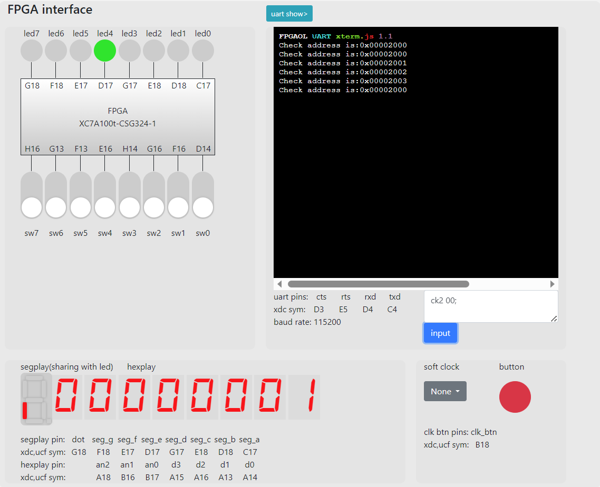

# COD lab4 report
## 牛庆源 PB21111733

### 1. 实验目的与内容
* 深化对RISC-V指令集的理解
* 理解单周期CPU的结构和工作原理
* 熟练掌握单周期CPU数据通路和控制器的设计和描述方法
* 理解单周期CPU的调试方法

### 2. 实验平台
* vscode
* vivado
* fpgaol

### 3. 实验过程

#### 3.1 设计单周期CPU数据通路

* 要求完善单周期CPU的各个模块

1. **PC寄存器**

在clk作用下：rst时`pc_cur<=32'h3000`; 其他时候`pc_cur<=pc_next`。
同时完成了一个作用为`PC+4`的模块`ADD_PC`

2. **寄存器堆RF**

使用文档中给出的语句初始化，其他与lab2中相同。

3. **算数逻辑单元ALU**

去掉溢出位的处理，其他不变，为方便接入Ctrl模块，各个运算模式可以用`parameter`进行命名。

4. **IMM生成器**

参考文档中给出的各类型指令立即数的组成，分为I，*Ishamt（选做1）*，B，S，U，J型指令使用`case`语句分别生成。立即数为有符号数。

1. **指令存储器IM和数据存储器DM**

均为`256*32`位，使用vivado中的ip核即可创建。对于指令存储器，每次测试分别录入`fls.coe，test.coe，test_others.coe`

6. **MEM模块**

生成的ip核例化在这个模块内，注意两个模块的端口a均为`addr[9:2]`

7. **控制器Control**

该模块通过指令存储器的指令`inst`，通过一个很大的选择器（根据指令集不同指令的操作码格式选择），生成`jal`等控制信号。*（选做1，2，3，4，5）*

8. **分支模块Branch**

对CTRL生成的`br_type`，case出不同的跳转指令，比较两个寄存器内容大小，产生br信号。*（选做4）*

9. **选择器模块sel**

完成了四个sel模块：ALU的op1和op2的sel，PC的sel以及寄存器堆写回时的sel。具体实现为：通过CTRL模块对不同类型指令的分类以及对各个控制信号的赋值，在四个sel模块中分别对应即可。*（选做1，2，3，4，5）*

10. **CPU_Debug**

根据手册实验原理7给出的Debug接口信号处理，以及数据通路中的Debug的每一个接口，可以顺利地写出CPU_Debug模块。事实上接口信号处理给出的RF放在CPU中即可，Debug模块直接reg一个输入，然后当cpu_check_addr[12]为1时输出即可。

11. **AND_jalr**

（根据数据通路补充的模块）作用是jalr指令计算出的结果末位清0

* **RTL电路如下：**
* top：

* CPU：

#### 3.2 测试Lab3必做生成的fls.coe

* 使用该coe文件初始化Inst_mem，fpga烧写结果如下：
1. `run;`之后使用`sw7`初始化，再`ck2 00;`，可以看到0x2000地址存放结果为1

2. `add;`可以看到0x2001地址存放结果为1

3. `add;`可以看到0x2002地址存放结果为2

4. 多`add;`几次可以看到0x2005存放结果为8

5. `sub;`可以看到0x2004存放结果为5

6. `ck2 0a;`可以看到0x200a存放结果为`2'h59`

#### 3.3 测试test.coe以及选做写的汇编程序生成的test_others.coe

* 分别用两个coe初始化Inst_mem即可，fpga烧写结果分别如下：（可以通过bit流的不同名字区分）

1. 

2. 

可以看到在`run;`后，led0均亮起，说明均成功。

### 4. 实验总结

* 本次实验完成了单周期CPU，具体实现跟着文档走即可，给出的数据通路有些许错误但是清晰明了，跟着连线即可。
* 选做部分要完成更多的指令实现，事实上就是重复性工作，需要考虑更多的指令类型以及情况，对熟悉RISC-V指令集构成有很大帮助。
* 总体实验难度较难