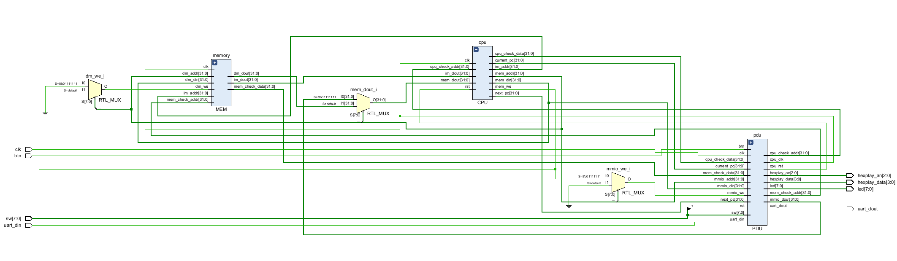
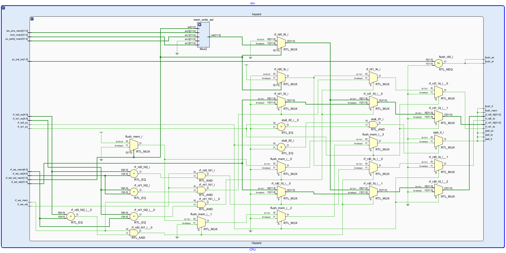
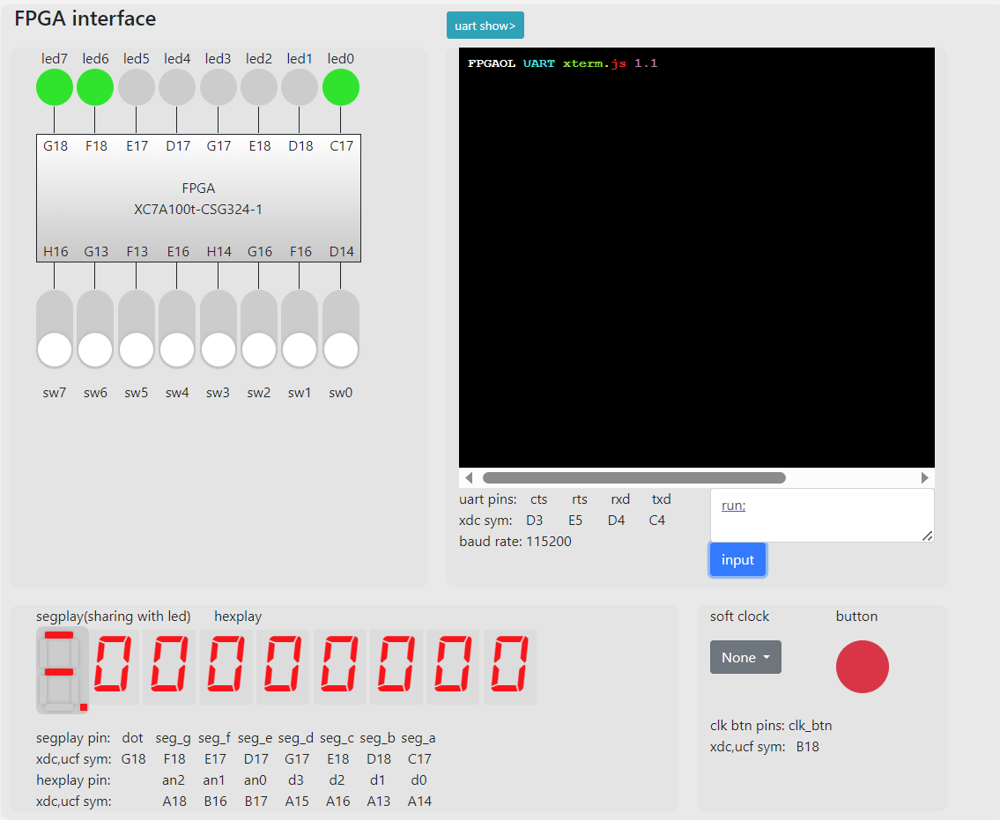

# COD lab5 report
## 牛庆源 PB21111733

### 1. 实验目的与内容
* 理解流水线CPU的结构和工作原理
* 掌握流水线CPU的设计和调试方法，特别是流水线中数据相关和控制相关的处理
* 熟练掌握数据通路和控制器的设计和描述方法

### 2. 实验平台
* vscode
* vivado
* fpgaol

### 3. 实验过程

#### 3.1 设计五级流水线CPU

* 要求修改部分lab4中的模块
* 添加段间寄存器
* 完成对于冒险的处理
* 通过测试

1. **段间寄存器PC**

加入一个stall接口

2. **寄存器堆写优先**

对x0仍然进行特殊处理，同时在赋值之前考虑读取和写入是否同时进行，若同时进行，传出的为正在写的内容。

3. **控制单元**

加入了两个寄存器读使能信号（rf_re0，rf_re1），由于全部考虑情况较多，这里只对用到的10条指令进行了处理。对于每条指令，读寄存器rs为x0时，将rf_re设置为0；写寄存器rd为0时，将wb_en设置为0。

4. **nop指令与段间寄存器清空**

采用给出的MUX2模块，修改接口得到MUX1模块为nop指令模块

5. **三种冒险的处理**

* 对于结构冒险，采用哈佛结构即可解决
* 对于数据冒险
> 首先判断数据冒险的发生条件：
> * MEM/WB段写使能为1 ：`if (rf_we_mem == 1)// MEM段`
> * EX段某寄存器读使能非零： `if (rf_re0_ex)// 寄存器0`
> * 上述寄存器地址等于MEM/WB段的写地址 `if (rf_ra0_ex == rf_wa_mem)`
> * 若为MEM段，写回的数并非数据存储器的读取结果
> 注意当MEM和WB都有前递存在时，前递MEM的数据(先`if`MEM段赋值即可)

* 对于控制冒险，由于所有跳转均在EX段检测，判断pc_sel_ex即可。
```verilog
if (pc_sel_ex != 0) // 控制冒险
begin
	flush_id = 1;
	flush_ex = 1;
end
else
begin
	flush_id = 0;
	flush_ex = 0;
end
```

1. **写出数据通路给出的其他模块**

诸如add4，alu等模块可以直接复用lab4的模块，连线即可

* RTL电路如下：
* top：


* cpu的hazard模块：



#### 3.2 完成流水线CPU的下载测试

* 烧写fpga结果如下：




### 4. 实验总结

* 本次实验完成了流水线cpu，重点在于对于三种冒险的处理，编写了hazard模块
* 难度较大，仅完成了必做，由于写了lab4的选做，控制模块的赋值更为复杂，于是重新编写了较为简单的控制模块仅完成了10条指令。
