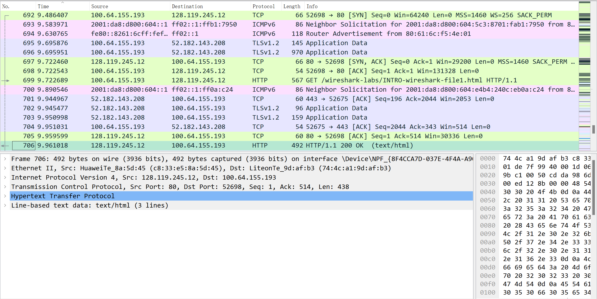
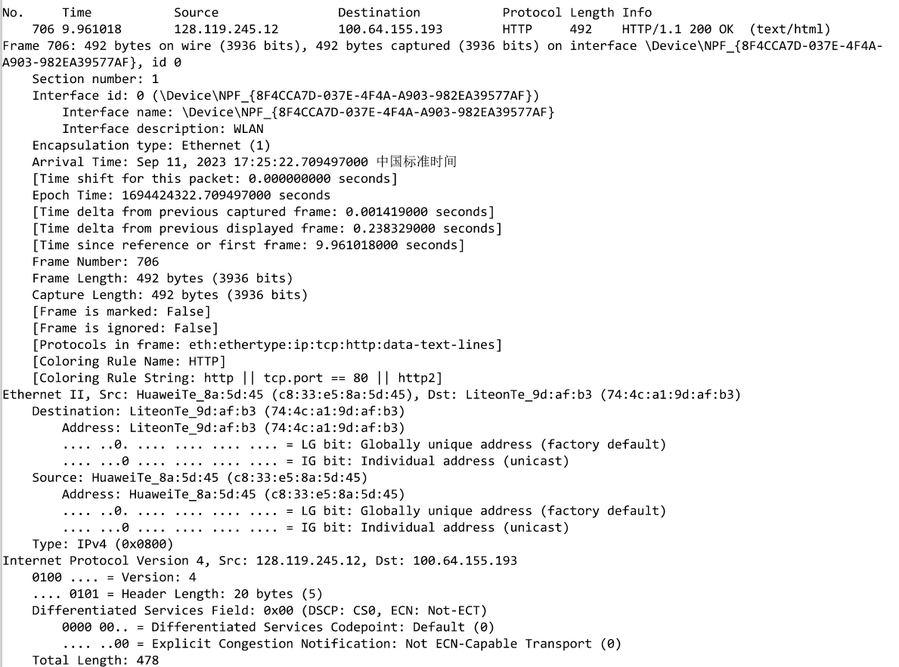
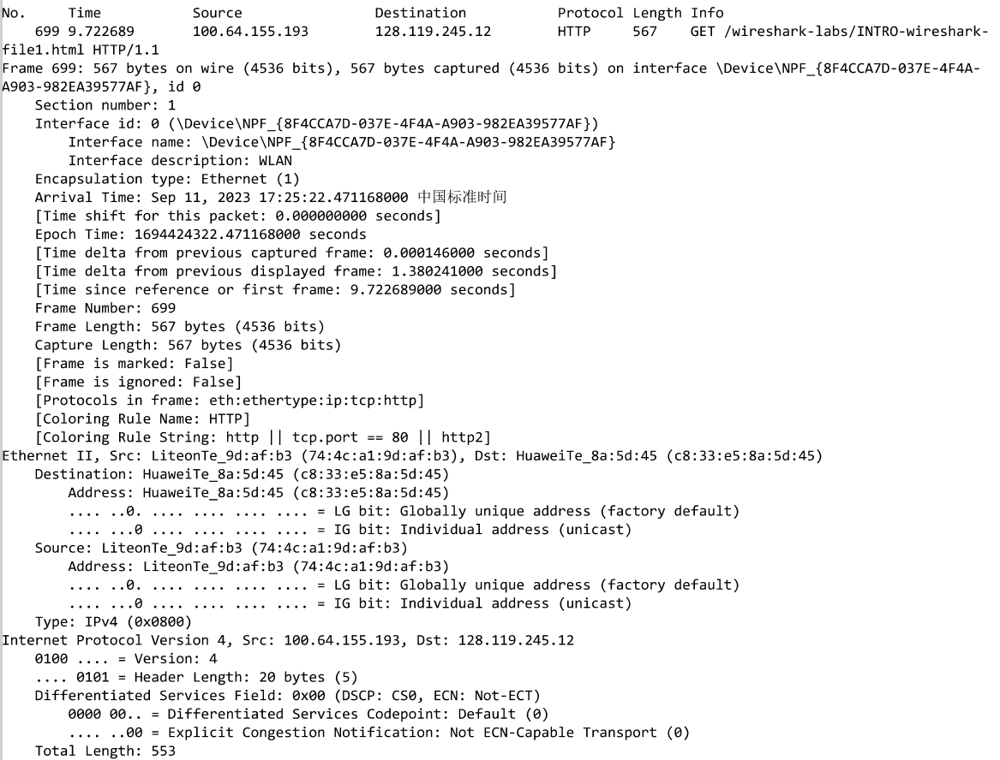

# LAB1
## 牛庆源 PB21111733
* **STEP1：开启捕获**
  
  部分内容如下（可以看到有TCP，ICMPv6，TLSv1.2等不同的协议）

* **STEP2：打开网址并停止捕获，搜索http协议**
  
  按照info排序找到get和response（OK）如下

  
  通过观察time可以计算出响应时间为`9.961018 - 9.722689 = 0.238329`秒

* **STEP3：判断本机ip和目标ip**

  通过观察Source和Destination可以判断出gaia.cs.umass.edu地址为128.119.245.12，本机地址为100.64.155.193

* **STEP4：将STEP2中的两个http消息打印**
  
  如下：（为部分截图，具体内容在同名pdf内）
  
  