# LAB2
## 牛庆源 PB21111733

* **1.**

如图所示：GET和RESPONSE都是1.1，即服务器和本地都是HTTP1.1

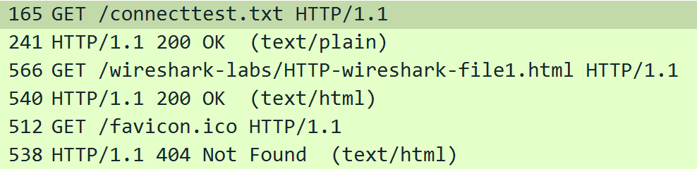

* **2.**

如图所示：Accept-Language

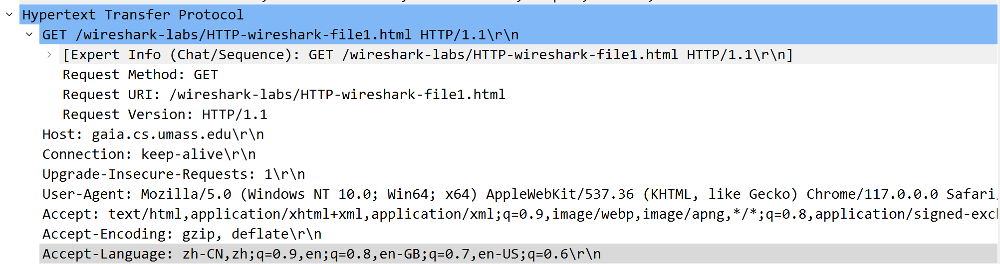

zh-CN   中文（中国），最高优先级

zh      中文，0.9优先级

en      英语，0.8优先级

en-GB   英语（英国），0.7优先级

en-US   英语（美国），0.6优先级

* **3.**

如图所示

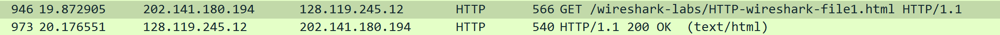

本机ip：202.141.180.194
服务器ip：128.119.245.12

* **4.**

return的如答3图所示为：200OK

* **5.**

如图所示：

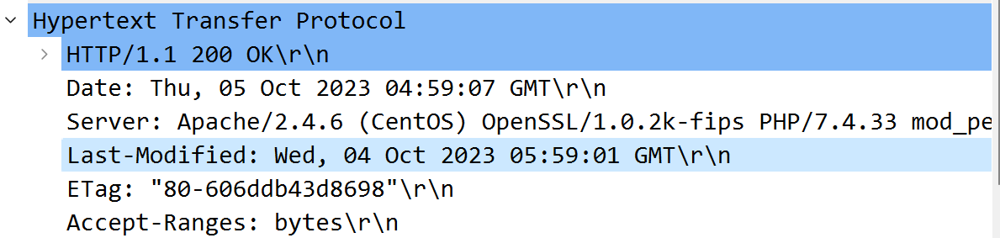

2023年10月4日上午05:59:01（格林威治标准时间）

* **6.**

如图所示：content length和file data

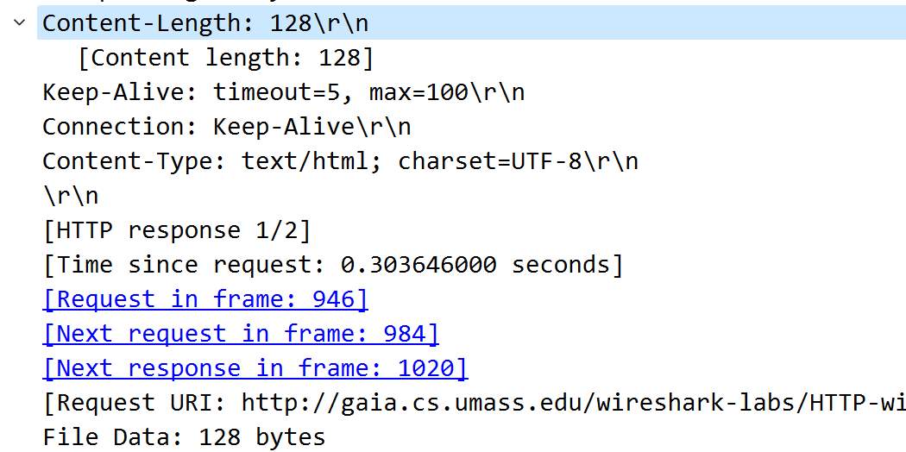

128 bytes

* **7.**

请求报文如图所示：

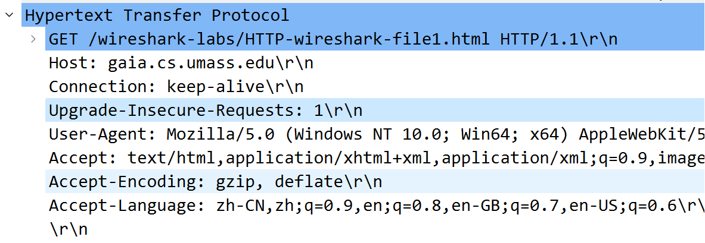

Host,Connection,User-Agent等

响应报文如图所示：

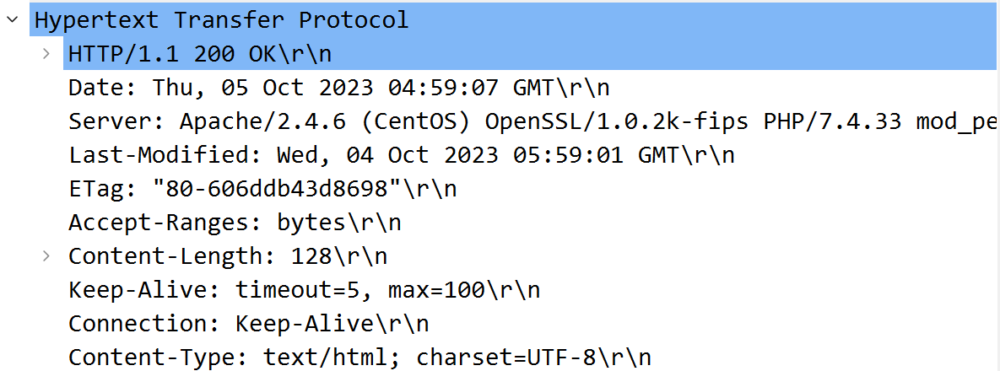

Date,Server,Last-Modified等

* **8.**

如下图所示：没有IF-MODIFIED-SINCE

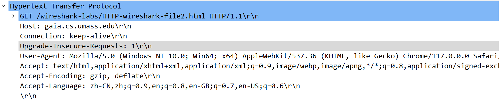

* **9.**

有返回内容，如下图所示：

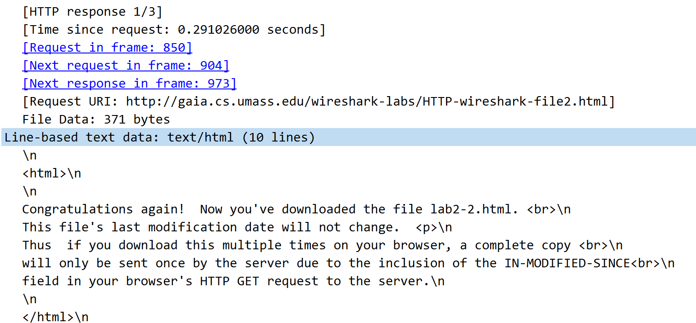

* **10.**

有，报头后内容是Last-Modified的时间

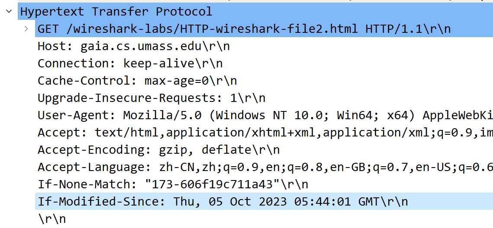

* **11.**

如图所示：304 Not Modified

该网页上次访问过没有修改，且在本地有缓存，所以没有返回文件内容

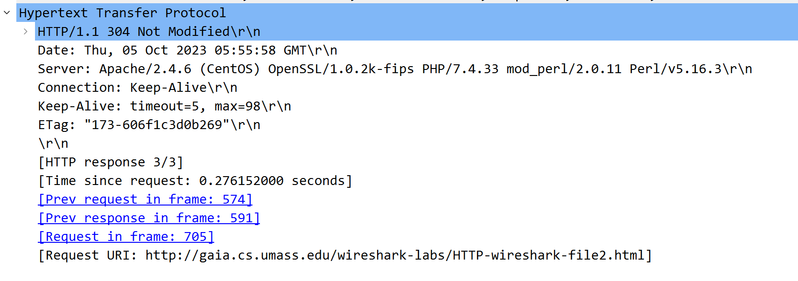

* **12.**

如图所示：一个get，包号3487

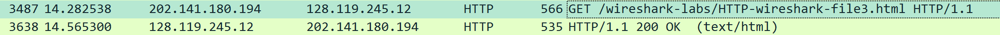

* **13.**

如答12图所示：包号3638，内容以及关联如下图

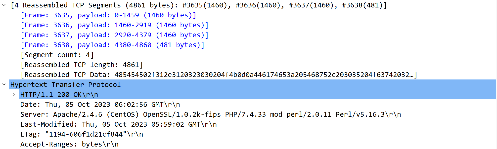

* **14.**

200OK

* **15.**

如答13图所示：四个TCP

分别为3635,3636,3637,3638

* **16.**

三个GET

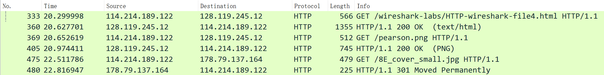

* **17.**

如上图时间所示，不是并行到达，有先后顺序

* **18.**

如下图所示，401 Unauthorized

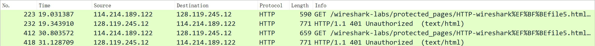

* **19.**

如下图所示：已经带有Authorization信息，即我输入的nqy1002

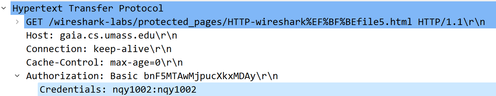

* 注：others中print3和print4为重做结果（当时忘记导出为pdf了）