# LAB3
## 牛庆源 PB21111733

* **1.**

查询bilibili的ip，为121.194.11.73

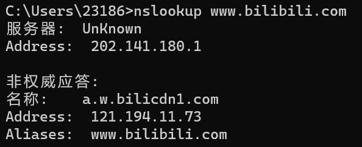

* **2.**

查询英国曼彻斯特大学的权威DNS服务器

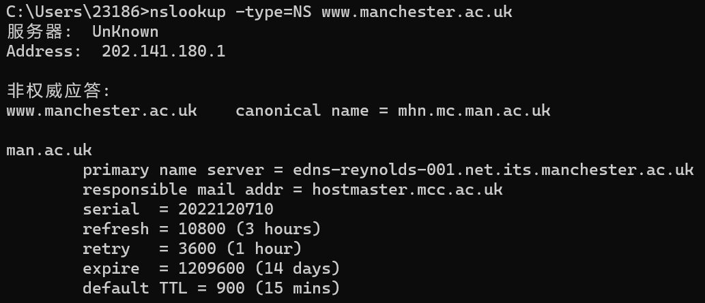

* **3.**

用曼彻斯特大学权威DNS查询yahoo失败，但列出了一些其他查询结果

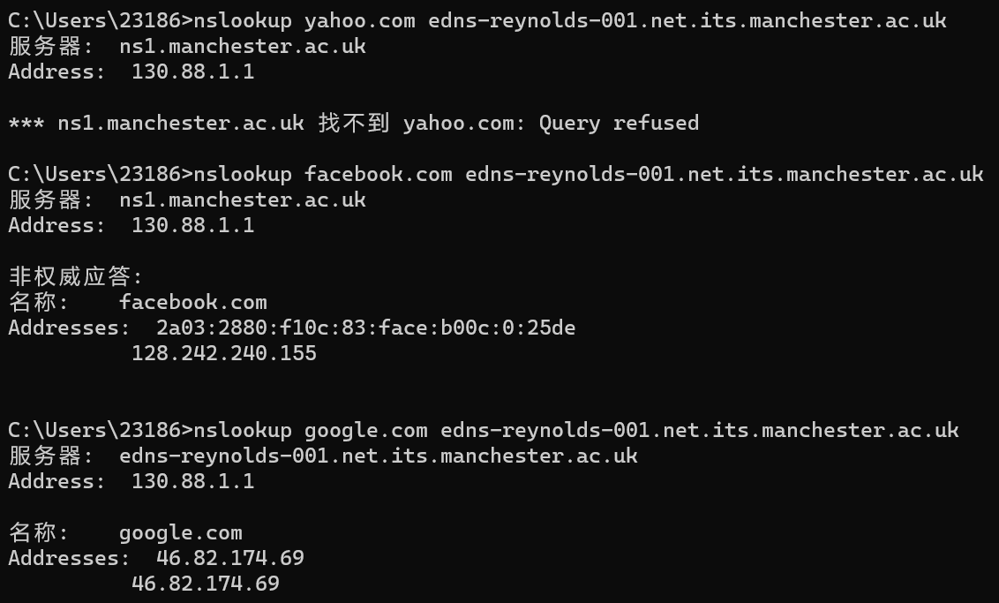

* **4.**

如图，为UDP协议

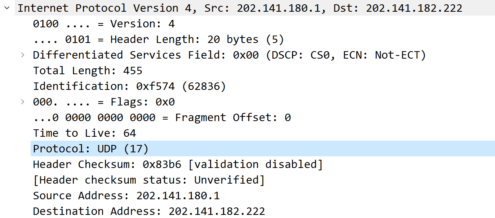

* **5.**

如下两图，都为端口号53

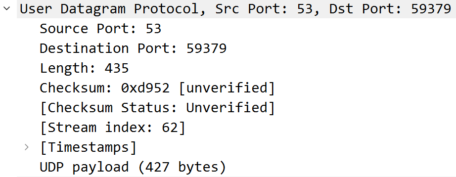

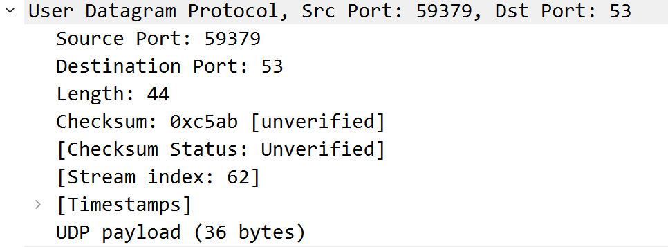

* **6.**

二者ip地址相同，均为202.141.180.1

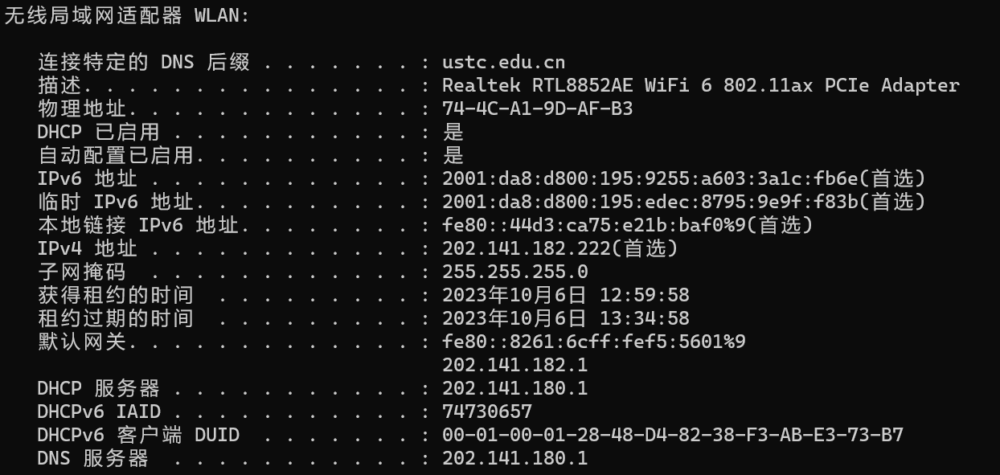

* **7.**

类型为type A，没有answers

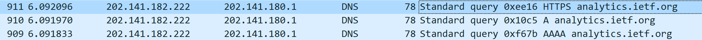

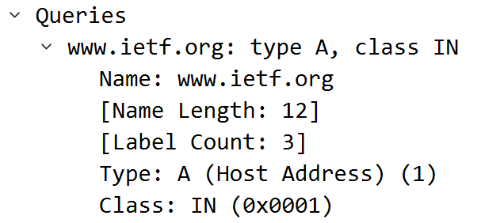

* **8.**

response中answers中有两条内容，如下

包含域名，类型，分类等信息

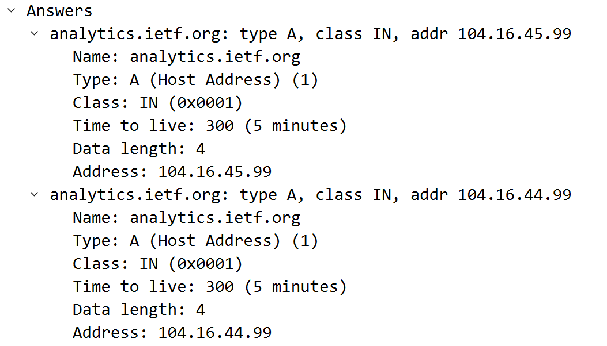

* **9.**

Q8图与下图比较，104.16.44.99是DNS response的answers中的

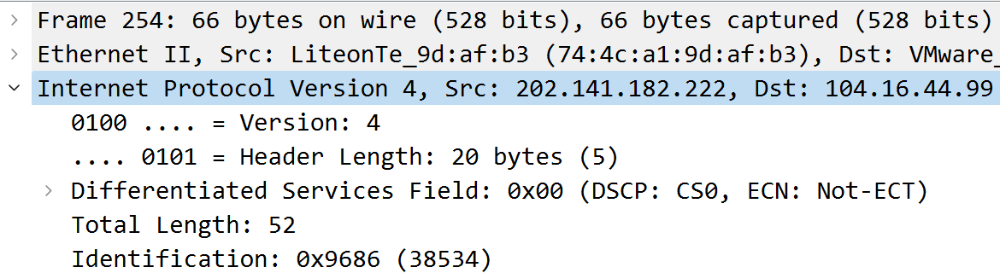

* **10.**

经检查，图片没有新的query

* **11.**

端口号均为53

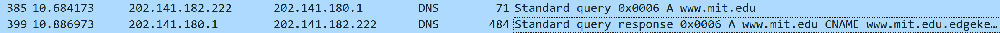

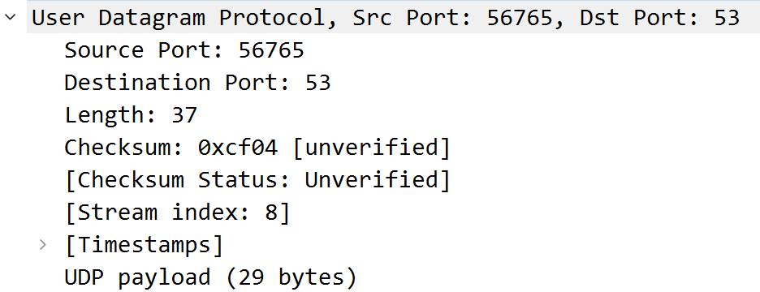

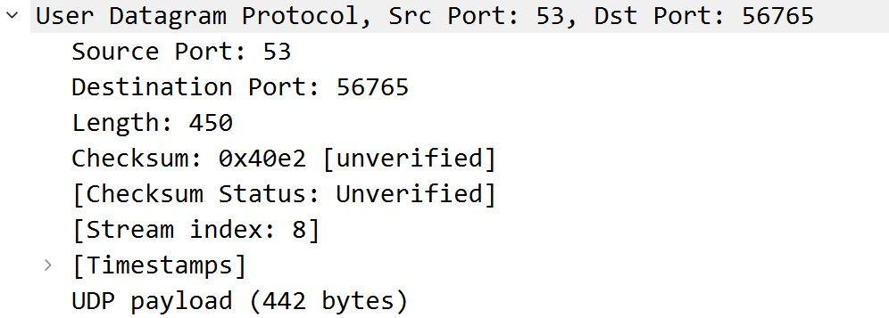

* **12.**

sent到202.141.180.1，与Q6图中本地DNS一致

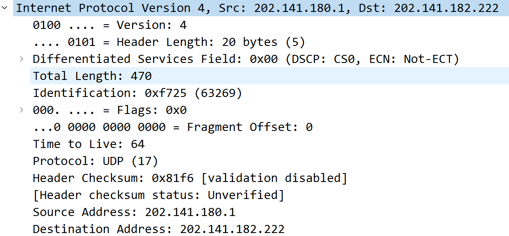

* **13.**

类型为type A，不含answers

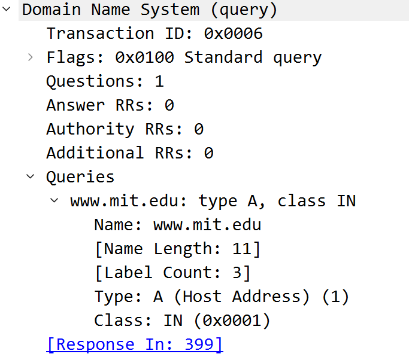

* **14.**

answers中有三个内容，如下，比之前的实验结果多出cname，以及其条目

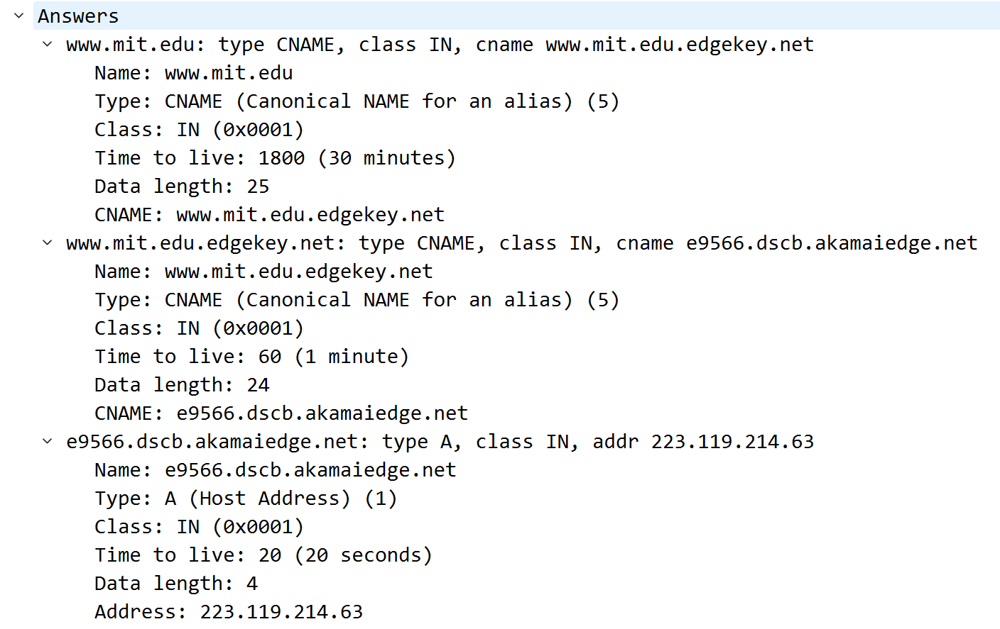

* **15.**

如解答中的截图

* **16.**

202.141.180.1，为本地DNS

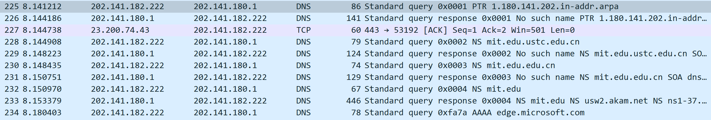

* **17.**

是type PTR，不含answers

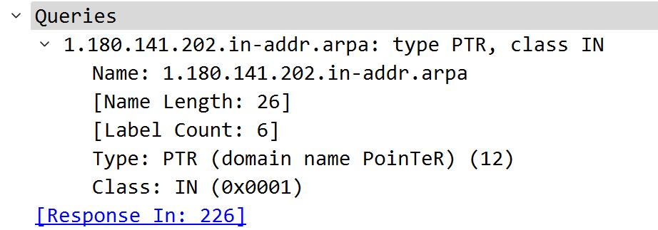

* **18.**

answers中的内容与nslookup得到的nameserver一致

没有给出ip地址但可以通过nslookup再次查询得到（？

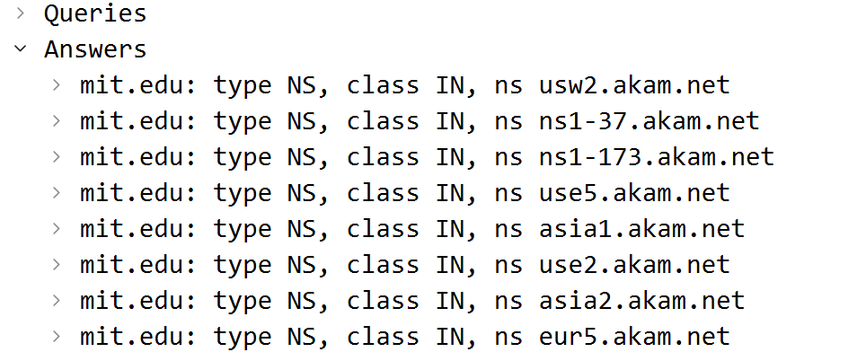

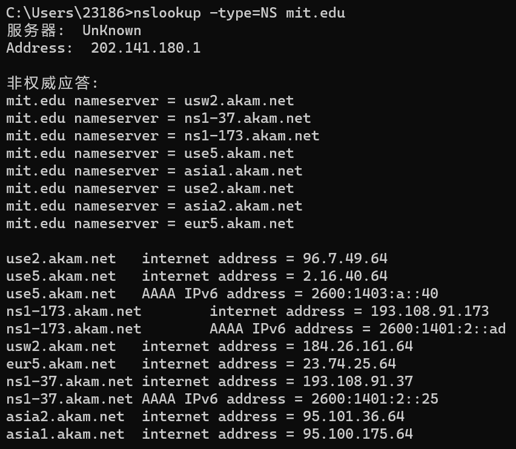

* **19.**

如解答中的截图

* ***一直超时，如下，所以在解答20与21问时用超时得到的结果，但22问采用了给出zip中文件的结果***

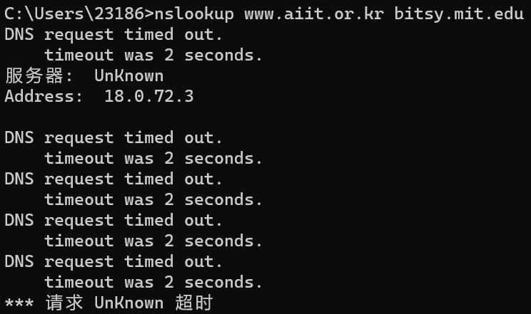

* **20 and 21.**

query请求被发送到18.0.72.3，是bitsy.mit.edu的地址，不是本地DNS的地址，类型为type A，没有answers

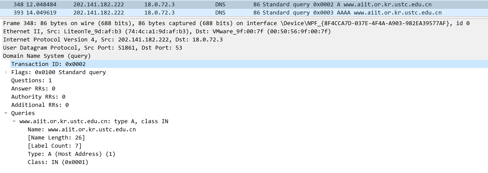

* **22.**

zip中的文件，其查询并非aiit.or.kr，为google.com，其使用的也并非是bitsy.mit.edu，所以answers个数可能不同，在此例中，个数为5个，包含有域名，类型等

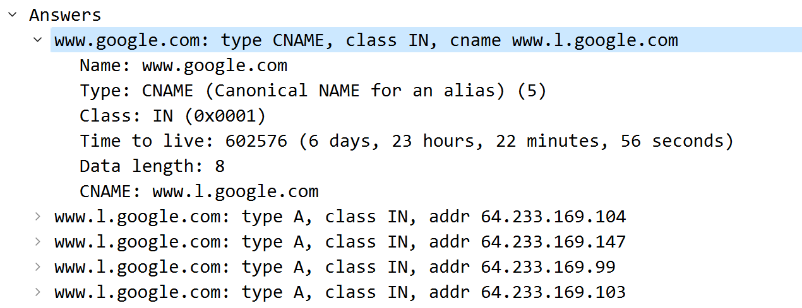