# LAB4
## 牛庆源 PB21111733

* **1.and2.**

    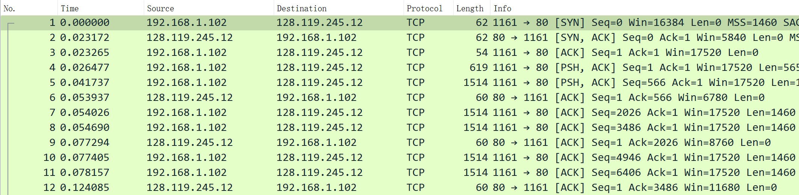

    1.将文件传输到gaia.cs.umass.edu的客户端ip地址为192.168.1.102，端口号为1161
    2.gaia.cs.umass.edu的IP地址是128.119.245.12，端口号为80

* **3.**

    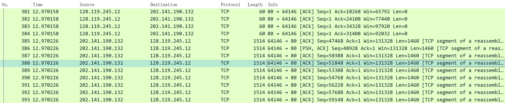

    本机客户端ip地址为202.141.190.132，端口号为64146

* **4.and5.**

    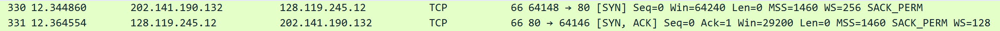
    

    4.TCP SYN段序号为0（由seq=0可得），在flags标识SYN段

    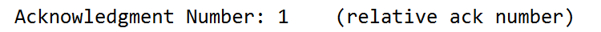
    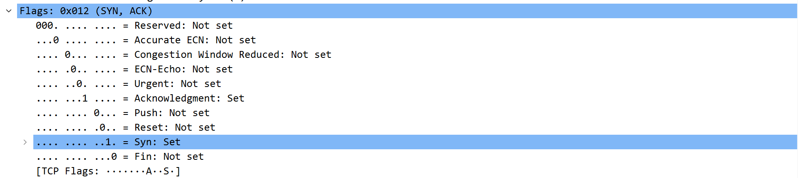
    5.SYN,ACK段序列号为0（由seq=0可得），ACK为1，flags标识该段

* **6.**

    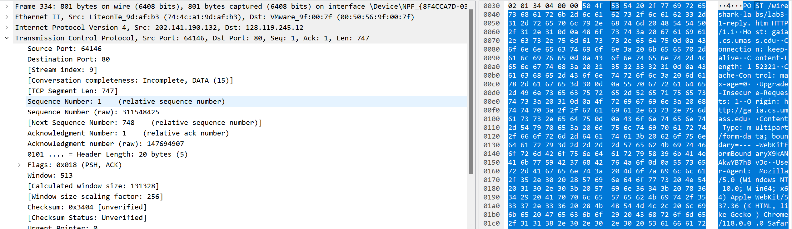
    post存在于PSH,ACK段，其序列号为1（seq=1）

* **7.**

    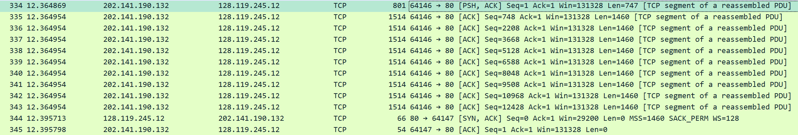
    
    前6个段的序列号为1 748 2208 3668 5128 6588，
        分段1在12.364869s发送，
        剩下五个分段在12.364954s并发发送

    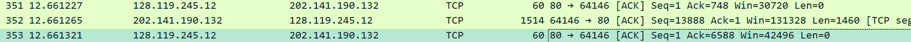

    收到了两个ACK分别为748和6588，分别为第二段和第六段的序列号，即第一段和第五段返回的ACK，收到的时间分别为12.661227s和12.661321s，

    依据时间差计算得到第一段和第五段的RTT分别为0.296358s和0.296367s

    第一段的EstimatedRTT1 = SampleRTT1 = 0.296358s
    第五段的EstimatedRTT5 = 0.875 * EstimatedRTT1 + 0.125 * SampleRTT5 = 0.296359s

* **8.**

    由题7图可知第一段为747bytes，剩下都为1460bytes

* **9.**

    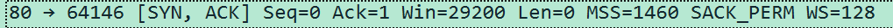

    the minimum amount of available buffer space 是 29200bytes（win）

    由题八答可知最大为1460bytes不超过29200bytes所以没有限制

* **10.**

    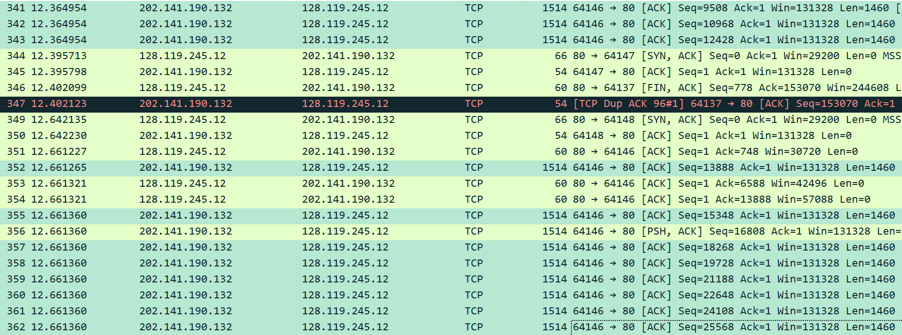
    
    由标记的内容可知seq是在不断增大的（由12.364954s到12.661265s到12.661360s时，seq仍然在一直增大），因此没有重传

* **11.**

    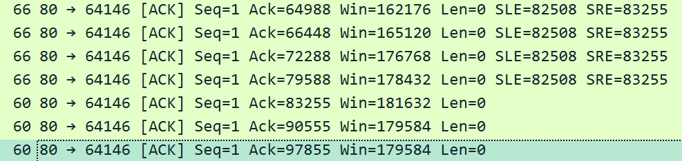

    Ack差为1460bytes的整数倍

* **12.**

    

    

    由第一个和最后一个ack信息可以计算得到

    $\frac{153069-1}{13.565270-12.364554} = 127.48kb/s$

* **13.**

    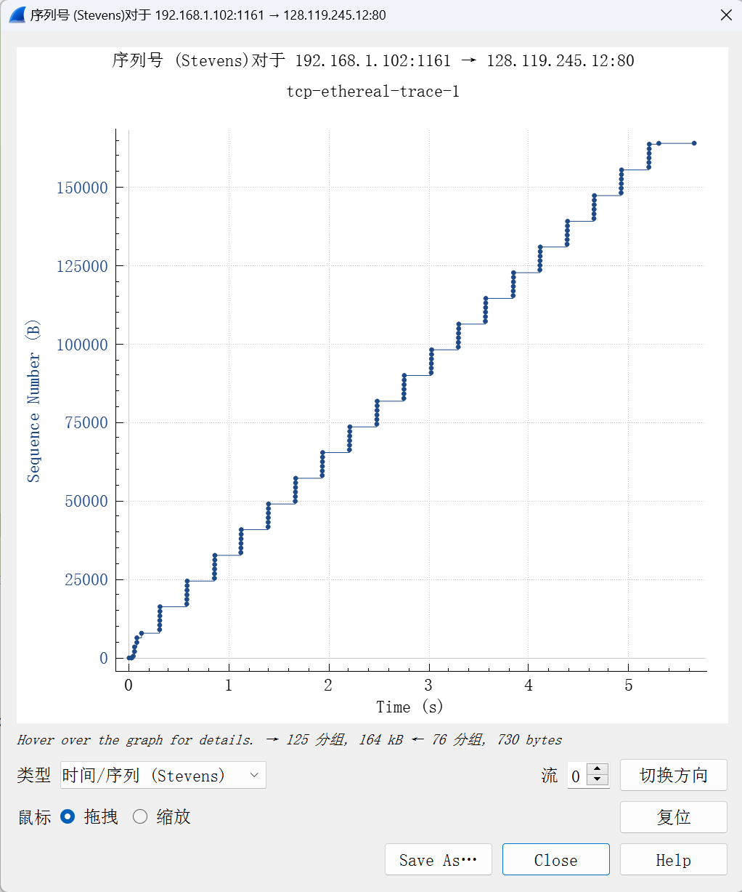

    慢启动阶段为

    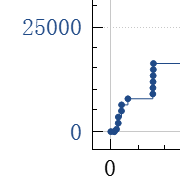

    后续都为拥塞避免（类似下图）

    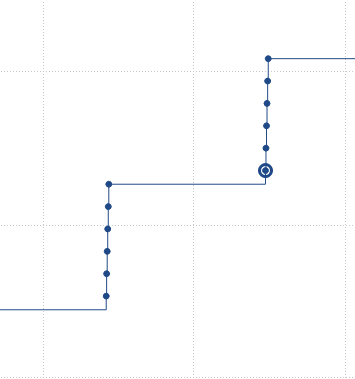

    区别为在拥塞避免阶段每隔一个RTT拥塞窗口增加5，而不是1

* **14.**

    （这题是后面重新抓包后做的，可能与之前数据有所偏差）

    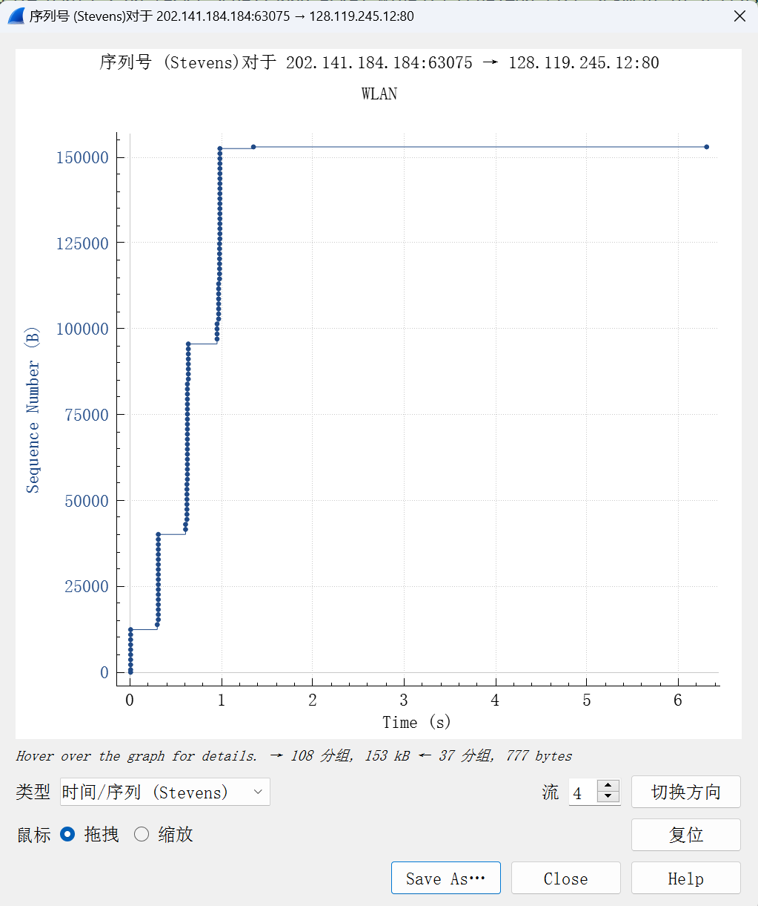

    慢启动阶段为下图，每隔一个RTT，增长约为指数速度增长

    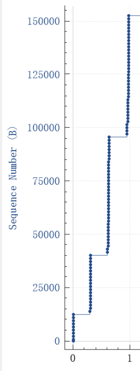

    后续为拥塞避免阶段

    区别为慢启动阶段不是严格的指数速度增长