# LAB5
## 牛庆源 PB21111733

* **1.**

    本地计算机ip地址为192.168.1.102
    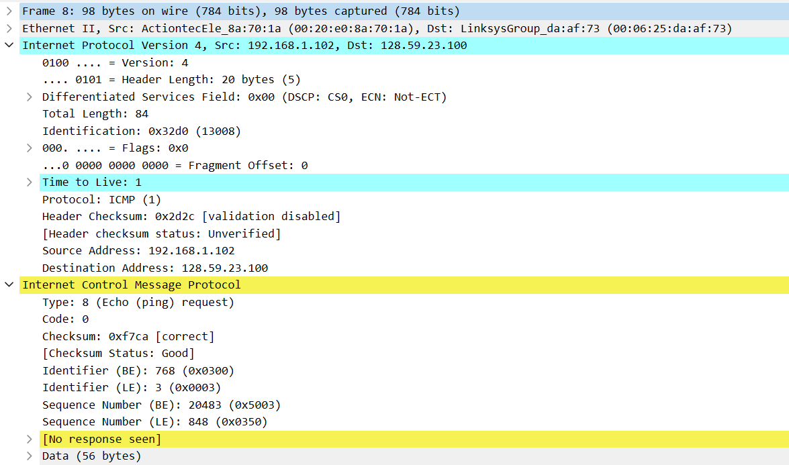

* **2.**

    ICMP(1)
    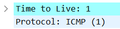

* **3.**

    Header Length: 20 bytes
    Total Length: 84 bytes
    How many bytes are in the payload of the IP datagram ?
    84 - 20 = 64 bytes
    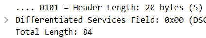

* **4.**

    没有分片，因为flag字段的Fragment都为0
    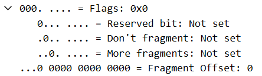

* **5.~7.**

    从NO.8开始往上一段内容如下：

    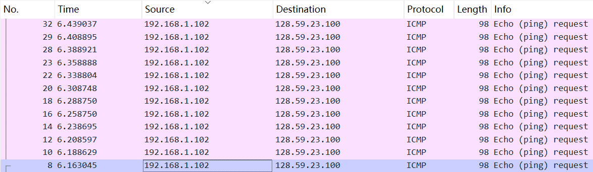

    Frame 8
        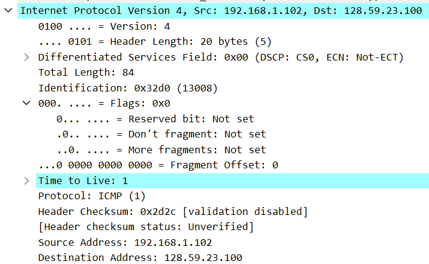

    Frame 10
        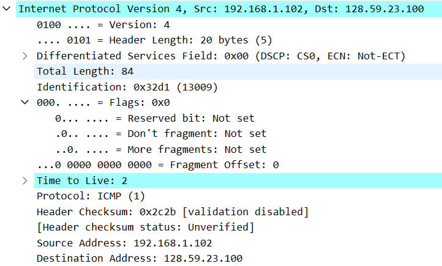

    Frame 20
        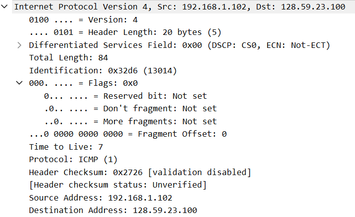

    改变：Identification, Time to Live, Header Checksum
    不变: Version, Header Length, Differentiated Services Field, Total Length, Flags, Fragment Offset, Protocol, Source Address, Destination Address
    必须不变：Version, Header Length, Differentiated Services Field, Protocol, Source Address, Destination Address
    必须改变：Identification, Time to Live, Header Checksum
    原因：Identification是标识，每一段报文必须唯一；Time to Live是由traceroute发送的TTL递增导致必须改变；Header改变，Checksum必须改变

    Idenitification递增1

* **8.**

    Identification: 0x9d7c (40316)
    Time to Live: 255
    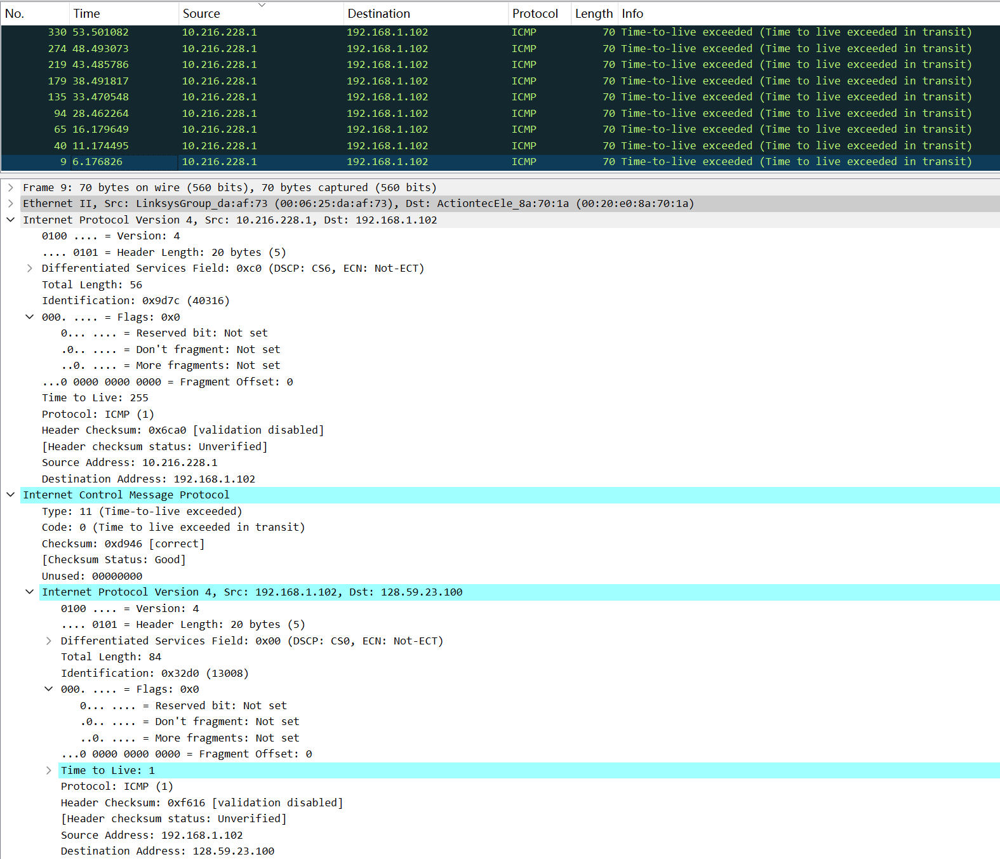

* **9.**

    Identification变化，因为其唯一性
    TTL不变，都是由同一个路由器发送

    Frame 9
        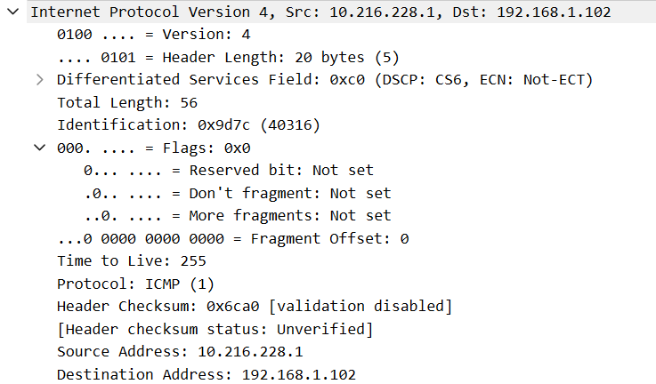

    Frame 135
        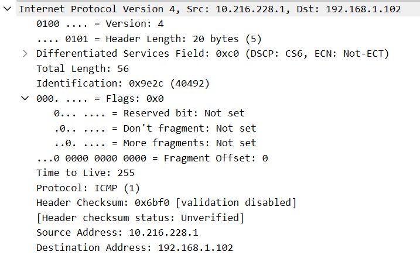

* **10.**

    Frame 93
    分为两片
    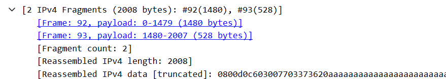

* **11.**

    Frame 92
    More fragments: Set 表明分片
    Fragment Offset: 0 表明是第一个分片
    Total Length: 1500 表明报文长度为1500字节
    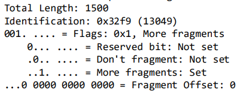

* **12.**

    Frame 93
    Fragment Offset: 1480 表明不是第一个分片
    More fragments: Not set 表明没有后续分片
    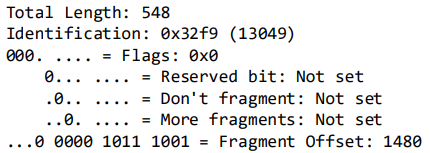

* **13.**

    对比Frame 92 和 Frame 93可以得到
    Total Length, Flags, More fragments, Fragment Offset变化
    Header Checksum也变化了
    
    

* **14.**

    Frame 218
    分了3片
    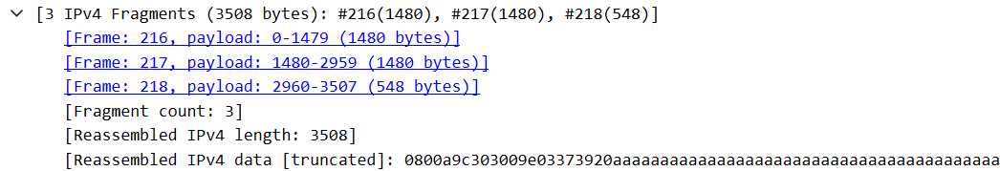

* **15.**

    Frame 216，Frame 217，Frame 218
    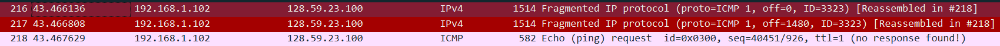
    变化: Total Length, (Flags, More fragments, )Fragment Offset, Header Checksum
    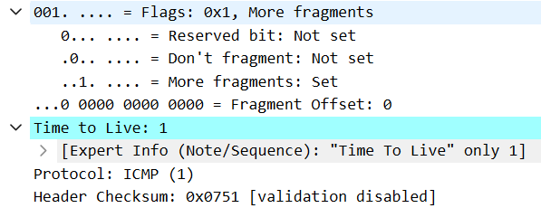
    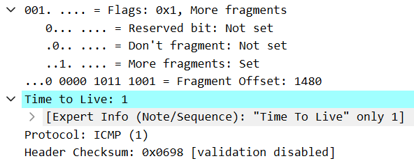
    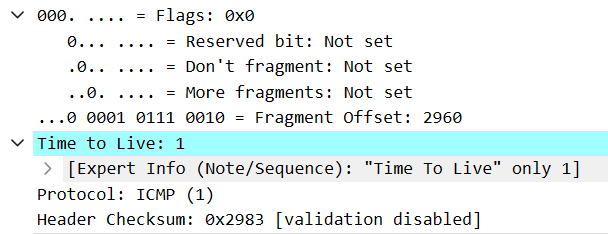