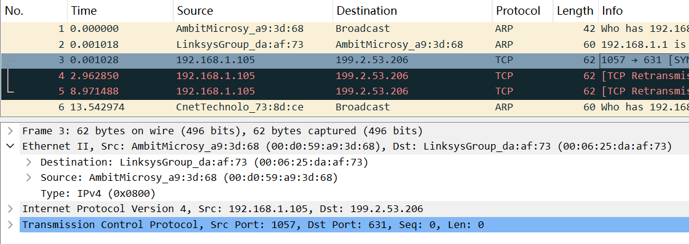

# LAB6
## 牛庆源 PB21111733

* **1.**

    依据source可知：
    00:d0:59:a9:3d:68
    

* **2.**

    依据destination可知：
    00:06:25:da:af:73
    不是gaia.cs.umass.edu的以太网地址，是距离本机最近的路由器地址

* **3.**

    由Type：IPv4 (0x0800)可知
    双字节帧类型字段的十六进制值为：0x0800，对应的上层协议为IPv4

* **4.**

    由下图GET中G的位置出现在0x0037即第55byte，前面有54bytes
    

* **5.**

    依据source可知：
    源地址的值是00:06:25:da:af:73
    不是电脑地址也不是gaia.cs.umass.edu的地址，是最近路由器的地址
    

* **6.**

    依据destination可知：
    目的地址是00:d0:59:a9:3d:68
    是我电脑的以太地址

* **7.**

    由Type: IPv4 (0x0800)
    双字节帧类型字段中的十六进制值为0x0800，上层协议为IPv4

* **8.**

    200 OK中OK第一次出现在frame 12的0x0044即68byte，前面有67bytes
    

* **9.**

    内容如下：
    
    两个接口，每个接口有三列内容，分别是
    Internet 地址(IP 地址)， 物理地址(MAC地址)，类型（静态永久保存，动态没用就删）

* **10.**

    源地址为00:d0:59:a9:3d:68
    目标地址为ff:ff:ff:ff:ff:ff
    

* **11.**

    由Type: ARP (0x0806)
    双字节以太网帧类型字段的十六进制值为0x0806，上层协议为IPv4

* **12.**
  - a.
    由Opcode: request (1)开始对应的位置为0x0015，所以有0x0014即20bytes
    

  - b.
    查看右侧内容可知Opcode为0x0001

  - c.
    包含了，右侧包含了源地址和目标地址
    00 d0 59 a9 3d 68
    ff ff ff ff ff ff

  - d.
    Target IP address字段

* **13.**
  - a.
    同Q12，20bytes
    

  - b.
    同Q12，找到其位置，内容为00 02即0x0002

  - c.
    回答在Sender MAC address，对应IP地址在Sender IP address

* **14.**

    由Q13图中的Destination和Source可知
    源地址：00:06:25:da:af:73
    目的地址:00:d0:59:a9:3d:68

* **15.**

    因为发送ARP请求时是广播，ARP响应是只有对应IP地址的路由器或者主机响应，而数据包6的请求可能没有这样的主机或者路由器，所以没有响应

* **Extra Credit**

    * EX-1

    正常：
    

    * EX-2

    默认时间是2min
