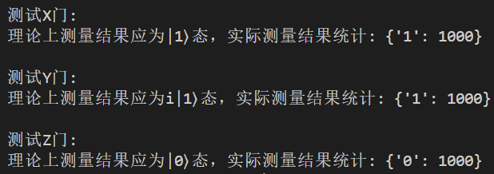
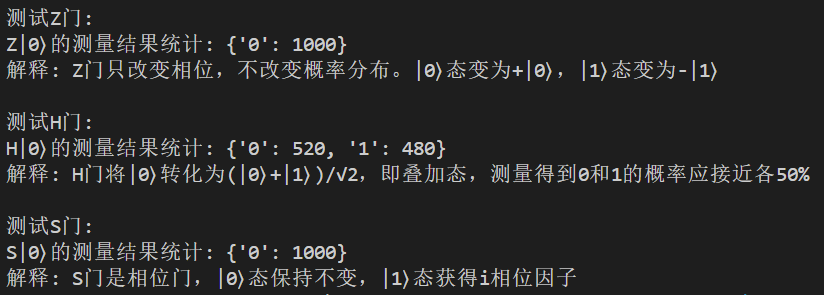
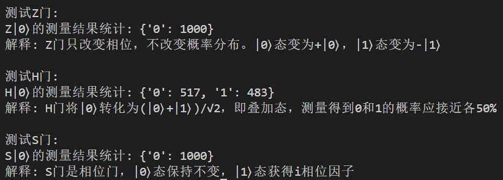
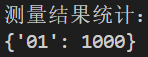

# 量子计算与机器学习 实验一

*PB21111733 牛庆源*

---

## 实验内容：

1. 将一个量子态初始化为|0>态，分别应用几种单比特门（X或Y或Z）将其变为最终态，验证测量结果和预期结果对比。
2. 将|0>态通过Z门，H门和S门转化为其他不同状态，观察和解释最终量子态的概率分布。
3. 初始化两个|0>态的量子比特，编写代码使得第一个量子比特变为|1>态，而第二个保持不变。

---

## 实验代码与结果分析：

### 问题一：

#### 代码：

```python
from pyqpanda import *

def quantum_single_gates_demo():
    # 初始化量子虚拟机
    qvm = CPUQVM()
    qvm.init_qvm()
    
    # 申请量子比特和经典寄存器
    qubits = qvm.qAlloc_many(1)
    cbits = qvm.cAlloc_many(1)
    
    # 测试X门
    print("\n测试X门:")
    prog = QProg()
    prog << X(qubits[0])  # 对初态|0⟩应用X门
    prog << Measure(qubits[0], cbits[0])
    
    # 运行1000次统计结果
    result = qvm.run_with_configuration(prog, cbits, 1000)
    print(f"理论上测量结果应为|1⟩态，实际测量结果统计: {result}")
    
    # 测试Y门
    print("\n测试Y门:")
    prog = QProg()
    prog << Y(qubits[0])  # 对初态|0⟩应用Y门
    prog << Measure(qubits[0], cbits[0])
    
    result = qvm.run_with_configuration(prog, cbits, 1000)
    print(f"理论上测量结果应为i|1⟩态，实际测量结果统计: {result}")
    
    # 测试Z门
    print("\n测试Z门:")
    prog = QProg()
    prog << Z(qubits[0])  # 对初态|0⟩应用Z门
    prog << Measure(qubits[0], cbits[0])
    
    result = qvm.run_with_configuration(prog, cbits, 1000)
    print(f"理论上测量结果应为|0⟩态，实际测量结果统计: {result}")
    
    # 释放量子虚拟机
    qvm.finalize()

if __name__ == "__main__":
    quantum_single_gates_demo()
```

#### 运行结果与分析：

多次运行后结果均为：



**X门：**应该将量子比特从 |0⟩ 翻转到 |1⟩，测量结果将显示为 1。

**Y门：**Y门应用了相位变化，将量子比特从 |0⟩ 转换为 i|1⟩，但由于我们无法直接观察到相位，测量的结果会显示为 1。

**Z门：** Z门对 |0⟩ 状态没有测量结果上的影响，测量结果应为 0。


### 问题二：

#### 代码：

```python
from pyqpanda import *
import numpy as np

def quantum_state_transformation():
    # 初始化量子虚拟机
    qvm = CPUQVM()
    qvm.init_qvm()
    
    # 申请量子比特和经典寄存器
    qubits = qvm.qAlloc_many(1)
    cbits = qvm.cAlloc_many(1)
    
    # 测试1: Z门
    print("\n测试Z门:")
    prog = QProg()
    prog << Z(qubits[0])  # 对初态|0⟩应用Z门
    prog << Measure(qubits[0], cbits[0])
    
    result = qvm.run_with_configuration(prog, cbits, 1000)
    print(f"Z|0⟩的测量结果统计: {result}")
    print("解释: Z门只改变相位，不改变概率分布。|0⟩态变为+|0⟩，|1⟩态变为-|1⟩")
    
    # 测试2: H门
    print("\n测试H门:")
    prog = QProg()
    prog << H(qubits[0])  # 对初态|0⟩应用H门
    prog << Measure(qubits[0], cbits[0])
    
    result = qvm.run_with_configuration(prog, cbits, 1000)
    print(f"H|0⟩的测量结果统计: {result}")
    print("解释: H门将|0⟩转化为(|0⟩+|1⟩)/√2，即叠加态，测量得到0和1的概率应接近各50%")
    
    # 测试3: S门
    print("\n测试S门:")
    prog = QProg()
    prog << S(qubits[0])  # 对初态|0⟩应用S门
    prog << Measure(qubits[0], cbits[0])
    
    result = qvm.run_with_configuration(prog, cbits, 1000)
    print(f"S|0⟩的测量结果统计: {result}")
    print("解释: S门是相位门，|0⟩态保持不变，|1⟩态获得i相位因子")   
    
    # 释放量子虚拟机
    qvm.finalize()

if __name__ == "__main__":
    quantum_state_transformation()
```

#### 运行结果与分析：

运行了两次，结果分别为：

1. 运行结果一：

   

2. 运行结果二：

   

解释如上图结果所示。特别地，对于H门转化的叠加态，在概率层面分别接近50%，测量时会有所偏差。


### 问题三：

#### 代码：

```python
from pyqpanda import *

def two_qubit_operation():
    # 初始化量子虚拟机
    qvm = CPUQVM()
    qvm.init_qvm()
    
    # 申请两个量子比特和经典寄存器
    qubits = qvm.qAlloc_many(2)  # 分配两个量子比特
    cbits = qvm.cAlloc_many(2)   # 分配两个经典寄存器
    
    # 创建量子程序
    prog = QProg()
    
    # 对第一个量子比特应用X门，将其从|0⟩变为|1⟩
    prog << X(qubits[0])
    # 对第二个量子比特应用Z门，保持其为|0⟩
    prog << Z(qubits[1])  
    
    # 测量两个量子比特
    prog << Measure(qubits[0], cbits[0])  # 测量第一个量子比特
    prog << Measure(qubits[1], cbits[1])  # 测量第二个量子比特
    
    # 运行程序1000次并统计结果
    result = qvm.run_with_configuration(prog, cbits, 1000)
    
    print("测量结果统计：")
    print(result)
    
    # 释放量子虚拟机
    qvm.finalize()

if __name__ == "__main__":
    two_qubit_operation()
```

#### 运行结果与分析：

运行多次结果均为：



理论上应该观察到'10'态，第一个量子比特通过X门变为|1>，第二个量子比特通过Z门保持|0>不变。

---

## 实验总结：

1. 安装了量子计算的一些库。

2. 学到了一些`pyqpanda`库中的关于量子比特，门的一些操作。
