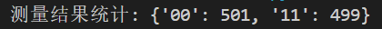
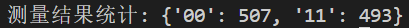
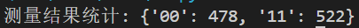
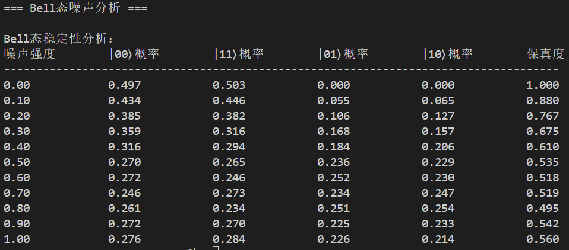

# 量子计算与机器学习 实验二

*PB21111733 牛庆源*

---

## 实验内容：

1. 使用H门和CNOT门创建两个比特的纠缠态（Bell态），验证Bell态的非局域性，即测量一个比特对另一个比特测量结果的影响。
2. 在叠加态上应用相位门（如S门或T门），观察其对量子比特状态的影响，并验证测量概率分布不受相位变化影响。
3. 探讨Bell态的稳定性，通过在纠缠态上应用噪声并测量一个比特的影响，分析量子纠缠的脆弱性（在某些比特的随机时间添加X、Y或Z门，模拟泡利噪声）。

---

## 实验代码与结果分析：

### 问题一：

#### 代码：

```python
from pyqpanda import *

def create_bell_state():
    # 初始化量子虚拟机
    qvm = CPUQVM()
    qvm.init_qvm()
    
    # 申请两个量子比特和两个经典比特
    qubits = qvm.qAlloc_many(2)
    cbits = qvm.cAlloc_many(2)
    
    # 创建量子程序
    prog = QProg()
    
    # 对第一个量子比特应用 H 门
    prog << H(qubits[0])
    
    # 对第二个量子比特应用 CNOT 门，qubits[0] 作为控制比特，qubits[1] 作为目标比特
    prog << CNOT(qubits[0], qubits[1])
    
    # 测量量子比特并存储结果到经典比特
    prog << Measure(qubits[0], cbits[0])
    prog << Measure(qubits[1], cbits[1])
    
    # 运行程序并查看测量结果
    result = qvm.run_with_configuration(prog, cbits, 1000)
    print(f"测量结果统计: {result}")
    
    # 释放量子虚拟机资源
    qvm.finalize()

if __name__ == "__main__":
    create_bell_state()
```

#### 运行结果与分析：

多次运行结果均为'00'态和'11'态几乎各占50%：



非局域性表现在：

* 两个量子比特的测量结果总是强相关的。

* 当测量第一个比特得到 0 时，第二个比特也一定是 0。

* 当测量第一个比特得到 1 时，第二个比特也一定是 1。


### 问题二：

#### 代码：

```python
from pyqpanda import *

def create_bell_state_with_phase_gates():
    # 初始化量子虚拟机
    qvm = CPUQVM()
    qvm.init_qvm()
    
    # 申请两个量子比特和两个经典比特
    qubits = qvm.qAlloc_many(2)
    cbits = qvm.cAlloc_many(2)
    
    # 创建量子程序
    prog = QProg()
    
    prog << H(qubits[0])
    prog << CNOT(qubits[0], qubits[1])
    
    # 作用 S 门或 T 门
    prog << S(qubits[0])
    prog << S(qubits[1])
    # 或者可以使用 T 门代替 S 门
    
    # 测量量子比特并存储结果到经典比特
    prog << Measure(qubits[0], cbits[0])
    prog << Measure(qubits[1], cbits[1])
    
    # 运行程序并查看测量结果
    result = qvm.run_with_configuration(prog, cbits, 1000)
    print(f"测量结果统计: {result}")
    
    # 释放量子虚拟机资源
    qvm.finalize()

if __name__ == "__main__":
    create_bell_state_with_phase_gates()

```

#### 运行结果与分析：

多次运行后，无论是对纠缠态使用T门还是S门，结果均为'00'态和'11'态几乎各占50%:

S门：



T门：



表明概率分布不受相位变化影响。


### 问题三：

#### 代码：

```python
from pyqpanda import *
import random
import numpy as np

def create_bell_state_with_noise(noise_strength=0.1, shots=1000):
    """
    创建Bell态并添加噪声
    noise_strength: 噪声强度（0到1之间）
    shots: 运行次数
    """
    # 初始化量子虚拟机
    qvm = CPUQVM()
    qvm.init_qvm()
    
    # 申请量子比特和经典寄存器
    qubits = qvm.qAlloc_many(2)
    cbits = qvm.cAlloc_many(2)
    
    # 统计结果
    counts = {'00': 0, '01': 0, '10': 0, '11': 0}
    
    # 多次重复实验
    for _ in range(shots):
        # 创建量子程序
        prog = QProg()
        
        # 创建Bell态
        prog << H(qubits[0])
        prog << CNOT(qubits[0], qubits[1])
        
        # 添加噪声
        noise_gates = [X, Y, Z]
        for qubit in qubits:
            if random.random() < noise_strength:
                noise_gate = random.choice(noise_gates)
                prog << noise_gate(qubit)
        
        # 测量
        prog << Measure(qubits[0], cbits[0])
        prog << Measure(qubits[1], cbits[1])
        
        # 运行一次并记录结果
        result = qvm.run_with_configuration(prog, cbits, 1)
        result_str = ''.join(str(bit) for bit in list(result.keys())[0])
        counts[result_str] += 1
    
    # 计算概率
    probabilities = {state: count/shots for state, count in counts.items()}
    
    # 计算保真度（与理想Bell态的重叠）
    fidelity = (counts['00'] + counts['11']) / shots
    
    # 释放量子虚拟机
    qvm.finalize()
    
    return {
        'counts': counts,
        'probabilities': probabilities,
        'fidelity': fidelity
    }

def analyze_bell_state_stability():
    """分析不同噪声强度下Bell态的稳定性"""
    noise_levels = np.linspace(0.0, 1.0, 11)  # 0.0到1.0之间均匀取11个点
    shots = 1000
    
    print("\nBell态稳定性分析：")
    print("噪声强度\t|00⟩概率\t|11⟩概率\t|01⟩概率\t|10⟩概率\t保真度")
    print("-" * 70)
    
    # 存储结果用于后续分析
    all_results = []
    
    for noise in noise_levels:
        results = create_bell_state_with_noise(noise, shots)
        probs = results['probabilities']
        fidelity = results['fidelity']
        
        print(f"{noise:.2f}\t{probs['00']:.3f}\t{probs['11']:.3f}\t"
              f"{probs['01']:.3f}\t{probs['10']:.3f}\t{fidelity:.3f}")
        
        all_results.append({
            'noise': noise,
            'fidelity': fidelity,
            'probabilities': probs
        })

def bell_state_noise_analysis():
    """主函数：执行完整的Bell态噪声分析"""
    print("=== Bell态噪声分析 ===")
    
    analyze_bell_state_stability()
    

if __name__ == "__main__":
    bell_state_noise_analysis()
```

#### 运行结果与分析：



* 没有噪声时（强度0.0）：保真度为100%。

* 当有噪声时，'01'态和'10'态开始出现。

* 随着强度的提升（大致），四种状态几乎各占25%。
* 噪声的出现会破坏Bell态的稳定性，表现了量子纠缠的脆弱性。

---

## 实验总结：

1. 创建了Bell态并对纠缠态的一些特性进行了实验探究。

2. 尤其理解了噪声对于Bell态稳定性的破坏。