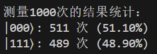
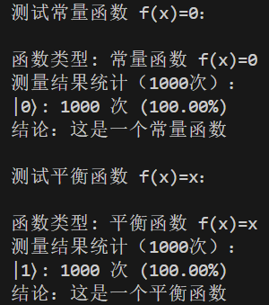

# 量子计算与机器学习 实验三

*PB21111733 牛庆源*

---

## 实验内容：

1. 应用 H 门和 CNOT 门构造 GHZ 态 $((|000\rangle+|111\rangle)/\sqrt{2})$

2. 实现 Deutsch 算法电路，针对给定的二值函数 𝑓(𝑥)，判定其为常量函数还是平衡函数。

   实验过程：

   * 定义常量函数：$f(x)=0$；平衡函数：$f(x)=x$。
   * 初始化两个量子比特，第一个为 $|0\rangle$，第二个为 $|1\rangle$。
   * 对两个比特分别应用 Hadamard 门，创建叠加态。
   * 应用函数 $f(x)$ 的量子门 $U_f$。
   * 对第一个比特应用 Hadamard 门 ，并测量第一个比特的结果。
   * 分析 $f(x)$ 分别为常量函数和平衡函数的现象。

---

## 实验代码与结果分析：

### 问题一：

#### 代码：

```python
from pyqpanda import *
import numpy as np

def create_and_measure_ghz_state():
    """
    创建和测量GHZ态：(|000⟩ + |111⟩)/√2
    """
    qvm = CPUQVM()
    qvm.init_qvm()
    
    # 申请3个量子比特和经典寄存器
    qubits = qvm.qAlloc_many(3)
    cbits = qvm.cAlloc_many(3)
    
    # 构建量子程序
    prog = QProg()
    
    # 构建GHZ态
    prog << H(qubits[0]) \
        << CNOT(qubits[0], qubits[1]) \
        << CNOT(qubits[1], qubits[2])
    
    # 测量所有量子比特
    prog << Measure(qubits[0], cbits[0]) \
        << Measure(qubits[1], cbits[1]) \
        << Measure(qubits[2], cbits[2])
    
    # 运行程序并获取结果
    result = qvm.run_with_configuration(prog, cbits, 1000)
    
    # 格式化输出结果
    print("\n测量1000次的结果统计：")
    for state, count in result.items():
        print(f"|{state}⟩: {count} 次 ({count/1000*100:.2f}%)")
    
    qvm.finalize()

if __name__ == "__main__":
    create_and_measure_ghz_state()
```

#### 运行结果与分析：



两态测量时几乎各占50%。

### 问题二：

#### 代码：

```python
from pyqpanda import *
import numpy as np

def deutsch_algorithm(f_type='constant'):
    """
    实现Deutsch算法
    f_type: 'constant' 表示常量函数 f(x)=0
            'balanced' 表示平衡函数 f(x)=x
    """
    qvm = CPUQVM()
    qvm.init_qvm()
    
    # 申请两个量子比特和一个经典寄存器
    qubits = qvm.qAlloc_many(2)
    cbit = qvm.cAlloc()
    
    # 构建量子程序
    prog = QProg()
    
    # 初始化：|0⟩|1⟩
    prog << X(qubits[1])
    
    # 应用H门创建叠加态
    prog << H(qubits[0]) << H(qubits[1])
    
    # 应用Uf (量子oracle)
    if f_type == 'constant':  # f(x)=0
        # 对于常量函数f(x)=0，Uf不做任何操作
        pass
    else:  # f(x)=x
        # 对于平衡函数f(x)=x，Uf实现为CNOT门
        prog << CNOT(qubits[0], qubits[1])
    
    # 对第一个量子比特应用H门
    prog << H(qubits[0])
    
    # 测量第一个量子比特
    prog << Measure(qubits[0], cbit)
    
    # 运行程序并统计结果
    result = qvm.run_with_configuration(prog, [cbit], 1000)
    
    # 输出结果
    print(f"\n函数类型: {'常量函数 f(x)=0' if f_type=='constant' else '平衡函数 f(x)=x'}")
    print("测量结果统计（1000次）：")
    for state, count in result.items():
        print(f"|{state}⟩: {count} 次 ({count/1000*100:.2f}%)")
    
    # 判断函数类型
    if '0' in result and result['0']/1000 > 0.9:  # 考虑一些误差，使用0.9作为阈值
        print("结论：这是一个常量函数")
    elif '1' in result and result['1']/1000 > 0.9:
        print("结论：这是一个平衡函数")
    else:
        print("结论：结果不确定")
    
    qvm.finalize()

if __name__ == "__main__":
    print("测试常量函数 f(x)=0：")
    deutsch_algorithm('constant')
    
    print("\n测试平衡函数 f(x)=x：")
    deutsch_algorithm('balanced')
```

#### 运行结果与分析：



$f(x)$ 为常量函数时，测量结果为 $|0 \rangle$，$f(x)$ 为平衡函数时，测量结果为 $|1 \rangle$。即可以通过量子比特的测量，确定二值函数为常量函数还是平衡函数。

---

## 实验总结：

1. 三量子比特的操作与 GHZ 态的构建。

2. 实现了 Deutsch 算法电路。