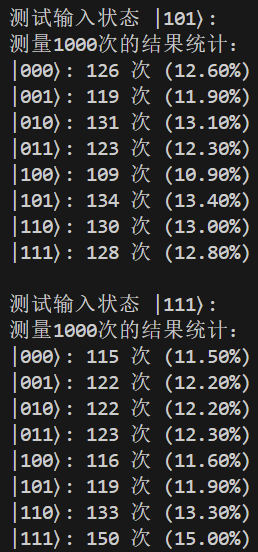
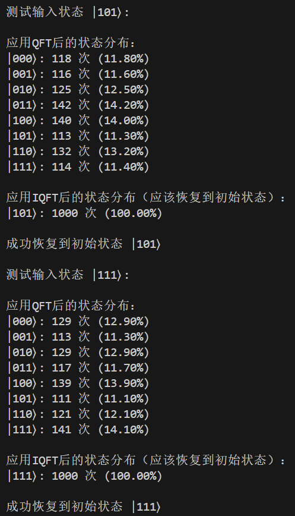

# 量子计算与机器学习 实验四

*PB21111733 牛庆源*

---

## 实验内容：

1. **编写并实现量子傅里叶变换电路**

   1. 使用 3 个量子比特，编写一个 QFT 的量子电路。
   2. 准备两个简单的输入量子态 |101⟩ 和 |111⟩ 并对其应用 QFT。(建议在实验过程中编写一个量子傅里叶变换的函数)
2. **实现 QFT 的逆变换（IQFT）**
   1. 在 QFT 电路后添加 IQFT 电路。
   2. 验证输入态是否可以通过 QFT 和 IQFT 的组合完全恢复。

---

## 实验代码与结果分析：

### 问题一：

#### 代码：

```python
from pyqpanda import *
import numpy as np
import cmath

def qft_circuit(qubits):
    """
    实现3位量子傅里叶变换电路
    参数:
        qubits: 量子比特列表
    返回:
        prog: 量子程序
    """
    prog = QProg()
    
    # QFT实现
    # 第一个量子比特
    prog << H(qubits[2])
    prog << CP(qubits[1], qubits[2], cmath.pi/2)
    prog << CP(qubits[0], qubits[2], cmath.pi/4)
    
    # 第二个量子比特
    prog << H(qubits[1])
    prog << CP(qubits[0], qubits[1], cmath.pi/2)
    
    # 第三个量子比特
    prog << H(qubits[0])
    
    # 交换比特位置
    prog << SWAP(qubits[0], qubits[2])
    
    return prog

def prepare_state(qubits, state_str):
    """
    准备指定的初始状态
    参数:
        qubits: 量子比特列表
        state_str: 目标状态字符串 ('101' 或 '111')
    返回:
        prog: 量子程序
    """
    prog = QProg()
    for i, bit in enumerate(reversed(state_str)):
        if bit == '1':
            prog << X(qubits[i])
    return prog

def test_qft():
    """
    测试QFT电路
    """
    qvm = CPUQVM()
    qvm.init_qvm()
    
    # 申请量子比特和经典寄存器
    qubits = qvm.qAlloc_many(3)
    cbits = qvm.cAlloc_many(3)
    
    # 测试两个输入状态
    test_states = ['101', '111']
    
    for state in test_states:
        print(f"\n测试输入状态 |{state}⟩:")
        
        # 构建量子程序
        prog = QProg()
        
        # 准备初始状态
        prog << prepare_state(qubits, state)
        
        # 应用QFT
        prog << qft_circuit(qubits)
        
        # 测量
        for i in range(3):
            prog << Measure(qubits[i], cbits[i])
        
        # 运行程序并获取结果
        result = qvm.run_with_configuration(prog, cbits, 1000)
        
        # 输出结果
        print("测量1000次的结果统计：")
        for measured_state, count in result.items():
            print(f"|{measured_state}⟩: {count} 次 ({count/1000*100:.2f}%)")
            
    qvm.finalize()

if __name__ == "__main__":
    test_qft()
```

#### 运行结果与分析：



对于两种输入状态，输出结果每一种状态的概率几乎都接近12.5%。

### 问题二：

#### 代码：

```python
from pyqpanda import *
import numpy as np
import cmath

def qft_circuit(qubits):
    """
    实现3位量子傅里叶变换电路
    """
    prog = QProg()
    
    # QFT实现
    # 第一个量子比特
    prog << H(qubits[2])
    prog << CP(qubits[1], qubits[2], cmath.pi/2)
    prog << CP(qubits[0], qubits[2], cmath.pi/4)
    
    # 第二个量子比特
    prog << H(qubits[1])
    prog << CP(qubits[0], qubits[1], cmath.pi/2)
    
    # 第三个量子比特
    prog << H(qubits[0])
    
    # 交换比特位置
    prog << SWAP(qubits[0], qubits[2])
    
    return prog

def iqft_circuit(qubits):
    """
    实现3位逆量子傅里叶变换电路
    """
    prog = QProg()
    
    # 交换比特位置
    prog << SWAP(qubits[0], qubits[2])
    
    # IQFT实现 (与QFT相反的顺序，并且旋转角度取负)
    # 第三个量子比特
    prog << H(qubits[0])
    
    # 第二个量子比特
    prog << CP(qubits[0], qubits[1], -cmath.pi/2)
    prog << H(qubits[1])
    
    # 第一个量子比特
    prog << CP(qubits[0], qubits[2], -cmath.pi/4)
    prog << CP(qubits[1], qubits[2], -cmath.pi/2)
    prog << H(qubits[2])
    
    return prog

def prepare_state(qubits, state_str):
    """
    准备指定的初始状态
    """
    prog = QProg()
    for i, bit in enumerate(reversed(state_str)):
        if bit == '1':
            prog << X(qubits[i])
    return prog

def test_qft_iqft():
    """
    测试QFT-IQFT组合电路
    """
    qvm = CPUQVM()
    qvm.init_qvm()
    
    # 申请量子比特和经典寄存器
    qubits = qvm.qAlloc_many(3)
    cbits = qvm.cAlloc_many(3)
    
    # 测试两个输入状态
    test_states = ['101', '111']
    
    for state in test_states:
        print(f"\n测试输入状态 |{state}⟩:")
        
        # 构建量子程序
        prog = QProg()
        
        # 准备初始状态
        prog << prepare_state(qubits, state)
        
        # 应用QFT
        prog << qft_circuit(qubits)
        
        print("\n应用QFT后的状态分布：")
        # 复制程序来测量QFT后的状态
        measure_prog = QProg()
        measure_prog << prog
        for i in range(3):
            measure_prog << Measure(qubits[i], cbits[i])
        result_qft = qvm.run_with_configuration(measure_prog, cbits, 1000)
        for measured_state, count in result_qft.items():
            print(f"|{measured_state}⟩: {count} 次 ({count/1000*100:.2f}%)")
        
        # 在原程序中继续添加IQFT
        prog << iqft_circuit(qubits)
        
        # 测量
        for i in range(3):
            prog << Measure(qubits[i], cbits[i])
        
        # 运行完整的QFT-IQFT程序并获取结果
        print("\n应用IQFT后的状态分布（应该恢复到初始状态）：")
        result = qvm.run_with_configuration(prog, cbits, 1000)
        for measured_state, count in result.items():
            print(f"|{measured_state}⟩: {count} 次 ({count/1000*100:.2f}%)")
        
        # 验证结果
        max_state = max(result.items(), key=lambda x: x[1])[0]
        if max_state == state:
            print(f"\n成功恢复到初始状态 |{state}⟩")
        else:
            print(f"\n未能完全恢复到初始状态 |{state}⟩")
            
    qvm.finalize()

if __name__ == "__main__":
    test_qft_iqft()
```

#### 运行结果与分析：



对应用量子傅里叶变换后的结果进行逆量子傅里叶变换，状态返回初始状态。

---

## 实验总结：

量子傅里叶变换：$QFT |x\rangle = \frac{1}{\sqrt{8}} \sum_{k=0}^{7} e^{2\pi i \frac{xk}{8}} |k\rangle$

1. Pyqpanda 库实现量子傅里叶变换函数并测试。

2. 实现逆量子傅里叶变换函数并测试。